# Hysteria 认证后端系统 - 技术设计文档

> **关联文档**:
> - [`hysteria-server-config.md`](hysteria-server-config.md) — Hysteria 2 完整服务端配置参考
> - [`hysteria-traffic-stats-api.md`](hysteria-traffic-stats-api.md) — Hysteria 2 流量统计 API 详细文档

## 1. 项目概述

### 1.1 项目目标

构建一个基于 C# .NET 的 Hysteria 代理认证后端系统，采用主从架构设计：
- **主服务器（Master Server）**：提供完整的 HTTP API 服务、用户管理、数据存储、认证授权、流量统计
- **边缘节点（Edge Node）**：部署在各 VPS 上，负责本地 Hysteria 服务运行、状态上报、认证请求转发、流量数据采集

### 1.2 技术栈

| 组件 | 技术选型 |
|------|----------|
| 开发语言 | C# (.NET 8.0) |
| Web 框架 | ASP.NET Core |
| 数据库 | SQLite (轻量级，适合中小规模) |
| ORM | Entity Framework Core |
| 部署环境 | Ubuntu / Debian Linux |
| 认证协议 | Hysteria HTTP Auth API |
| 流量采集 | Hysteria [`trafficStats` API](hysteria-traffic-stats-api.md)（方案一：Edge Agent 内部采集） |
| 节点通信 | REST API |
| 系统监控 | `proc` 文件系统（`/proc/stat`、`/proc/meminfo`、`/proc/net/dev`） |
| 日志 | Microsoft.Extensions.Logging + 文件日志 |
| 配置管理 | JSON 配置文件 (`appsettings.json`, `agent.json`) |
| 容器化（可选） | Docker / Docker Compose |

### 1.3 核心功能

1. **用户认证**：Hysteria 客户端连接时，Hysteria 服务端通过 HTTP Auth 向 Edge Agent 发起验证请求；Edge Agent 完成协议转换后转发到主服务器进行身份校验
2. **流量采集统计**（方案一）：Edge Agent 定时调用本地 Hysteria 的 [`trafficStats` API](hysteria-traffic-stats-api.md) 采集各用户流量数据，汇总后上报主服务器，实现精准的流量记录与扣减
3. **流量管理**：记录并限制用户流量使用，支持流量配额、已用流量追踪、超额断连
4. **账号管理**：完整的用户 CRUD 操作、激活/禁用、过期管理、节点白名单
5. **节点监控**：边缘节点实时采集系统指标（CPU、内存、网络）并上报主服务器
6. **在线用户管理**：通过 Hysteria `/online` API 实时掌握各节点在线用户数，支持通过 `/kick` 接口踢用户下线
7. **深度流量审计**：支持通过 Hysteria [`/dump/streams`](hysteria-traffic-stats-api.md#get-dumpstreams--查询-tcp-流详情) API 导出 TCP 流详情，用于故障排查和安全审计
8. **管理员管理**：管理员账号 CRUD、基于 JWT 的身份认证、操作审计日志
9. **健康检查**：主服务器和边缘节点的健康探活接口，支撑外部负载均衡和监控系统
10. **数据可靠性**：流量数据幂等上报、并发扣减保障、数据备份与恢复策略

---

## 2. 系统架构设计

### 2.1 整体架构图

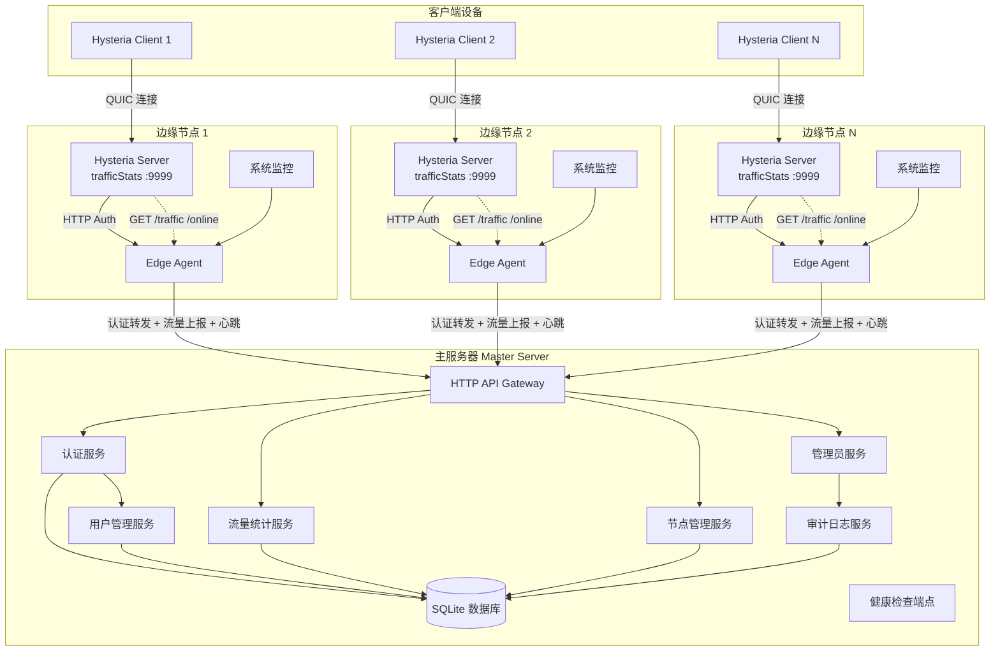

### 2.2 主服务器架构

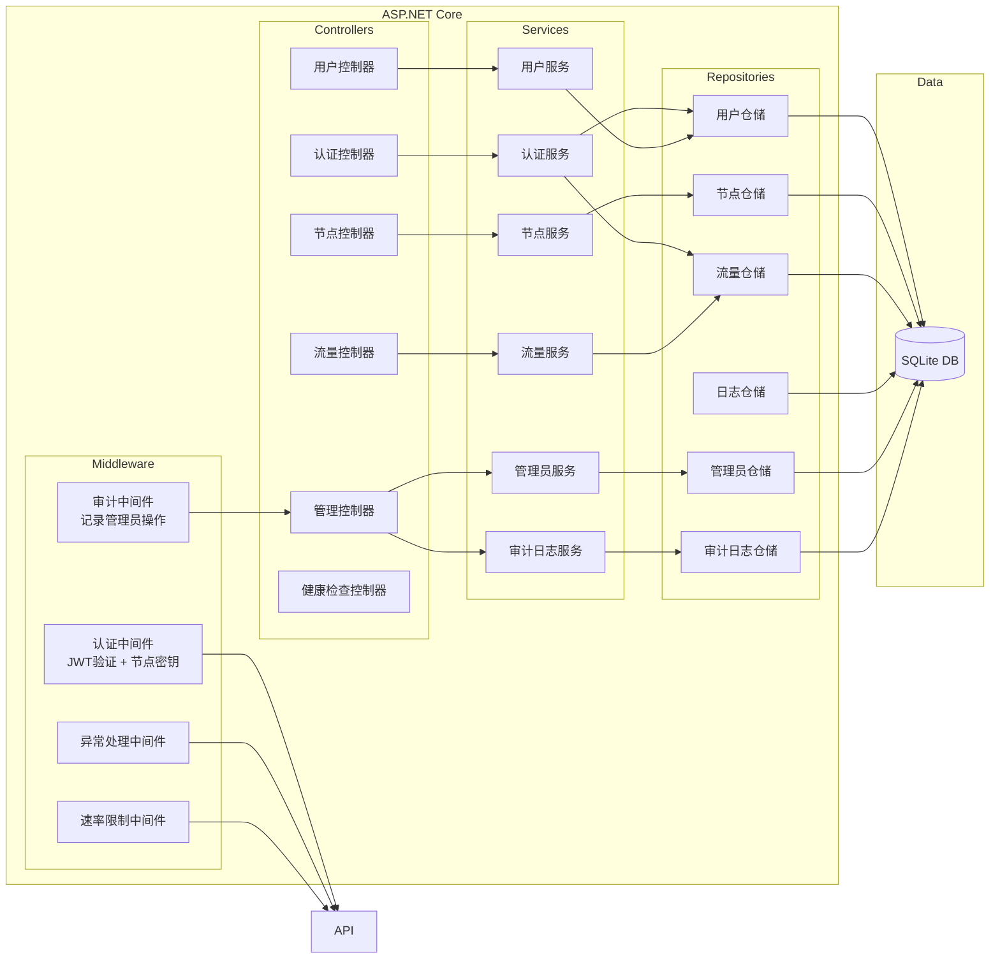

### 2.3 边缘节点架构

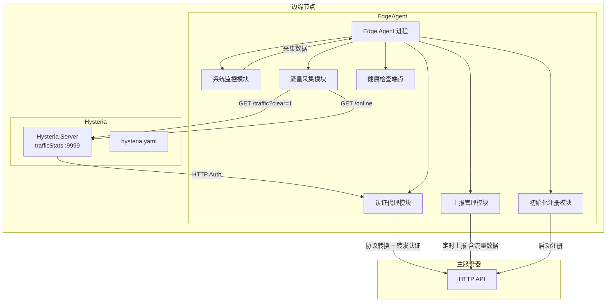

---

## 3. 数据库设计

### 3.1 ER 图

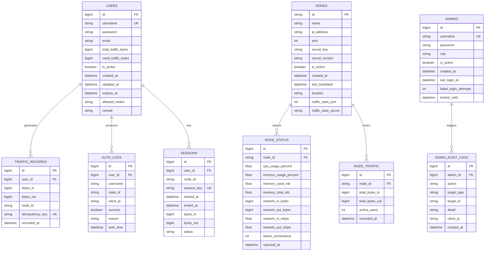

### 3.2 表结构详细设计

#### 3.2.1 用户表 (Users)

| 字段 | 类型 | 约束 | 说明 |
|------|------|------|------|
| Id | BIGINT | PK, AUTO_INCREMENT | 用户唯一标识 |
| Username | VARCHAR(64) | UNIQUE, NOT NULL | 登录用户名 |
| Password | VARCHAR(256) | NOT NULL | 密码（BCrypt 加密） |
| Email | VARCHAR(128) | NULL | 邮箱地址 |
| TotalTrafficBytes | BIGINT | NOT NULL, DEFAULT 0 | 总流量配额（字节） |
| UsedTrafficBytes | BIGINT | NOT NULL, DEFAULT 0 | 已使用流量（字节） |
| IsActive | BOOLEAN | NOT NULL, DEFAULT 1 | 是否激活 |
| CreatedAt | DATETIME | NOT NULL | 创建时间 |
| UpdatedAt | DATETIME | NOT NULL | 更新时间 |
| ExpiresAt | DATETIME | NULL | 过期时间（NULL=永不过期） |
| AllowedNodes | TEXT | NULL | 允许使用的节点ID列表（JSON数组，NULL=全部） |
| Remark | TEXT | NULL | 备注信息 |

#### 3.2.2 流量记录表 (TrafficRecords)

| 字段 | 类型 | 约束 | 说明 |
|------|------|------|------|
| Id | BIGINT | PK, AUTO_INCREMENT | 记录ID |
| UserId | BIGINT | FK, NOT NULL | 用户ID |
| BytesIn | BIGINT | NOT NULL | 入站流量/用户上传（字节）。对应 Hysteria `rx`（服务端视角） |
| BytesOut | BIGINT | NOT NULL | 出站流量/用户下载（字节）。对应 Hysteria `tx`（服务端视角） |
| NodeId | VARCHAR(64) | NOT NULL | 节点ID |
| IdempotencyKey | VARCHAR(128) | UNIQUE, NOT NULL | 幂等键，格式 `{nodeId}_{userId}_{timestamp}`，防止重复计入 |
| RecordedAt | DATETIME | NOT NULL | 记录时间 |

> **注意流量方向映射**：Hysteria 的 `tx`/`rx` 是服务端视角。`tx` = 服务端发出 = 客户端收到 = **用户的下载流量**，在 `TrafficRecords` 中记入 `BytesOut`。`rx` = 服务端收到 = 客户端发出 = **用户的上传流量**，记入 `BytesIn`。详见 [`hysteria-traffic-stats-api.md` §GET /traffic](hysteria-traffic-stats-api.md#get-traffic--查询用户流量)。

> **幂等保障**：`IdempotencyKey` 使用唯一约束，确保同一次上报的流量数据不会因重试而重复计入。详见 [§15.2 流量数据幂等性](#152-流量数据幂等性)。

#### 3.2.3 认证日志表 (AuthLogs)

| 字段 | 类型 | 约束 | 说明 |
|------|------|------|------|
| Id | BIGINT | PK, AUTO_INCREMENT | 日志ID |
| UserId | BIGINT | FK, NULL | 用户ID（认证失败时为NULL） |
| Username | VARCHAR(64) | NOT NULL | 尝试认证的用户名 |
| NodeId | VARCHAR(64) | NOT NULL | 认证节点ID |
| ClientIp | VARCHAR(45) | NOT NULL | 客户端IP |
| Success | BOOLEAN | NOT NULL | 是否成功 |
| Reason | VARCHAR(256) | NULL | 失败原因 |
| AuthTime | DATETIME | NOT NULL | 认证时间 |

#### 3.2.4 会话表 (Sessions)

| 字段 | 类型 | 约束 | 说明 |
|------|------|------|------|
| Id | BIGINT | PK, AUTO_INCREMENT | 会话ID |
| UserId | BIGINT | FK, NOT NULL | 用户ID |
| NodeId | VARCHAR(64) | NOT NULL | 节点ID |
| SessionKey | VARCHAR(128) | UNIQUE, NOT NULL | 会话密钥 |
| StartedAt | DATETIME | NOT NULL | 开始时间 |
| EndedAt | DATETIME | NULL | 结束时间 |
| BytesIn | BIGINT | NOT NULL, DEFAULT 0 | 入站流量 |
| BytesOut | BIGINT | NOT NULL, DEFAULT 0 | 出站流量 |
| Status | VARCHAR(16) | NOT NULL, DEFAULT 'active' | 会话状态：`active`、`idle`、`closed` |

#### 3.2.5 节点表 (Nodes)

| 字段 | 类型 | 约束 | 说明 |
|------|------|------|------|
| Id | VARCHAR(64) | PK | 节点唯一标识（UUID） |
| Name | VARCHAR(128) | NOT NULL | 节点名称 |
| IpAddress | VARCHAR(45) | NOT NULL | 节点IP地址 |
| Port | INT | NOT NULL | Hysteria 服务端口 |
| SecretKey | VARCHAR(256) | NOT NULL | 节点密钥（用于节点间通信认证） |
| SecretVersion | INT | NOT NULL, DEFAULT 1 | 密钥版本号，用于密钥轮换 |
| IsActive | BOOLEAN | NOT NULL, DEFAULT 1 | 是否激活 |
| CreatedAt | DATETIME | NOT NULL | 创建时间 |
| LastHeartbeat | DATETIME | NULL | 最后心跳时间 |
| Location | VARCHAR(128) | NULL | 节点位置描述 |
| TrafficStatsPort | INT | NULL | Hysteria trafficStats API 端口（用于 Edge Agent 本地采集） |
| TrafficStatsSecret | VARCHAR(256) | NULL | trafficStats API 密钥 |

#### 3.2.6 节点状态表 (NodeStatus)

| 字段 | 类型 | 约束 | 说明 |
|------|------|------|------|
| Id | BIGINT | PK, AUTO_INCREMENT | 状态记录ID |
| NodeId | VARCHAR(64) | FK, NOT NULL | 节点ID |
| CpuUsagePercent | FLOAT | NOT NULL | CPU 使用率（%） |
| MemoryUsagePercent | FLOAT | NOT NULL | 内存使用率（%） |
| MemoryUsedMb | FLOAT | NOT NULL | 已用内存（MB） |
| MemoryTotalMb | FLOAT | NOT NULL | 总内存（MB） |
| NetworkInBytes | BIGINT | NOT NULL | 累计网络流入（字节） |
| NetworkOutBytes | BIGINT | NOT NULL | 累计网络流出（字节） |
| NetworkInMbps | FLOAT | NOT NULL | 当前网络流入速率（Mbps） |
| NetworkOutMbps | FLOAT | NOT NULL | 当前网络流出速率（Mbps） |
| ActiveConnections | INT | NOT NULL | 当前活跃连接数 |
| ReportedAt | DATETIME | NOT NULL | 上报时间 |

#### 3.2.7 节点流量统计表 (NodeTraffic)

| 字段 | 类型 | 约束 | 说明 |
|------|------|------|------|
| Id | BIGINT | PK, AUTO_INCREMENT | 统计ID |
| NodeId | VARCHAR(64) | FK, NOT NULL | 节点ID |
| TotalBytesIn | BIGINT | NOT NULL | 总入站流量 |
| TotalBytesOut | BIGINT | NOT NULL | 总出站流量 |
| ActiveUsers | INT | NOT NULL | 活跃用户数 |
| RecordedAt | DATETIME | NOT NULL | 统计时间 |

#### 3.2.8 管理员表 (Admins)

| 字段 | 类型 | 约束 | 说明 |
|------|------|------|------|
| Id | BIGINT | PK, AUTO_INCREMENT | 管理员唯一标识 |
| Username | VARCHAR(64) | UNIQUE, NOT NULL | 管理员用户名 |
| Password | VARCHAR(256) | NOT NULL | 密码（BCrypt 加密） |
| Role | VARCHAR(32) | NOT NULL, DEFAULT 'admin' | 角色：`super_admin`、`admin`、`readonly` |
| IsActive | BOOLEAN | NOT NULL, DEFAULT 1 | 是否激活 |
| CreatedAt | DATETIME | NOT NULL | 创建时间 |
| LastLoginAt | DATETIME | NULL | 最后登录时间 |
| FailedLoginAttempts | INT | NOT NULL, DEFAULT 0 | 连续登录失败次数 |
| LockedUntil | DATETIME | NULL | 账号锁定到期时间（NULL=未锁定） |

> **角色说明**：
> - `super_admin`：完全权限，可管理其他管理员
> - `admin`：标准权限，可管理用户和节点
> - `readonly`：只读权限，仅可查看数据

#### 3.2.9 管理员操作审计日志表 (AdminAuditLogs)

| 字段 | 类型 | 约束 | 说明 |
|------|------|------|------|
| Id | BIGINT | PK, AUTO_INCREMENT | 日志ID |
| AdminId | BIGINT | FK, NOT NULL | 操作管理员ID |
| Action | VARCHAR(64) | NOT NULL | 操作类型：`create`、`update`、`delete`、`login`、`logout`、`kick_user` 等 |
| TargetType | VARCHAR(32) | NOT NULL | 操作目标类型：`user`、`node`、`admin`、`system` |
| TargetId | VARCHAR(64) | NULL | 操作目标ID |
| Detail | TEXT | NULL | 操作详情（JSON格式，含变更前后对比） |
| ClientIp | VARCHAR(45) | NOT NULL | 操作来源IP |
| CreatedAt | DATETIME | NOT NULL | 操作时间 |

---

## 4. API 接口设计

> **关联文档**:
> - [`hysteria-server-config.md` §9 验证](hysteria-server-config.md#9-验证-auth) — Hysteria 原生 HTTP Auth 协议定义
> - [`hysteria-traffic-stats-api.md`](hysteria-traffic-stats-api.md) — Hysteria 流量统计 API 完整参考

### 4.0 统一响应格式与错误处理

所有 API 响应遵循统一格式。成功和列表响应使用直接数据对象，错误响应使用标准错误结构。

#### 4.0.1 统一错误响应格式

```
HTTP 状态码: 4xx / 5xx
Content-Type: application/json
```

```json
{
    "error": {
        "code": "invalid_credentials",
        "message": "用户名或密码错误",
        "requestId": "req_abc123def456"
    }
}
```

| 字段 | 类型 | 说明 |
|------|------|------|
| `error.code` | string | 机器可读的错误代码，供程序化处理 |
| `error.message` | string | 人类可读的错误描述 |
| `error.requestId` | string | 请求追踪ID（对应日志中的 `RequestId`） |

#### 4.0.2 全局错误代码

| 错误代码 | HTTP 状态码 | 说明 |
|----------|-------------|------|
| `invalid_credentials` | 401 | 用户名或密码错误 |
| `token_expired` | 401 | JWT Token 已过期 |
| `token_invalid` | 401 | JWT Token 无效 |
| `unauthorized` | 401 | 未提供认证凭据 |
| `forbidden` | 403 | 权限不足 |
| `account_disabled` | 403 | 账号已禁用 |
| `account_expired` | 403 | 账号已过期 |
| `account_locked` | 403 | 账号已锁定（登录失败次数过多） |
| `traffic_exhausted` | 403 | 流量已用尽 |
| `node_not_allowed` | 403 | 不允许使用该节点 |
| `node_secret_invalid` | 403 | 节点密钥无效 |
| `not_found` | 404 | 资源不存在 |
| `conflict` | 409 | 资源冲突（如用户名重复） |
| `idempotency_conflict` | 409 | 幂等键冲突（重复上报） |
| `rate_limited` | 429 | 请求过于频繁 |
| `validation_error` | 422 | 请求参数校验失败 |
| `internal_error` | 500 | 服务器内部错误 |

### 4.1 认证 API 双层设计

本项目采用**双层认证架构**：

| 层级 | 端点 | 通信方 | 协议 |
|------|------|--------|------|
| **第一层**（原生协议） | `POST /auth` (Edge Agent 本地) | Hysteria Server → Edge Agent | [Hysteria 原生 HTTP Auth](hysteria-server-config.md#91-http-验证本项目的核心集成方式) |
| **第二层**（内部协议） | `POST /api/v1/auth/hysteria` (主服务器) | Edge Agent → 主服务器 | 项目自定义协议 |

#### 4.1.1 第一层：Hysteria 原生认证请求

当客户端连接时，Hysteria 服务端向 Edge Agent 发送 `POST` 请求（遵循[官方协议](hysteria-server-config.md#91-http-验证本项目的核心集成方式)）：

```
POST /auth
Content-Type: application/json
```

**请求体（Hysteria 原生格式）：**

```json
{
    "addr": "123.123.123.123:44556",
    "auth": "user_password_string",
    "tx": 52428800
}
```

| 字段 | 类型 | 说明 |
|------|------|------|
| `addr` | string | 客户端地址和端口 |
| `auth` | string | 客户端提交的密码（Base64 编码后的认证串） |
| `tx` | uint64 | 客户端期望的发送速率（字节/秒，服务端视角 = 客户端下载速率） |

**Edge Agent 返回给 Hysteria（HTTP 200）：**

```json
{
    "ok": true,
    "id": "username_identifier"
}
```

> **关键点**: Hysteria 原生协议不区分 `username` 和 `password`，仅通过 `auth` 字段传递认证凭据。Edge Agent 的 [`AuthProxy`](#53-认证代理实现) 负责解析凭据，提取用户名和密码后再调用主服务器 API。

#### 4.1.2 第二层：主服务器内部认证 API

Edge Agent 完成协议转换后，向主服务器发起认证请求：

```
POST /api/v1/auth/hysteria
Content-Type: application/json
X-Node-Secret: {node_secret}
```

**请求体：**

```json
{
    "username": "user123",
    "password": "password123",
    "nodeId": "edge-node-01",
    "clientIp": "192.168.1.100"
}
```

**成功响应（HTTP 200）：**

```json
{
    "success": true,
    "userId": 12345,
    "message": "Authentication successful",
    "remainingTraffic": 1073741824,
    "expiresAt": "2025-12-31T23:59:59Z"
}
```

**失败响应（HTTP 401/403）：**

```json
{
    "error": {
        "code": "invalid_credentials",
        "message": "用户名或密码错误",
        "requestId": "req_a1b2c3d4"
    }
}
```

**失败原因枚举：**

| 原因代码 | 说明 | HTTP 状态码 |
|----------|------|-------------|
| `invalid_credentials` | 用户名或密码错误 | 401 |
| `account_disabled` | 账号已禁用 | 403 |
| `account_expired` | 账号已过期 | 403 |
| `traffic_exhausted` | 流量已用尽 | 403 |
| `node_not_allowed` | 不允许使用该节点 | 403 |
| `internal_error` | 服务器内部错误 | 500 |

#### 4.1.3 协议转换对照

Edge Agent 在 [`POST /auth`](#411-第一层hysteria-原生认证请求) 和 [`POST /api/v1/auth/hysteria`](#412-第二层主服务器内部认证-api) 之间进行协议转换：

| 对比维度 | Hysteria 原生协议 | 项目内部 API |
|----------|-------------------|--------------|
| 认证字段 | `auth` (密码) | `username` + `password` |
| 地址字段 | `addr` | `clientIp` |
| 节点标识 | 无 | `nodeId`（由 Edge Agent 配置提供） |
| 速率信息 | `tx`（字节/秒） | 含在请求体中 |
| 成功响应 | `{"ok": true, "id": "..."}` | `{"success": true, "userId": ..., ...}` |

### 4.2 用户管理 API

所有用户管理 API 需要管理员认证（`Authorization: Bearer {admin_token}`）。

#### 4.2.1 创建用户

```
POST /api/v1/users
Content-Type: application/json
Authorization: Bearer {admin_token}
```

**请求体：**

```json
{
    "username": "user123",
    "password": "password123",
    "email": "user@example.com",
    "totalTrafficBytes": 10737418240,
    "isActive": true,
    "expiresAt": "2025-12-31T23:59:59Z",
    "allowedNodes": ["node-01", "node-02"],
    "remark": "测试用户"
}
```

**响应（HTTP 201）：**

```json
{
    "id": 1,
    "username": "user123",
    "email": "user@example.com",
    "totalTrafficBytes": 10737418240,
    "usedTrafficBytes": 0,
    "isActive": true,
    "createdAt": "2025-01-01T00:00:00Z",
    "expiresAt": "2025-12-31T23:59:59Z",
    "allowedNodes": ["node-01", "node-02"]
}
```

#### 4.2.2 获取用户列表

```
GET /api/v1/users?page=1&pageSize=20&search=&isActive=true&nodeId=
Authorization: Bearer {admin_token}
```

| 查询参数 | 类型 | 默认值 | 说明 |
|----------|------|--------|------|
| `page` | int | `1` | 页码 |
| `pageSize` | int | `20` | 每页条数（最大 100） |
| `search` | string | — | 搜索用户名或邮箱 |
| `isActive` | bool/null | — | 按激活状态筛选（null=全部） |
| `nodeId` | string | — | 按允许节点筛选 |

**响应（HTTP 200）：**

```json
{
    "total": 100,
    "page": 1,
    "pageSize": 20,
    "items": [
        {
            "id": 1,
            "username": "user123",
            "email": "user@example.com",
            "totalTrafficBytes": 10737418240,
            "usedTrafficBytes": 1073741824,
            "isActive": true,
            "createdAt": "2025-01-01T00:00:00Z",
            "expiresAt": "2025-12-31T23:59:59Z"
        }
    ]
}
```

#### 4.2.3 获取用户详情

```
GET /api/v1/users/{userId}
Authorization: Bearer {admin_token}
```

#### 4.2.4 更新用户

```
PUT /api/v1/users/{userId}
Content-Type: application/json
Authorization: Bearer {admin_token}
```

> 支持部分更新，仅需传递要修改的字段。

#### 4.2.5 删除用户

```
DELETE /api/v1/users/{userId}
Authorization: Bearer {admin_token}
```

> 删除为软删除模式，实际将 `IsActive` 设为 `false`。该用户的历史流量数据和认证日志保留不删除。

#### 4.2.6 重置用户流量

```
POST /api/v1/users/{userId}/reset-traffic
Authorization: Bearer {admin_token}
```

> 将 `UsedTrafficBytes` 重置为 `0`，不影响历史 `TrafficRecords`。

#### 4.2.7 获取用户流量统计

```
GET /api/v1/users/{userId}/traffic-stats?period=month
Authorization: Bearer {admin_token}
```

| 查询参数 | 类型 | 说明 |
|----------|------|------|
| `period` | string | 统计周期：`day`、`week`、`month`、`all` |

### 4.3 节点管理 API

#### 4.3.1 注册节点

```
POST /api/v1/nodes/register
Content-Type: application/json
X-Node-Secret: {node_secret}
```

**请求体：**

```json
{
    "nodeId": "edge-node-01",
    "name": "东京节点",
    "ipAddress": "10.0.0.1",
    "port": 443,
    "location": "Tokyo, Japan",
    "trafficStatsPort": 9999,
    "trafficStatsSecret": "some_secret"
}
```

#### 4.3.2 节点心跳/状态上报（含流量数据）

> 此接口同时承载系统状态上报和用户流量数据上报。Edge Agent 将本地 Hysteria 流量采集结果合并到心跳请求中。

```
POST /api/v1/nodes/{nodeId}/heartbeat
Content-Type: application/json
X-Node-Secret: {node_secret}
```

**请求体：**

```json
{
    "nodeId": "edge-node-01",
    "cpuUsagePercent": 45.2,
    "memoryUsagePercent": 62.5,
    "memoryUsedMb": 2048,
    "memoryTotalMb": 4096,
    "networkInBytes": 1073741824,
    "networkOutBytes": 2147483648,
    "networkInMbps": 12.5,
    "networkOutMbps": 25.3,
    "activeConnections": 150,
    "reportedAt": "2025-01-01T12:00:00Z",
    "userTraffic": {
        "user1": { "tx": 1073741824, "rx": 536870912 },
        "user2": { "tx": 2147483648, "rx": 1073741824 }
    },
    "onlineUsers": {
        "user1": 2,
        "user2": 1
    }
}
```

| 流量字段 | 类型 | 说明 |
|----------|------|------|
| `userTraffic` | object | 从 Hysteria `GET /traffic?clear=1` 采集的各用户流量（[API 参考](hysteria-traffic-stats-api.md#get-traffic--查询用户流量)） |
| `userTraffic.{user}.tx` | int64 | 服务端发送字节数（= 用户下载流量）→ 记录为 `BytesOut` |
| `userTraffic.{user}.rx` | int64 | 服务端接收字节数（= 用户上传流量）→ 记录为 `BytesIn` |
| `onlineUsers` | object | 从 Hysteria `GET /online` 采集的在线用户连接数（[API 参考](hysteria-traffic-stats-api.md#get-online--查询在线用户)） |

#### 4.3.3 获取节点列表

```
GET /api/v1/nodes?isActive=true
Authorization: Bearer {admin_token}
```

#### 4.3.4 获取节点详情

```
GET /api/v1/nodes/{nodeId}
Authorization: Bearer {admin_token}
```

#### 4.3.5 获取节点历史状态

```
GET /api/v1/nodes/{nodeId}/status-history?hours=24
Authorization: Bearer {admin_token}
```

### 4.4 管理 API

#### 4.4.1 管理员登录

```
POST /api/v1/admin/login
Content-Type: application/json
```

**请求体：**

```json
{
    "username": "admin",
    "password": "admin_password"
}
```

**响应（HTTP 200）：**

```json
{
    "token": "eyJhbGciOiJIUzI1NiIs...",
    "expiresAt": "2025-01-02T00:00:00Z",
    "admin": {
        "id": 1,
        "username": "admin",
        "role": "super_admin"
    }
}
```

> **登录失败处理**：连续失败 5 次锁定 15 分钟（可配置）。成功登录后重置失败计数器。

#### 4.4.2 系统概览

```
GET /api/v1/admin/dashboard
Authorization: Bearer {admin_token}
```

**响应（HTTP 200）：**

```json
{
    "totalUsers": 1000,
    "activeUsers": 850,
    "totalNodes": 10,
    "activeNodes": 8,
    "onlineUsersNow": 342,
    "totalTrafficToday": 1099511627776,
    "totalTrafficThisMonth": 32985348833280
}
```

#### 4.4.3 踢用户下线

```
POST /api/v1/admin/kick-user
Content-Type: application/json
Authorization: Bearer {admin_token}
```

**请求体：**

```json
{
    "username": "user123",
    "nodeId": "edge-node-01"
}
```

> 主服务器通过 Edge Agent 调用 Hysteria [`POST /kick`](hysteria-traffic-stats-api.md#post-kick--踢用户下线) 接口。由于 Hysteria 客户端内置重连逻辑，建议同时通过 [`PUT /api/v1/users/{userId}`](#424-更新用户) 将用户 `isActive` 设为 `false`。

#### 4.4.4 创建管理员

```
POST /api/v1/admin/admins
Content-Type: application/json
Authorization: Bearer {admin_token}
```

> 仅 `super_admin` 角色可调用。

**请求体：**

```json
{
    "username": "new_admin",
    "password": "secure_password",
    "role": "admin"
}
```

#### 4.4.5 获取管理员列表

```
GET /api/v1/admin/admins
Authorization: Bearer {admin_token}
```

> 仅 `super_admin` 角色可调用。

#### 4.4.6 更新管理员

```
PUT /api/v1/admin/admins/{adminId}
Content-Type: application/json
Authorization: Bearer {admin_token}
```

> 仅 `super_admin` 角色可调用。支持修改角色、激活/禁用、重置密码。

#### 4.4.7 获取审计日志

```
GET /api/v1/admin/audit-logs?page=1&pageSize=50&adminId=&action=&targetType=&startTime=&endTime=
Authorization: Bearer {admin_token}
```

> 仅 `super_admin` 和 `admin` 角色可调用。

### 4.5 健康检查 API

#### 4.5.1 主服务器健康检查

```
GET /health
```

无需认证，供负载均衡器和监控系统使用。

**响应（HTTP 200）：**

```json
{
    "status": "healthy",
    "timestamp": "2025-01-01T12:00:00Z",
    "version": "1.0.0",
    "uptime": "72h15m30s",
    "checks": {
        "database": "ok",
        "disk_space": "ok"
    }
}
```

| 状态值 | 说明 |
|--------|------|
| `healthy` | 所有检查通过 |
| `degraded` | 部分检查警告（如磁盘空间不足） |
| `unhealthy` | 关键检查失败（如数据库不可达） |

#### 4.5.2 Edge Agent 健康检查

Edge Agent 本地暴露健康检查端点，供外部监控或主服务器按需探活：

```
GET /health
```

**响应（HTTP 200）：**

```json
{
    "status": "healthy",
    "nodeId": "edge-node-01",
    "timestamp": "2025-01-01T12:00:00Z",
    "checks": {
        "hysteria_reachable": true,
        "master_reachable": true,
        "traffic_collector": "running",
        "system_monitor": "running"
    }
}
```

---

## 5. 边缘节点设计

### 5.1 Edge Agent 架构

边缘节点运行一个轻量级的 Edge Agent 进程，负责：

1. **启动注册**：启动时向主服务器注册并同步节点信息
2. **系统监控**：采集 CPU、内存、网络等指标
3. **认证代理**：接收本地 Hysteria 的认证请求，完成协议转换后转发到主服务器
4. **流量采集**：定时调用本地 Hysteria 的 [`trafficStats` API](hysteria-traffic-stats-api.md) 采集各用户流量和在线状态
5. **状态上报**：定时向主服务器发送心跳、系统状态和流量数据
6. **本地缓存**：缓存用户认证信息，减少网络请求
7. **健康探活**：暴露健康检查端点

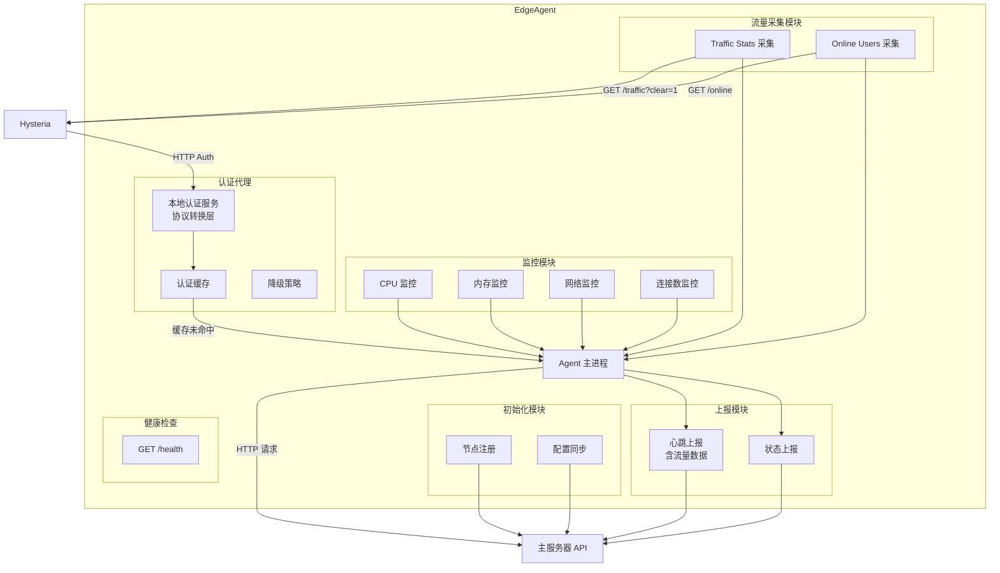

### 5.1.1 Edge Agent 启动与初始化流程

Edge Agent 启动时执行以下初始化序列：

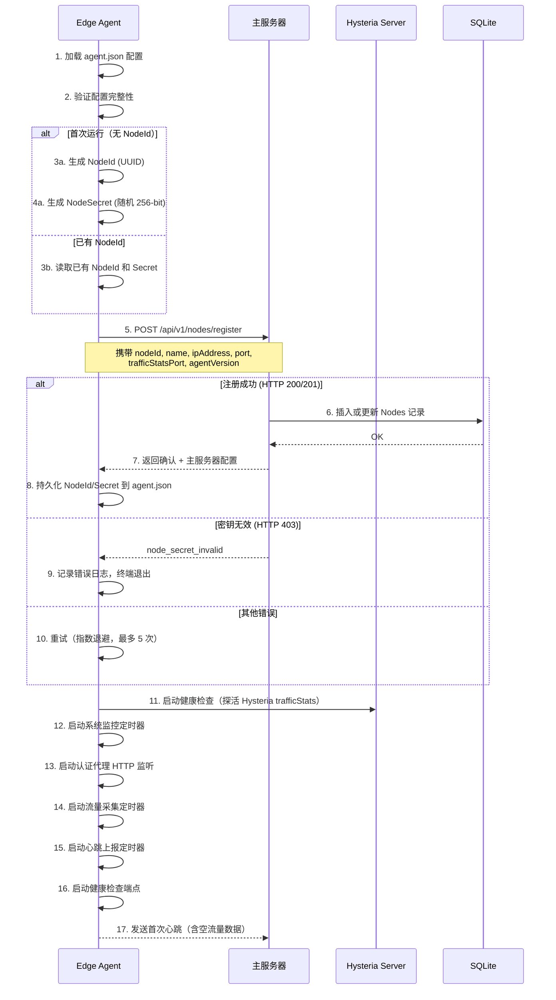

> **注册重试策略**：使用指数退避算法，初始间隔 2s，最大间隔 60s，最多重试 5 次。全部重试失败后 Agent 退出，由 systemd 的 `Restart=always` 策略重启。

### 5.2 系统监控实现

#### 5.2.1 CPU 使用率

```csharp
// 使用 /proc/stat 读取 CPU 信息
// 计算两次采样之间的差值
public double GetCpuUsage()
{
    var stat1 = ReadProcStat();
    Thread.Sleep(1000);
    var stat2 = ReadProcStat();
    
    var totalDiff = stat2.Total - stat1.Total;
    var idleDiff = stat2.Idle - stat1.Idle;
    
    return (1.0 - (double)idleDiff / totalDiff) * 100;
}
```

#### 5.2.2 内存使用率

```csharp
// 读取 /proc/meminfo
public MemoryInfo GetMemoryInfo()
{
    var memInfo = ParseProcMeminfo();
    
    var used = memInfo.Total - memInfo.Available;
    var usagePercent = (double)used / memInfo.Total * 100;
    
    return new MemoryInfo
    {
        TotalMb = memInfo.Total / 1024 / 1024,
        UsedMb = used / 1024 / 1024,
        UsagePercent = usagePercent
    };
}
```

#### 5.2.3 网络流量

```csharp
// 读取 /proc/net/dev
public NetworkInfo GetNetworkInfo()
{
    var interfaces = ParseProcNetDev();
    
    // 只统计非 lo 接口
    var totalIn = interfaces
        .Where(i => i.Name != "lo")
        .Sum(i => i.BytesReceived);
    
    var totalOut = interfaces
        .Where(i => i.Name != "lo")
        .Sum(i => i.BytesSent);
    
    return new NetworkInfo
    {
        TotalInBytes = totalIn,
        TotalOutBytes = totalOut
    };
}
```

### 5.3 认证代理实现

Edge Agent 在本地启动一个 HTTP 服务，监听指定端口，接收 Hysteria 的认证请求。核心职责是完成 **Hysteria 原生协议 → 项目内部协议** 的转换。

#### 5.3.1 协议转换逻辑

```csharp
// Edge Agent 认证代理核心逻辑
public async Task<HysteriaAuthResponse> HandleAuthAsync(HysteriaAuthRequest request)
{
    // 1. 解析 Hysteria 原生请求中的 auth 字段
    //    Hysteria 发送: { "addr": "1.2.3.4:5566", "auth": "base64_creds", "tx": 52428800 }
    var (username, password) = ParseAuthField(request.Auth);
    
    // 2. 检查本地缓存
    if (_cache.TryGet(username, out var cachedResult))
        return cachedResult;
    
    // 3. 构造内部 API 请求
    var internalRequest = new InternalAuthRequest
    {
        Username = username,
        Password = password,
        NodeId = _config.NodeId,
        ClientIp = ExtractIp(request.Addr)
    };
    
    // 4. 转发到主服务器
    var internalResponse = await _masterClient.PostAsync<InternalAuthResponse>(
        "/api/v1/auth/hysteria", internalRequest
    );
    
    // 5. 转换响应为 Hysteria 原生格式
    var hysteriaResponse = new HysteriaAuthResponse
    {
        Ok = internalResponse.Success,
        Id = internalResponse.Success ? username : ""
    };
    
    // 6. 更新缓存
    if (internalResponse.Success)
        _cache.Set(username, hysteriaResponse);
    
    return hysteriaResponse;
}
```

#### 5.3.2 协议转换对照表

| 转换方向 | Hysteria 原生 | → | 项目内部 |
|-----------|--------------|---|----------|
| 请求 | `auth` (单一凭据字段) | → | `username` + `password`（分离） |
| 请求 | `addr` ("IP:Port") | → | `clientIp`（仅 IP） |
| 请求 | `tx`（速率） | → | 含在请求体中 |
| 请求 | 无节点标识 | → | `nodeId`（Agent 配置注入） |
| 响应 | `ok` + `id` | ← | `success` + `userId` |

> **协议详情**: Hysteria 原生 HTTP Auth 协议定义见 [`hysteria-server-config.md` §9.1](hysteria-server-config.md#91-http-验证本项目的核心集成方式)。

### 5.4 流量采集实现（方案一）

> 这是流量统计的**核心实现**。方案选择背景和与其他方案的对比见 [§11.1 方案选型](#111-方案选型)。

Edge Agent 定时调用本地 Hysteria 的 [`trafficStats` API](hysteria-traffic-stats-api.md)，采集流量和在线用户数据，合并到心跳上报中。

```csharp
// Edge Agent 流量采集定时任务
public async Task CollectAndReportTrafficAsync()
{
    // 1. 调用本地 Hysteria trafficStats API — 获取流量并在返回后清零
    var traffic = await _httpClient.GetFromJsonAsync<Dictionary<string, TrafficInfo>>(
        "http://127.0.0.1:9999/traffic?clear=1",
        headers: new { Authorization = _config.TrafficStatsSecret }
    );
    
    // 2. 获取在线用户连接数
    var online = await _httpClient.GetFromJsonAsync<Dictionary<string, int>>(
        "http://127.0.0.1:9999/online",
        headers: new { Authorization = _config.TrafficStatsSecret }
    );
    
    // 3. 合并到心跳上报
    await _masterClient.PostAsync($"/api/v1/nodes/{_config.NodeId}/heartbeat", new
    {
        // ... 系统监控数据 ...
        UserTraffic = traffic,     // { "user1": { "tx": 1024, "rx": 512 }, ... }
        OnlineUsers = online,      // { "user1": 2, "user2": 1 }
        ReportedAt = DateTime.UtcNow
    });
}
```

#### 5.4.1 数据流向

```
Hysteria Server                Edge Agent                  主服务器
     │                             │                           │
     │  (每 N 秒)                   │                           │
     │◄──── GET /traffic?clear=1 ──│                           │
     │───► {user: {tx, rx}}        │                           │
     │                             │                           │
     │◄──── GET /online ──────────│                           │
     │───► {user: connections}     │                           │
     │                             │──► POST /api/v1/nodes/   │
     │                             │    {nodeId}/heartbeat     │
     │                             │    (含 userTraffic +      │
     │                             │     onlineUsers)          │
     │                             │                           │
     │                             │◄─── 主服务器更新:         │
     │                             │     - Users.UsedTrafficBytes
     │                             │     - TrafficRecords 写入 │
     │                             │     - NodeTraffic 记录    │
```

#### 5.4.2 流量方向映射

| Hysteria API 字段 | 视角 | 含义 | 主服务器数据库 |
|-------------------|------|------|---------------|
| `tx` | 服务端发出 | 用户下载 | `TrafficRecords.BytesOut` |
| `rx` | 服务端收到 | 用户上传 | `TrafficRecords.BytesIn` |
| 两者合计 | — | 用户总流量 | `Users.UsedTrafficBytes` |
| `online[user]` | — | 在线设备数 | 用于更新 `Sessions` 表 |

### 5.5 关键配置说明

Edge Agent 需要配置 `trafficStats` 相关信息以访问本地 Hysteria API：

```json
{
    "TrafficStats": {
        "ListenAddress": "127.0.0.1",
        "ListenPort": 9999,
        "Secret": "your_secret_here",
        "CollectIntervalSeconds": 30
    }
}
```

> **安全建议**: Hysteria 的 `trafficStats.listen` 应绑定到 `127.0.0.1`，仅允许本地 Edge Agent 访问。详见 [`hysteria-server-config.md` §14](hysteria-server-config.md#14-流量统计-api-trafficstats)。

---

## 6. 安全设计

### 6.1 认证安全

| 安全措施 | 说明 |
|----------|------|
| 密码加密 | 使用 BCrypt 算法存储用户密码和管理员密码（Work Factor = 12） |
| API 认证 | 管理员 API 使用 JWT Token（HMAC-SHA256），过期时间可配置 |
| 节点认证 | 节点间通信使用 Secret Key，通过 `X-Node-Secret` 请求头传递 |
| HTTPS | 生产环境强制使用 HTTPS |
| 请求签名 | 关键操作添加请求签名防重放 |
| trafficStats 安全 | 绑定 `127.0.0.1` + 设置 secret，防止未授权访问 |
| 管理员登录保护 | 连续失败 5 次后锁定 15 分钟（可配置） |
| JWT Token 刷新 | Token 过期前 5 分钟可刷新，无需重新登录 |

### 6.2 数据安全

| 安全措施 | 说明 |
|----------|------|
| SQL 注入防护 | 使用 EF Core 参数化查询 |
| XSS 防护 | 输入验证和输出编码 |
| 敏感数据加密 | 密钥等敏感数据使用 AES-256-GCM 加密存储 |
| 日志脱敏 | 日志中不记录密码等敏感信息，仅保留用户名和操作类型 |
| 审计追踪 | 所有管理员操作记录到 `AdminAuditLogs`，不可删除 |

### 6.3 网络安全

| 安全措施 | 说明 |
|----------|------|
| CORS 配置 | 限制跨域访问，仅允许配置的管理端域名 |
| 速率限制 | API 请求速率限制（见 [§6.4](#64-速率限制配置)） |
| IP 白名单 | 管理 API 可配置 IP 白名单 |
| 节点密钥 | 节点注册和通信需要有效密钥 |
| 本地回环绑定 | Hysteria `trafficStats` 和 Edge Agent 认证代理均绑定 `127.0.0.1` |
| 请求体大小限制 | 限制请求体最大 1MB，防止大 payload 攻击 |

### 6.4 速率限制配置

| 端点分组 | 限制规则 | 说明 |
|----------|----------|------|
| 认证 API (`/api/v1/auth/*`) | 100 次/分钟/IP | Edge Agent 汇聚了多用户请求，适度宽松 |
| 管理登录 (`/api/v1/admin/login`) | 10 次/分钟/IP | 防止暴力破解 |
| 管理 API 其他 | 60 次/分钟/Token | 管理员操作频率控制 |
| 节点心跳 (`/api/v1/nodes/*/heartbeat`) | 不限制 | 心跳需及时处理 |
| 健康检查 (`/health`) | 不限制 | 监控系统高频调用 |

> 速率限制中间件使用 ASP.NET Core 内置的 `RateLimiter` 中间件实现，基于固定窗口算法。

### 6.5 CORS 配置

```json
{
    "Cors": {
        "AllowedOrigins": ["https://admin.example.com"],
        "AllowedMethods": ["GET", "POST", "PUT", "DELETE"],
        "AllowedHeaders": ["Authorization", "Content-Type"],
        "ExposeHeaders": ["X-Request-Id"],
        "MaxAgeSeconds": 3600
    }
}
```

> 仅在管理 API 路由（`/api/v1/admin/*`、`/api/v1/users/*`）启用 CORS。节点通信 API（`/api/v1/auth/*`、`/api/v1/nodes/*`）不启用 CORS（无浏览器场景）。

### 6.6 密钥管理策略

| 密钥类型 | 生成方式 | 长度 | 存储 | 轮换 |
|----------|----------|------|------|------|
| JWT Secret | 管理员配置 | ≥ 256-bit (32 字符) | `appsettings.json` 或环境变量 | 手动轮换 |
| 节点 SecretKey | Edge Agent 首次启动时随机生成 | 256-bit (64 hex) | `Nodes` 表（AES 加密） + `agent.json` | 通过 `SecretVersion` 支持多版本并存 |
| trafficStats Secret | 管理员配置 | ≥ 128-bit (16 字符) | `Nodes` 表（AES 加密） + `hysteria.yaml` | 手动轮换 |

**节点密钥轮换流程**：

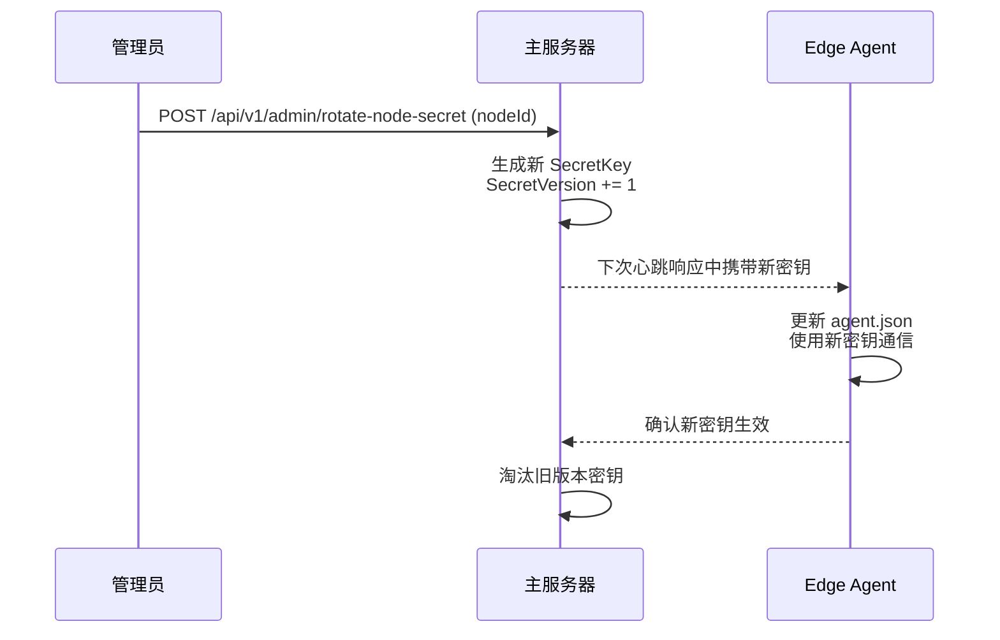

> **多版本密钥**：在轮换期间，主服务器同时接受旧版本和新版本的 `SecretKey`，确保零停机切换。

---

## 7. 项目结构

```
HysteriaAuth/
├── src/
│   ├── HysteriaAuth.Master/           # 主服务器项目
│   │   ├── Controllers/
│   │   │   ├── AuthController.cs      # 认证控制器
│   │   │   ├── UsersController.cs     # 用户管理控制器
│   │   │   ├── NodesController.cs     # 节点管理控制器
│   │   │   ├── AdminController.cs     # 管理功能控制器
│   │   │   ├── TrafficController.cs   # 流量统计控制器
│   │   │   └── HealthController.cs    # 健康检查控制器
│   │   ├── Services/
│   │   │   ├── AuthService.cs         # 认证服务
│   │   │   ├── UserService.cs         # 用户服务
│   │   │   ├── NodeService.cs         # 节点服务
│   │   │   ├── TrafficService.cs      # 流量服务
│   │   │   ├── AdminService.cs        # 管理员服务
│   │   │   └── AuditService.cs        # 审计日志服务
│   │   ├── Repositories/
│   │   │   ├── IUserRepository.cs
│   │   │   ├── INodeRepository.cs
│   │   │   ├── ITrafficRepository.cs
│   │   │   ├── IAuthLogRepository.cs
│   │   │   ├── IAdminRepository.cs
│   │   │   └── IAuditLogRepository.cs
│   │   ├── Models/
│   │   │   ├── Entities/              # EF Core 实体
│   │   │   │   ├── User.cs
│   │   │   │   ├── Node.cs
│   │   │   │   ├── TrafficRecord.cs
│   │   │   │   ├── AuthLog.cs
│   │   │   │   ├── Session.cs
│   │   │   │   ├── NodeStatus.cs
│   │   │   │   ├── NodeTraffic.cs
│   │   │   │   ├── Admin.cs
│   │   │   │   └── AdminAuditLog.cs
│   │   │   ├── DTOs/                  # 数据传输对象
│   │   │   │   ├── UserDto.cs
│   │   │   │   ├── NodeDto.cs
│   │   │   │   ├── AuthRequest.cs
│   │   │   │   ├── AdminDto.cs
│   │   │   │   └── ErrorResponse.cs
│   │   │   └── ViewModel/             # 视图模型
│   │   ├── Data/
│   │   │   ├── AppDbContext.cs        # EF Core 上下文
│   │   │   └── Migrations/            # 数据库迁移
│   │   ├── Middleware/
│   │   │   ├── JwtMiddleware.cs       # JWT 认证中间件
│   │   │   ├── NodeAuthMiddleware.cs  # 节点密钥认证中间件
│   │   │   ├── ExceptionMiddleware.cs # 全局异常处理中间件
│   │   │   ├── RateLimitMiddleware.cs # 速率限制中间件
│   │   │   └── AuditMiddleware.cs     # 管理员操作审计中间件
│   │   ├── Config/
│   │   │   ├── AppSettings.cs         # 配置类
│   │   │   ├── JwtSettings.cs         # JWT 配置
│   │   │   └── RateLimitSettings.cs   # 速率限制配置
│   │   ├── appsettings.json           # 配置文件
│   │   └── Program.cs                 # 入口
│   │
│   └── HysteriaAuth.Agent/            # 边缘节点 Agent 项目
│       ├── Services/
│       │   ├── SystemMonitor.cs       # 系统监控服务
│       │   ├── AuthProxy.cs           # 认证代理服务（含协议转换）
│       │   ├── TrafficCollector.cs    # 流量采集服务
│       │   ├── StatusReporter.cs      # 状态上报服务
│       │   └── Initializer.cs         # 启动初始化与注册服务
│       ├── Models/
│       │   ├── SystemMetrics.cs       # 系统指标模型
│       │   ├── TrafficInfo.cs         # 流量数据模型
│       │   └── NodeConfig.cs          # 节点配置
│       ├── Config/
│       │   └── agent.json             # Agent 配置
│       ├── Middleware/
│       │   └── HealthCheckMiddleware.cs # 健康检查端点
│       └── Program.cs                 # 入口
│
├── tests/
│   ├── HysteriaAuth.Tests/
│   │   ├── Unit/
│   │   │   ├── Services/
│   │   │   └── Controllers/
│   │   ├── Integration/
│   │   │   ├── ApiTests/
│   │   │   └── DatabaseTests/
│   │   └── E2E/
│   │       └── AuthFlowTests/
│
├── document/
│   ├── architecture-design.md         # 本文档
│   ├── hysteria-server-config.md      # Hysteria 服务端配置参考
│   └── hysteria-traffic-stats-api.md  # Hysteria 流量统计 API 文档
│
├── scripts/
│   ├── deploy-master.sh               # 主服务器部署脚本
│   ├── deploy-agent.sh                # Agent 部署脚本
│   ├── backup-db.sh                   # 数据库备份脚本
│   └── restore-db.sh                  # 数据库恢复脚本
│
├── docker/
│   ├── Dockerfile.master
│   ├── Dockerfile.agent
│   └── docker-compose.yml
│
└── HysteriaAuth.sln                   # 解决方案文件
```

---

## 8. 配置说明

### 8.1 主服务器配置 (appsettings.json)

```json
{
    "ConnectionStrings": {
        "DefaultConnection": "Data Source=/var/lib/hysteria-auth/hysteria-auth.db"
    },
    "Jwt": {
        "Secret": "your-super-secret-key-at-least-32-chars",
        "Issuer": "hysteria-auth-master",
        "Audience": "hysteria-auth-admin",
        "ExpirationMinutes": 1440,
        "RefreshWindowMinutes": 5
    },
    "Auth": {
        "CacheEnabled": true,
        "CacheExpirationMinutes": 5,
        "MaxAuthAttemptsPerMinute": 10,
        "LockoutDurationMinutes": 15
    },
    "Node": {
        "HeartbeatTimeoutSeconds": 90,
        "StatusReportIntervalSeconds": 30,
        "KeyRotationEnabled": true
    },
    "Traffic": {
        "CollectIntervalSeconds": 30,
        "TrafficDataRetentionDays": 90,
        "ConcurrentUpdateRetryCount": 3,
        "IdempotencyEnabled": true
    },
    "Admin": {
        "MaxFailedLoginAttempts": 5,
        "LockoutDurationMinutes": 15,
        "AuditLogRetentionDays": 365
    },
    "RateLimit": {
        "AuthPerMinute": 100,
        "AdminLoginPerMinute": 10,
        "AdminApiPerMinute": 60
    },
    "Cors": {
        "AllowedOrigins": ["https://admin.example.com"],
        "AllowedMethods": ["GET", "POST", "PUT", "DELETE"],
        "AllowedHeaders": ["Authorization", "Content-Type"],
        "MaxAgeSeconds": 3600
    },
    "Backup": {
        "AutoBackupEnabled": true,
        "BackupIntervalHours": 24,
        "BackupDirectory": "/var/backups/hysteria-auth",
        "RetentionDays": 30
    },
    "Logging": {
        "LogLevel": {
            "Default": "Information",
            "Microsoft": "Warning",
            "HysteriaAuth": "Debug"
        },
        "File": "/var/log/hysteria-auth/master.log"
    }
}
```

### 8.2 边缘节点 Agent 配置 (agent.json)

```json
{
    "NodeId": "edge-node-01",
    "NodeName": "Tokyo Edge Node",
    "MasterServerUrl": "https://master.example.com",
    "NodeSecret": "your-node-secret-key",
    "AgentVersion": "1.0.0",
    "Init": {
        "RegistrationRetryMax": 5,
        "RegistrationRetryInitialSeconds": 2,
        "RegistrationRetryMaxSeconds": 60
    },
    "AuthProxy": {
        "ListenAddress": "127.0.0.1",
        "ListenPort": 8080
    },
    "TrafficStats": {
        "ListenAddress": "127.0.0.1",
        "ListenPort": 9999,
        "Secret": "your_traffic_stats_secret",
        "CollectIntervalSeconds": 30
    },
    "Monitor": {
        "IntervalSeconds": 10,
        "NetworkInterfaces": ["eth0"]
    },
    "Reporter": {
        "IntervalSeconds": 30,
        "RetryCount": 3,
        "RetryDelaySeconds": 5
    },
    "Cache": {
        "Enabled": true,
        "MaxSize": 1000,
        "ExpirationMinutes": 5
    },
    "HealthCheck": {
        "Enabled": true,
        "ListenAddress": "127.0.0.1",
        "ListenPort": 8081
    },
    "Logging": {
        "LogLevel": "Information",
        "File": "/var/log/hysteria-auth/agent.log"
    }
}
```

| 新增配置项 | 说明 |
|-----------|------|
| `Init.RegistrationRetryMax` | 注册重试最大次数 |
| `Init.RegistrationRetryInitialSeconds` | 注册重试初始间隔（秒） |
| `Init.RegistrationRetryMaxSeconds` | 注册重试最大间隔（秒） |
| `HealthCheck.Enabled` | 是否启用健康检查端点 |
| `HealthCheck.ListenAddress` | 健康检查监听地址 |
| `HealthCheck.ListenPort` | 健康检查监听端口 |
| `TrafficStats.ListenAddress` | Hysteria trafficStats API 监听地址（建议 `127.0.0.1`） |
| `TrafficStats.ListenPort` | Hysteria trafficStats API 端口 |
| `TrafficStats.Secret` | API 认证密钥，需与 Hysteria 配置中的 `trafficStats.secret` 一致 |
| `TrafficStats.CollectIntervalSeconds` | 流量采集间隔（秒），默认 30s |

---

## 9. 部署方案

### 9.1 主服务器部署

#### 9.1.1 系统要求

- Ubuntu 20.04+ / Debian 11+
- .NET 8.0 Runtime
- 至少 1GB RAM
- 至少 10GB 磁盘空间

#### 9.1.2 部署步骤

```bash
#!/bin/bash
# deploy-master.sh

# 1. 安装 .NET Runtime
sudo apt-get update
sudo apt-get install -y dotnet-runtime-8.0

# 2. 创建应用目录
sudo mkdir -p /opt/hysteria-auth/master
sudo mkdir -p /var/lib/hysteria-auth
sudo mkdir -p /var/log/hysteria-auth
sudo mkdir -p /var/backups/hysteria-auth

# 3. 复制应用文件
cp -r publish/* /opt/hysteria-auth/master/

# 4. 设置权限
sudo chown -r www-data:www-data /opt/hysteria-auth/master
sudo chown -r www-data:www-data /var/lib/hysteria-auth
sudo chown -r www-data:www-data /var/log/hysteria-auth
sudo chown -r www-data:www-data /var/backups/hysteria-auth

# 5. 创建 systemd 服务
sudo tee /etc/systemd/system/hysteria-auth-master.service > /dev/null << EOF
[Unit]
Description=Hysteria Auth Master Server
After=network.target

[Service]
Type=notify
User=www-data
Group=www-data
WorkingDirectory=/opt/hysteria-auth/master
ExecStart=/usr/bin/dotnet /opt/hysteria-auth/master/HysteriaAuth.Master.dll
Restart=always
RestartSec=5
Environment=ASPNETCORE_ENVIRONMENT=Production
Environment=ASPNETCORE_URLS=http://127.0.0.1:5000

[Install]
WantedBy=multi-user.target
EOF

# 6. 启动服务
sudo systemctl daemon-reload
sudo systemctl enable hysteria-auth-master
sudo systemctl start hysteria-auth-master
```

### 9.2 边缘节点 Agent 部署

#### 9.2.1 系统要求

- Ubuntu 20.04+ / Debian 11+
- .NET 8.0 Runtime
- 至少 256MB RAM
- 至少 100MB 磁盘空间

#### 9.2.2 部署步骤

```bash
#!/bin/bash
# deploy-agent.sh

# 1. 安装 .NET Runtime
sudo apt-get update
sudo apt-get install -y dotnet-runtime-8.0

# 2. 创建应用目录
sudo mkdir -p /opt/hysteria-auth/agent
sudo mkdir -p /var/log/hysteria-auth

# 3. 复制应用文件
cp -r publish/* /opt/hysteria-auth/agent/

# 4. 创建配置文件
sudo tee /opt/hysteria-auth/agent/agent.json > /dev/null << EOF
{
    "NodeId": "$(uuidgen)",
    "NodeName": "$(hostname)",
    "MasterServerUrl": "https://master.example.com",
    "NodeSecret": "$(openssl rand -hex 32)",
    "AgentVersion": "1.0.0",
    "Init": {
        "RegistrationRetryMax": 5,
        "RegistrationRetryInitialSeconds": 2,
        "RegistrationRetryMaxSeconds": 60
    },
    "AuthProxy": {
        "ListenAddress": "127.0.0.1",
        "ListenPort": 8080
    },
    "TrafficStats": {
        "ListenAddress": "127.0.0.1",
        "ListenPort": 9999,
        "Secret": "$(openssl rand -hex 16)",
        "CollectIntervalSeconds": 30
    },
    "Monitor": {
        "IntervalSeconds": 10,
        "NetworkInterfaces": ["eth0"]
    },
    "Reporter": {
        "IntervalSeconds": 30,
        "RetryCount": 3,
        "RetryDelaySeconds": 5
    },
    "Cache": {
        "Enabled": true,
        "MaxSize": 1000,
        "ExpirationMinutes": 5
    },
    "HealthCheck": {
        "Enabled": true,
        "ListenAddress": "127.0.0.1",
        "ListenPort": 8081
    }
}
EOF

# 5. 设置权限
sudo chown -r root:root /opt/hysteria-auth/agent
sudo chmod 600 /opt/hysteria-auth/agent/agent.json

# 6. 创建 systemd 服务
sudo tee /etc/systemd/system/hysteria-auth-agent.service > /dev/null << EOF
[Unit]
Description=Hysteria Auth Edge Agent
After=network.target hysteria-server.service
Requires=hysteria-server.service

[Service]
Type=notify
User=root
Group=root
WorkingDirectory=/opt/hysteria-auth/agent
ExecStart=/usr/bin/dotnet /opt/hysteria-auth/agent/HysteriaAuth.Agent.dll
Restart=always
RestartSec=5
Environment=ASPNETCORE_ENVIRONMENT=Production

[Install]
WantedBy=multi-user.target
EOF

# 7. 启动服务
sudo systemctl daemon-reload
sudo systemctl enable hysteria-auth-agent
sudo systemctl start hysteria-auth-agent
```

### 9.3 Nginx 反向代理配置

```nginx
server {
    listen 443 ssl http2;
    server_name master.example.com;

    ssl_certificate /etc/ssl/certs/hysteria-auth.crt;
    ssl_certificate_key /etc/ssl/private/hysteria-auth.key;

    # 健康检查（无需认证）
    location /health {
        proxy_pass http://127.0.0.1:5000;
        proxy_set_header Host $host;
        access_log off;
    }

    # 认证 API（Edge Agent 调用）
    location /api/v1/auth/ {
        proxy_pass http://127.0.0.1:5000;
        proxy_set_header Host $host;
        proxy_set_header X-Real-IP $remote_addr;
        proxy_set_header X-Forwarded-For $proxy_add_x_forwarded_for;
        proxy_set_header X-Forwarded-Proto $scheme;
    }

    # 管理 API
    location /api/v1/admin/ {
        # 可配置 IP 白名单
        # allow 192.168.1.0/24;
        # deny all;
        
        proxy_pass http://127.0.0.1:5000;
        proxy_set_header Host $host;
        proxy_set_header X-Real-IP $remote_addr;
    }

    # 用户管理 API
    location /api/v1/users/ {
        proxy_pass http://127.0.0.1:5000;
        proxy_set_header Host $host;
        proxy_set_header X-Real-IP $remote_addr;
    }

    # 节点 API
    location /api/v1/nodes/ {
        proxy_pass http://127.0.0.1:5000;
        proxy_set_header Host $host;
        proxy_set_header X-Real-IP $remote_addr;
    }
}
```

---

## 10. Hysteria 集成配置

> **关联文档**: [`hysteria-server-config.md`](hysteria-server-config.md) — 完整配置项说明

### 10.1 Hysteria 服务器配置 (YAML)

边缘节点 Hysteria 服务端配置模板：

```yaml
# Hysteria 2 服务端配置 — 边缘节点模板
listen: :443

tls:
  cert: /etc/hysteria/server.crt
  key: /etc/hysteria/server.key

auth:
  type: http
  http:
    url: http://127.0.0.1:8080/auth    # Edge Agent 认证代理
    insecure: false

bandwidth:
  up: 100 mbps
  down: 100 mbps

ignoreClientBandwidth: false

sniff:
  enable: true

udpIdleTimeout: 60s

speedTest: false

# 流量统计 API — Edge Agent 通过此接口采集流量数据
trafficStats:
  listen: 127.0.0.1:9999               # 仅本地回环可访问
  secret: your_traffic_stats_secret     # 与 Edge Agent agent.json 中一致

# 伪装
masquerade:
  type: proxy
  proxy:
    url: https://www.bing.com
    rewriteHost: true
```

> **配置说明**:
> - [`auth.http`](hysteria-server-config.md#9-验证-auth): 指向 Edge Agent 的本地认证代理
> - [`trafficStats`](hysteria-server-config.md#14-流量统计-api-trafficstats): 开启流量统计 API，供 Edge Agent 采集用户流量
> - 其他配置项详见 [`hysteria-server-config.md`](hysteria-server-config.md)

### 10.2 认证流程

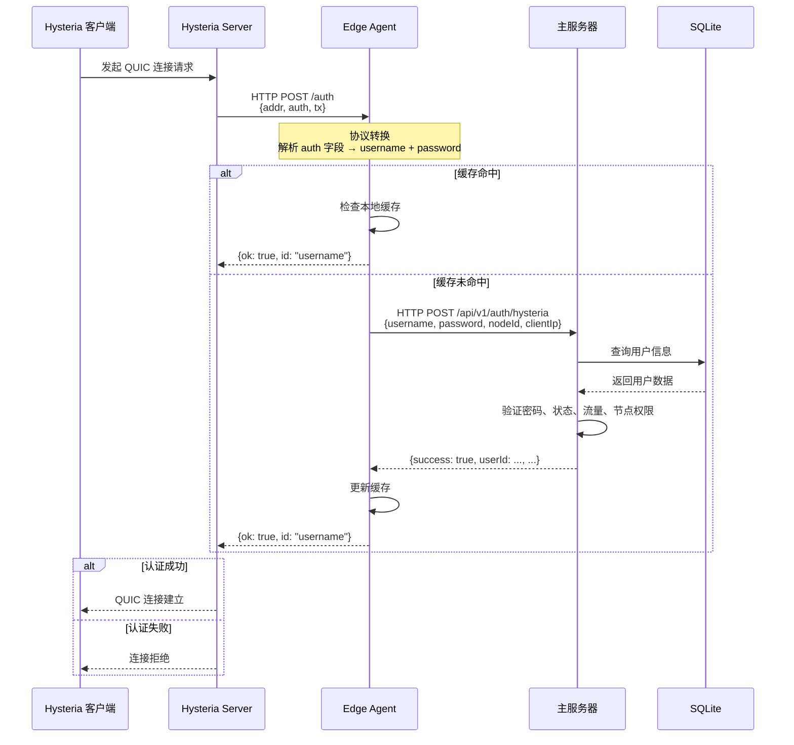

---

## 11. 流量统计与扣减

> **关联文档**: [`hysteria-traffic-stats-api.md`](hysteria-traffic-stats-api.md) — Hysteria 流量统计 API 完整参考

### 11.1 方案选型

针对流量统计，评估了以下两种方案：

| 方案 | 描述 | 优点 | 缺点 |
|------|------|------|------|
| **方案一（采用）** | Edge Agent 内部采集，定时调用本地 Hysteria `trafficStats` API，汇总后上报主服务器 | 延迟低（本地回环）、无需暴露端口、安全性好 | 依赖 Edge Agent 稳定运行 |
| 方案二 | 主服务器直接调用各边缘节点的 `trafficStats` API | 无需 Edge Agent 参与 | 需要边缘节点开放端口或 VPN 组网、网络延迟高、安全风险大 |

**选择方案一的核心理由**：

1. **安全性**：`trafficStats.listen` 绑定 `127.0.0.1`，仅本地进程可访问，无需暴露到公网
2. **可靠性**：本地回环调用不受网络波动影响
3. **数据一致性**：使用 `?clear=1` 参数在读取后清零，确保每次采集的是增量数据，不会重复计数
4. **架构简洁**：Edge Agent 本身就是数据汇总点，流量数据和系统监控数据合并上报，减少主服务器的连接数

### 11.2 流量采集流程

```mermaid
flowchart TD
    Start[Edge Agent 定时器触发] --> CallTraffic[GET /traffic?clear=1]
    CallTraffic --> CallOnline[GET /online]
    CallOnline --> Merge[合并系统监控数据]
    Merge --> Report[POST /api/v1/nodes/{nodeId}/heartbeat]
    
    Report --> MasterProcess[主服务器处理]
    
    subgraph MasterProcess[主服务器处理流程]
        direction TB
        CheckIdempotency{幂等键检查}
        CheckIdempotency -->|新数据| BeginTx[开启数据库事务]
        CheckIdempotency -->|重复数据| Skip[跳过（重复上报）]
        BeginTx --> UpdateUsers[遍历 userTraffic<br/>更新 Users.UsedTrafficBytes]
        UpdateUsers --> InsertRecords[写入 TrafficRecords<br/>含 IdempotencyKey<br/>tx → BytesOut, rx → BytesIn]
        InsertRecords --> UpdateSessions[更新 Sessions 表<br/>在线状态]
        UpdateSessions --> UpdateNodeTraffic[写入 NodeTraffic<br/>节点汇总]
        UpdateNodeTraffic --> CommitTx[提交事务]
        CheckQuota{检查流量配额}
        CommitTx --> CheckQuota
    end
    
    Skip --> CheckQuota
    
    CheckQuota -->|超额| KickUser[调用 Edge Agent<br/>踢用户下线]
    CheckQuota -->|正常| Done[完成]
    
    KickUser --> Done
```

### 11.3 流量检查流程（认证时）

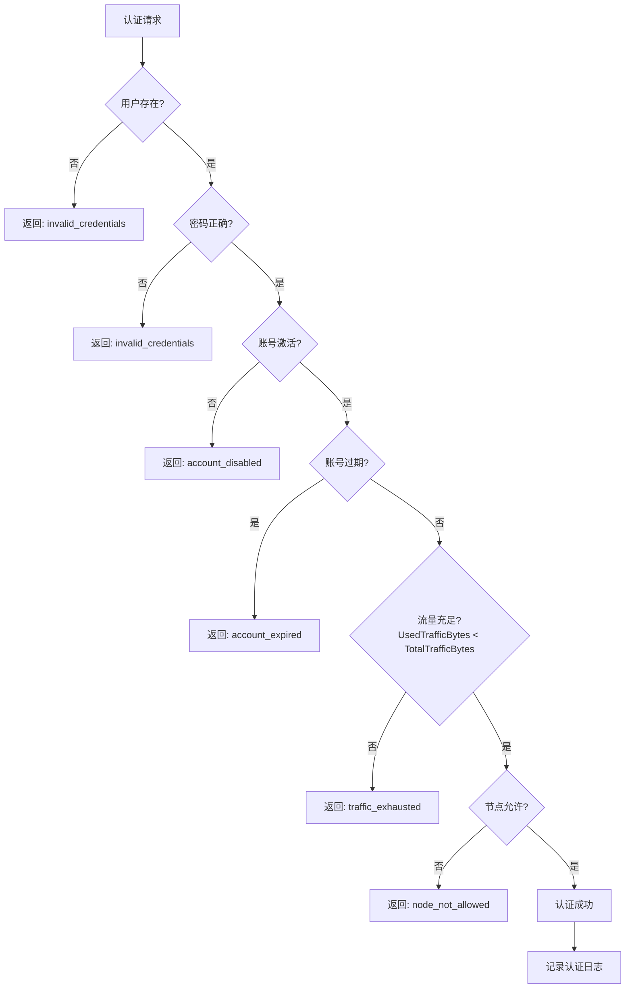

> **流量检查策略**: 认证时仅校验 `Users.UsedTrafficBytes < Users.TotalTrafficBytes`，不进行预扣减。实际流量扣减通过定时采集上报机制异步完成（§11.2）。当流量超额时，主服务器可主动通过 Edge Agent 调用 [`POST /kick`](hysteria-traffic-stats-api.md#post-kick--踢用户下线) 断开用户连接。

### 11.4 数据可靠性保障

| 保障措施 | 说明 |
|----------|------|
| `?clear=1` 原子操作 | 读取后立即清零，防止重复计数 |
| 增量上报 | 每次上报的是自上次采集以来的增量，而非累计值 |
| 幂等键保护 | 使用 `{nodeId}_{userId}_{timestamp}` 幂等键防止上报重试导致重复计入（详见 [§15.2](#152-流量数据幂等性)） |
| 上报重试 | Edge Agent 上报失败时重试 3 次（可配置），防止数据丢失 |
| 本地缓存兜底 | 如果主服务器不可达，Edge Agent 缓存流量数据，待恢复后补报 |
| 数据库事务 | 主服务器在单个事务中更新 `UsedTrafficBytes` 和写入 `TrafficRecords` |
| 并发扣减保护 | 使用乐观并发控制（行版本），确保 `UsedTrafficBytes` 并发更新安全（详见 [§15.1](#151-usersusedtrafficbytes-并发扣减)） |

---

## 12. 异常处理与降级

### 12.1 网络异常处理

| 场景 | 处理策略 |
|------|----------|
| 主服务器不可达 | Agent 使用本地缓存进行认证 |
| 缓存过期且主服务器不可达 | 拒绝新连接，允许已连接用户继续使用 |
| 数据库异常 | 返回 500 错误，记录日志 |
| 节点心跳超时 | 主服务器标记节点为离线状态（`IsActive = false`） |
| Hysteria trafficStats API 不可达 | Agent 跳过本次采集，记录警告日志，下次重试 |
| 流量数据上报失败 | 缓存到本地，下次上报时合并补报 |
| 节点密钥无效 | Agent 记录错误日志，持续重试注册，不清除已有密钥 |
| 数据库锁冲突 | 乐观并发重试（最多 3 次），超限后记录错误并返回 500 |

### 12.2 降级策略

```csharp
public async Task<AuthResult> AuthenticateAsync(AuthRequest request)
{
    try
    {
        // 尝试从主服务器认证
        return await _masterClient.AuthenticateAsync(request);
    }
    catch (Exception ex) when (_cache.IsEnabled)
    {
        _logger.LogWarning(ex, "主服务器不可达，使用缓存认证");
        
        // 降级：使用缓存认证
        return _cache.Authenticate(request.Username, request.Password);
    }
    catch (Exception ex)
    {
        _logger.LogError(ex, "认证失败");
        return AuthResult.Fail("internal_error");
    }
}
```

### 12.3 边缘节点离线处理

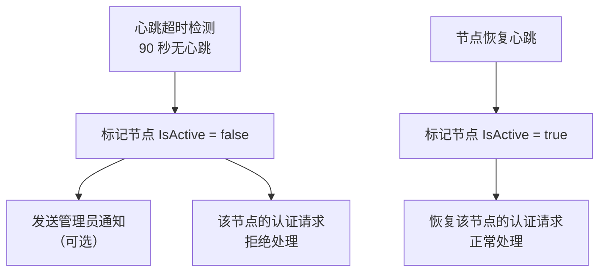

---

## 13. 监控与日志

### 13.1 日志级别

| 级别 | 说明 | 示例 |
|------|------|------|
| Trace | 详细调试信息 | 请求/响应详情、SQL 参数 |
| Debug | 调试信息 | 缓存命中/未命中、幂等检查结果 |
| Information | 一般信息 | 服务启动/停止、流量采集完成、节点注册成功 |
| Warning | 警告信息 | 主服务器响应慢、流量采集跳过、心跳超时 |
| Error | 错误信息 | 认证失败、数据库错误、API 不可达 |
| Critical | 严重错误 | 服务崩溃、数据库损坏 |

### 13.2 关键指标监控

| 指标 | 说明 | 数据来源 |
|------|------|----------|
| 认证成功率 | 认证成功次数 / 总认证次数 | `AuthLogs` 表 |
| 认证 P50/P99 延迟 | 认证请求处理时间分位数 | 内置 metrics |
| 活跃用户数 | 当前在线用户数 | Hysteria `/online` API |
| 用户流量使用量 | 每用户上传/下载字节数 | Hysteria `/traffic` API → `TrafficRecords` |
| 节点流量汇总 | 每节点总入站/出站流量 | `NodeTraffic` 表 |
| 流量采集间隔 | 两次流量采集的实际间隔 | Edge Agent 日志 |
| 节点健康状态 | 节点在线/离线状态 | 心跳超时检测 |
| TCP 流详情 | 活跃连接的目标地址和流量 | Hysteria `/dump/streams` API（按需调用） |
| 数据库大小 | SQLite 文件大小 | 文件系统 |
| API 请求速率 | 每分钟请求数（按端点分组） | 速率限制中间件 |

### 13.3 性能指标与 SLO

| 指标 | 目标 (SLO) | 测量方式 |
|------|-----------|----------|
| 认证请求 P50 延迟 | < 50ms | 主服务器内置 metrics |
| 认证请求 P99 延迟 | < 500ms | 主服务器内置 metrics |
| 心跳处理 P99 延迟 | < 100ms | 主服务器内置 metrics |
| 主服务器可用性 | ≥ 99.9% | 外部监控 + `/health` 端点 |
| Edge Agent 可用性 | ≥ 99.5% | 心跳上报连续性 |
| 流量数据上报延迟 | < 60s（2 个采集周期内） | 时间戳差值 |
| 数据库事务成功率 | ≥ 99.99% | 错误日志统计 |
| API 错误率（5xx） | < 0.1% | 中间件统计 |

> **SLO 告警**：当 P99 延迟连续 5 分钟超过目标值，或错误率连续 5 分钟超过阈值时，触发告警通知管理员。

---

## 14. 会话生命周期管理

### 14.1 会话状态机

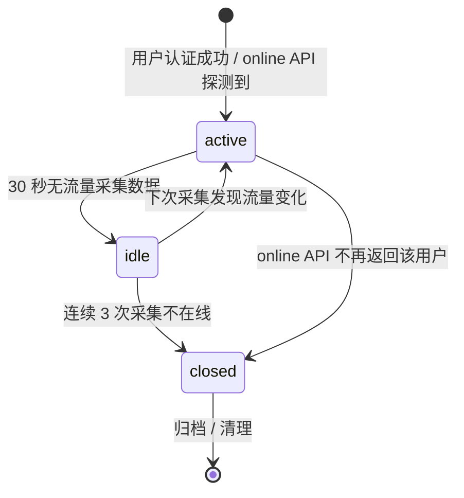

### 14.2 会话管理流程

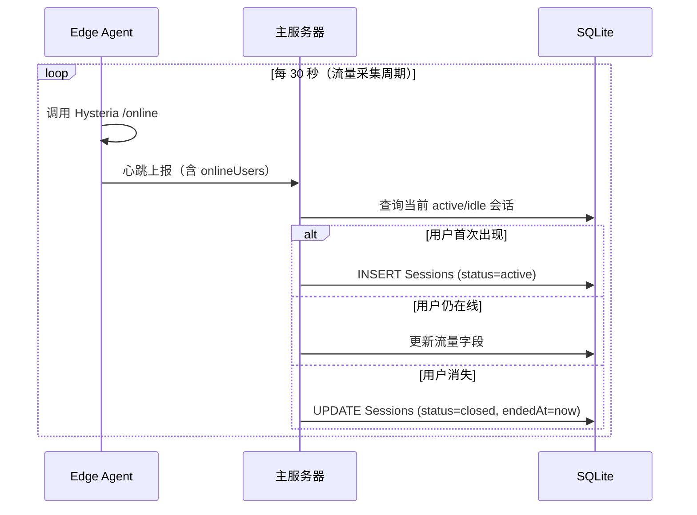

### 14.3 会话清理策略

| 操作 | 策略 |
|------|------|
| `closed` 会话 | 保留 7 天后自动清理（后台定时任务） |
| `idle` → `active` | 自动恢复，不创建新会话 |
| `idle` → `closed` | 连续 3 次采集（90 秒）不在线则关闭 |
| 流量数据 | `Sessions.BytesIn/BytesOut` 在每次心跳时更新，与 `TrafficRecords` 保持同步 |

---

## 15. 并发控制与数据一致性

### 15.1 `Users.UsedTrafficBytes` 并发扣减

由于多个 Edge Agent 可能同时上报同一个用户的流量数据（同一用户连接不同节点），对 `UsedTrafficBytes` 的更新存在并发竞争。

**策略**：使用 EF Core 乐观并发控制（Optimistic Concurrency）。

```csharp
// User 实体配置
public class User
{
    // ... 其他字段 ...
    
    [Timestamp]
    public byte[] RowVersion { get; set; }  // 行版本号，由数据库自动管理
}

// 流量扣减服务
public async Task UpdateUsedTrafficAsync(long userId, long bytesToAdd, int retryCount = 3)
{
    for (int i = 0; i < retryCount; i++)
    {
        try
        {
            var user = await _context.Users.FindAsync(userId);
            user.UsedTrafficBytes += bytesToAdd;
            await _context.SaveChangesAsync();
            return; // 成功
        }
        catch (DbUpdateConcurrencyException)
        {
            if (i == retryCount - 1) throw; // 最后一次仍失败则抛出
            // 重新加载实体并重试
            await Task.Delay(Random.Shared.Next(10, 50));
            _context.ChangeTracker.Clear();
        }
    }
}
```

### 15.2 流量数据幂等性

Edge Agent 上报失败后会重试，也可能因网络问题导致同一批数据被多次发送。使用幂等键机制防止重复计入。

**幂等键生成规则**：`{nodeId}_{timestamp_rounded_to_interval}`

示例：`edge-node-01_2025-01-01T12:00:00Z`

```csharp
// 主服务器心跳处理中的幂等检查
public async Task ProcessHeartbeatAsync(HeartbeatRequest request)
{
    // 生成幂等键
    var idempotencyKey = $"{request.NodeId}_{request.ReportedAt:yyyy-MM-ddTHH:mm:00Z}";
    
    // 开始事务
    using var transaction = await _context.Database.BeginTransactionAsync();
    
    foreach (var (username, traffic) in request.UserTraffic)
    {
        var userId = await GetUserIdAsync(username);
        
        // 检查幂等键是否已存在
        var exists = await _context.TrafficRecords
            .AnyAsync(r => r.IdempotencyKey == idempotencyKey && r.UserId == userId);
        
        if (exists)
        {
            _logger.LogDebug("跳过重复流量数据: {Key}", idempotencyKey);
            continue;
        }
        
        // 写入流量记录（含幂等键）
        _context.TrafficRecords.Add(new TrafficRecord
        {
            UserId = userId,
            BytesIn = traffic.Rx,
            BytesOut = traffic.Tx,
            NodeId = request.NodeId,
            IdempotencyKey = $"{idempotencyKey}_{username}",
            RecordedAt = request.ReportedAt
        });
        
        // 更新用户已用流量（带乐观并发重试）
        await UpdateUsedTrafficAsync(userId, traffic.Rx + traffic.Tx);
    }
    
    await transaction.CommitAsync();
}
```

> **唯一约束**：`TrafficRecords.IdempotencyKey` 设置数据库 UNIQUE 约束，即使应用层检查遗漏，数据库层面也能保证幂等性。

### 15.3 心跳数据原子性

心跳请求同时承载系统状态、用户流量、在线用户三类数据。处理过程中若部分成功会导致数据不一致。

**策略**：整个心跳处理包裹在一个数据库事务中，任一子操作失败则整体回滚。

```
BEGIN TRANSACTION
    INSERT NodeStatus (系统状态)
    FOR EACH user IN userTraffic:
        IF NOT idempotency_duplicate:
            INSERT TrafficRecords
            UPDATE Users.UsedTrafficBytes
    INSERT NodeTraffic (节点流量汇总)
    UPDATE Nodes.LastHeartbeat
    UPDATE Sessions (在线状态)
COMMIT
```

---

## 16. 数据备份与恢复

### 16.1 自动备份策略

| 参数 | 值 |
|------|-----|
| 备份间隔 | 24 小时（可配置） |
| 备份方式 | SQLite `.backup` 命令（在线热备份） |
| 备份目录 | `/var/backups/hysteria-auth/` |
| 保留天数 | 30 天 |
| 备份命名 | `hysteria-auth-{yyyy-MM-dd-HHmmss}.db` |

### 16.2 备份脚本

```bash
#!/bin/bash
# backup-db.sh

BACKUP_DIR="/var/backups/hysteria-auth"
DB_PATH="/var/lib/hysteria-auth/hysteria-auth.db"
RETENTION_DAYS=30

mkdir -p "$BACKUP_DIR"

# 执行在线备份
sqlite3 "$DB_PATH" ".backup '$BACKUP_DIR/hysteria-auth-$(date +%Y-%m-%d-%H%M%S).db'"

# 清理过期备份
find "$BACKUP_DIR" -name "hysteria-auth-*.db" -mtime +$RETENTION_DAYS -delete

echo "Backup completed at $(date)"
```

### 16.3 恢复脚本

```bash
#!/bin/bash
# restore-db.sh

BACKUP_FILE="$1"
DB_PATH="/var/lib/hysteria-auth/hysteria-auth.db"

if [ -z "$BACKUP_FILE" ]; then
    echo "Usage: restore-db.sh <backup_file>"
    exit 1
fi

if [ ! -f "$BACKUP_FILE" ]; then
    echo "Backup file not found: $BACKUP_FILE"
    exit 1
fi

# 停止主服务
sudo systemctl stop hysteria-auth-master

# 备份当前数据库（以防万一）
cp "$DB_PATH" "$DB_PATH.bak-$(date +%Y-%m-%d-%H%M%S)"

# 恢复
cp "$BACKUP_FILE" "$DB_PATH"
sudo chown www-data:www-data "$DB_PATH"

# 启动主服务
sudo systemctl start hysteria-auth-master

echo "Restore completed from $BACKUP_FILE"
```

### 16.4 数据保留策略

| 数据类型 | 保留期限 | 清理方式 |
|----------|----------|----------|
| `TrafficRecords` | 90 天 | 后台定时任务每日清理 |
| `AuthLogs` | 90 天 | 后台定时任务每日清理 |
| `NodeStatus` | 30 天 | 后台定时任务每日清理 |
| `NodeTraffic` | 90 天 | 后台定时任务每日清理 |
| `AdminAuditLogs` | 365 天 | 后台定时任务每日清理 |
| `Sessions` (closed) | 7 天 | 后台定时任务每日清理 |
| 数据库备份 | 30 天 | 备份脚本自动清理 |

---

## 17. 测试策略

### 17.1 测试分层

```
┌────────────────────────────────┐
│         E2E 测试                │  ← 完整认证流程 + 流量采集
│   (AuthFlowTests)              │
├────────────────────────────────┤
│       集成测试                  │  ← API 端点 + 数据库操作
│   (ApiTests + DatabaseTests)   │
├────────────────────────────────┤
│        单元测试                 │  ← 业务逻辑 + 服务层
│   (Services + Controllers)     │
└────────────────────────────────┘
```

### 17.2 测试框架与工具

| 层级 | 框架/工具 | 说明 |
|------|-----------|------|
| 单元测试 | xUnit + Moq + FluentAssertions | 业务逻辑单元测试 |
| 集成测试 | xUnit + Testcontainers + EF Core InMemory | API 端点和数据库集成 |
| E2E 测试 | xUnit + 本地 Hysteria 实例 | 完整认证流程验证 |

### 17.3 测试覆盖目标

| 模块 | 目标覆盖率 | 关键场景 |
|------|-----------|----------|
| `AuthService` | ≥ 90% | 认证成功、各种失败原因、流量检查、节点验证 |
| `UserService` | ≥ 85% | CRUD 操作、流量重置、批量操作 |
| `NodeService` | ≥ 85% | 注册、心跳处理、状态查询、密钥轮换 |
| `TrafficService` | ≥ 90% | 流量扣减、幂等检查、并发冲突重试、事务回滚 |
| `AdminService` | ≥ 85% | 登录、锁定、审计日志写入 |
| Edge Agent `AuthProxy` | ≥ 80% | 协议转换、缓存命中/未命中、降级 |
| Edge Agent `TrafficCollector` | ≥ 80% | 采集、合并、上报重试 |

### 17.4 关键测试用例

| 场景 | 层级 | 描述 |
|------|------|------|
| 认证成功 | 单元 | 正确用户名密码返回成功 |
| 密码错误 | 单元 | 错误密码返回 `invalid_credentials` |
| 流量耗尽 | 单元 | `UsedTrafficBytes >= TotalTrafficBytes` 返回 `traffic_exhausted` |
| 账号过期 | 单元 | `ExpiresAt < Now` 返回 `account_expired` |
| 节点白名单 | 单元 | 不在白名单返回 `node_not_allowed` |
| 协议转换 | 单元 | Hysteria 原生请求 → 内部 API 请求转换正确 |
| 并发扣减 | 集成 | 两个线程同时增量 `UsedTrafficBytes`，最终值正确 |
| 幂等检查 | 集成 | 重复上报相同数据，仅计入一次 |
| 心跳事务 | 集成 | 部分失败时整体回滚 |
| 节点注册 | 集成 | 首次注册 + 重复注册幂等 |
| 端到端认证 | E2E | Hysteria Client → 边缘节点 → 主服务器完整链路 |

---

## 18. 扩展性考虑

### 18.1 数据库扩展

虽然当前使用 SQLite，但通过 EF Core 抽象，未来可以轻松迁移到：
- PostgreSQL（推荐，适合中等规模，支持更高级的并发控制）
- MySQL（适合已有 MySQL 基础设施）
- SQL Server（适合企业环境）

### 18.2 水平扩展

| 组件 | 扩展方式 |
|------|----------|
| 主服务器 | 多实例 + 负载均衡（需改用共享数据库） |
| 边缘节点 | 无限水平扩展，每个节点独立运行 |
| 数据库 | 读写分离、分库分表 |

### 18.3 未来功能

- 用户自助门户（查看流量、修改密码）
- 多租户支持
- 计费系统
- Web 管理控制台
- Prometheus/Grafana 监控集成
- 流量预测与自动扩容
- Docker 镜像发布与容器化部署
- gRPC 替代 REST 用于节点通信（更低延迟）
- 流量 QoS 分级（不同用户不同带宽限制）

---

## 19. 开发计划

### Phase 1: 核心功能（2-3 周）

- [ ] 项目初始化
- [ ] 数据库模型和 EF Core 配置（含 Admins、AdminAuditLogs 表）
- [ ] 用户 CRUD API
- [ ] 管理员登录和 CRUD API
- [ ] Hysteria 认证 API（双层设计）
- [ ] Edge Agent 认证代理（含协议转换）
- [ ] 统一错误响应格式中间件

### Phase 2: 节点管理（1-2 周）

- [ ] 节点注册和初始化流程
- [ ] 系统监控模块
- [ ] 状态上报功能
- [ ] 节点管理 API
- [ ] 节点密钥轮换机制
- [ ] 健康检查端点

### Phase 3: 流量统计（1-2 周）

- [ ] Edge Agent 流量采集模块（方案一）
- [ ] 主服务器流量汇总与幂等扣减
- [ ] 在线用户管理与踢用户下线
- [ ] TCP 流详情查询（按需）
- [ ] 会话生命周期管理
- [ ] 并发控制与事务保障

### Phase 4: 完善功能（1 周）

- [ ] 认证缓存
- [ ] 日志记录
- [ ] 审计日志
- [ ] 异常处理和降级
- [ ] 速率限制
- [ ] CORS 配置
- [ ] 数据备份与恢复脚本

### Phase 5: 测试和部署（1 周）

- [ ] 单元测试（≥ 80% 核心模块覆盖率）
- [ ] 集成测试
- [ ] E2E 认证流程测试
- [ ] 部署脚本
- [ ] 文档完善

---

## 附录

### A. Hysteria HTTP 认证协议参考

Hysteria 2 的 HTTP 认证插件使用以下协议（详见[官方文档](hysteria-server-config.md#91-http-验证本项目的核心集成方式)）：

```
POST {auth_url}
Content-Type: application/json

{
    "addr": "123.123.123.123:44556",
    "auth": "base64_encoded_credentials",
    "tx": 52428800
}
```

| 字段 | 类型 | 说明 |
|------|------|------|
| `addr` | string | 客户端地址和端口 |
| `auth` | string | 客户端提交的密码（Base64 编码） |
| `tx` | uint64 | 客户端期望发送速率（字节/秒，服务端视角） |

**成功响应（HTTP 200）：**

```json
{
    "ok": true,
    "id": "username_identifier"
}
```

**失败响应：**

返回任何非 200 的 HTTP 状态码均视为认证失败。

> **与旧版协议的区别**: Hysteria 2 的认证请求体使用 `addr`、`auth`、`tx` 三个字段，而非旧版的 `username`、`password`、`remote_addr`。Hysteria 2 不区分用户名和密码，由认证后端自行解析 `auth` 字段。

### B. Hysteria 流量统计 API 参考

详见 [`hysteria-traffic-stats-api.md`](hysteria-traffic-stats-api.md)，四个核心接口：

| 接口 | 方法 | 用途 |
|------|------|------|
| `/traffic` | GET | 查询各用户累计流量，支持 `?clear=1` 清零 |
| `/online` | GET | 查询各用户在线连接数 |
| `/kick` | POST | 踢指定用户下线 |
| `/dump/streams` | GET | 导出所有 TCP 流详情 |

### C. 常用命令

```bash
# 发布主服务器
dotnet publish src/HysteriaAuth.Master -c Release -o publish/master

# 发布 Edge Agent
dotnet publish src/HysteriaAuth.Agent -c Release -o publish/agent

# 运行主服务器（开发环境）
dotnet run --project src/HysteriaAuth.Master

# 运行 Edge Agent（开发环境）
dotnet run --project src/HysteriaAuth.Agent

# 创建数据库迁移
dotnet ef migrations add InitialCreate --project src/HysteriaAuth.Master

# 应用数据库迁移
dotnet ef database update --project src/HysteriaAuth.Master

# 手动测试 Hysteria 流量统计 API
curl -H 'Authorization: your_secret' http://127.0.0.1:9999/traffic
curl -H 'Authorization: your_secret' http://127.0.0.1:9999/online

# 手动备份数据库
bash scripts/backup-db.sh

# 手动恢复数据库
bash scripts/restore-db.sh /var/backups/hysteria-auth/hysteria-auth-2025-01-01-120000.db

# 运行测试
dotnet test tests/HysteriaAuth.Tests/HysteriaAuth.Tests.csproj

# 查看测试覆盖率
dotnet test tests/HysteriaAuth.Tests/HysteriaAuth.Tests.csproj \
    --collect:"XPlat Code Coverage" \
    --results-directory:./coverage
```

### D. 文档修订历史

| 日期 | 版本 | 变更说明 |
|------|------|----------|
| 2026-05-21 | v1.1 | 大规模补全：新增管理员表和审计日志表、健康检查 API、统一错误响应格式、会话生命周期管理、并发控制与数据一致性、密钥轮换策略、CORS/速率限制配置、数据备份恢复、SLO 指标、测试策略、Edge Agent 初始化流程、管理员管理 API |
| — | v1.0 | 初始版本 |
