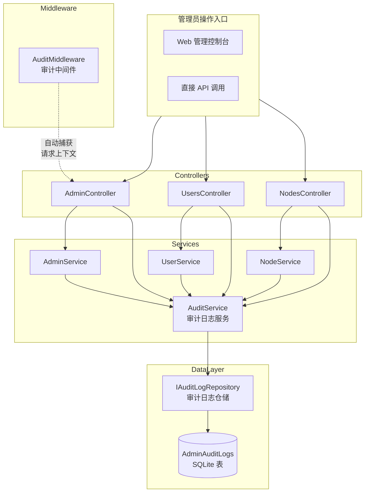

# 审计日志模块设计

> **父文档**: [架构文档目录](README.md) | **关联**: [`database-design.md`](database-design.md) · [`api-design.md`](api-design.md) · [`security-design.md`](security-design.md) · [`system-architecture.md`](system-architecture.md) · [`../exchange/master-panel-api.md`](../exchange/master-panel-api.md)

---

## 1. 概述

### 1.1 模块目标

审计日志模块负责记录所有管理员在系统中执行的关键操作，提供可追溯、不可篡改的操作历史记录，满足合规审计和安全性要求。

### 1.2 核心功能

| 功能 | 说明 |
|------|------|
| **操作记录** | 所有管理员写操作（CRUD、登录、踢人等）自动记录审计日志 |
| **不可篡改** | 审计日志一旦写入即不可修改或删除（数据库约束 + 应用层保护） |
| **多维查询** | 支持按管理员、操作类型、目标类型、时间范围的多维筛选 |
| **分页查询** | 标准分页响应格式 |
| **数据保留** | 自动清理超过保留期限（默认 365 天）的历史日志 |
| **操作详情** | 记录变更前后对比的详细 JSON 数据 |

### 1.3 架构位置



---

## 2. 数据模型

### 2.1 实体定义

`AdminAuditLogs` 表结构如下：

| 字段 | 类型 | 约束 | 说明 |
|------|------|------|------|
| `Id` | BIGINT | PK, AUTO_INCREMENT | 日志 ID |
| `AdminId` | BIGINT | FK → Admins.Id, NOT NULL | 操作管理员 ID |
| `Action` | VARCHAR(64) | NOT NULL | 操作类型 |
| `TargetType` | VARCHAR(32) | NOT NULL | 操作目标类型 |
| `TargetId` | VARCHAR(64) | NULL | 操作目标 ID（字符串，兼容数字和 UUID） |
| `Detail` | TEXT | NULL | 操作详情（JSON 格式，含变更前后对比） |
| `ClientIp` | VARCHAR(45) | NOT NULL | 操作来源 IP |
| `CreatedAt` | DATETIME | NOT NULL | 操作时间（UTC） |

> **详细字段说明见**：[`database-design.md` §2.9](database-design.md#29-管理员操作审计日志表-adminauditlogs)

### 2.2 导航属性

```csharp
public class AdminAuditLog
{
    // ... 字段 ...

    [ForeignKey(nameof(AdminId))]
    public Admin? Admin { get; set; }  // 用于获取 adminName
}
```

### 2.3 不可篡改保护

**双层保护机制**：

1. **应用层**（`AppDbContext.SaveChanges`）：
   - 在 `SaveChanges()` 和 `SaveChangesAsync()` 中拦截对 `AdminAuditLogs` 实体的 `Modified` 和 `Deleted` 状态
   - 如果检测到修改或删除操作，抛出 `InvalidOperationException`

2. **数据库层**：
   - 仅创建 `INSERT` 和 `SELECT` 权限（如使用独立数据库账号）
   - SQLite 下可通过文件权限保护

---

## 3. API 设计

### 3.1 审计日志查询 API

> **完整 API 文档参照**：[`master-panel-api.md` §8.1](../exchange/master-panel-api.md#81-get-apiv1adminaudit-logs--获取审计日志)

| 项目 | 值 |
|------|-----|
| **路由** | `GET /api/v1/admin/audit-logs` |
| **认证** | `Authorization: Bearer {admin_token}` |
| **权限** | `super_admin`（完全权限）、`admin`（可查看，不可管理） |
| **缓存** | 不缓存（审计日志需实时查询） |

#### 查询参数

| 参数 | 类型 | 默认值 | 说明 | SQL 映射 |
|------|------|--------|------|----------|
| `page` | int | `1` | 页码 | `OFFSET (page-1) * pageSize` |
| `pageSize` | int | `50` | 每页条数（最大 200） | `LIMIT pageSize` |
| `adminId` | long | — | 按操作管理员 ID 筛选 | `WHERE AdminId = @adminId` |
| `action` | string | — | 按操作类型筛选 | `WHERE Action = @action` |
| `targetType` | string | — | 按目标类型筛选 | `WHERE TargetType = @targetType` |
| `startTime` | string (ISO 8601) | — | 开始时间（含该时刻） | `WHERE CreatedAt >= @startTime` |
| `endTime` | string (ISO 8601) | — | 结束时间（不含该时刻） | `WHERE CreatedAt < @endTime` |

#### 组合筛选逻辑

- 多个筛选条件之间为 **AND** 关系
- `startTime` 和 `endTime` 可单独使用，也可组合使用（形成时间范围）
- 所有参数均为可选，不传时不筛选对应字段
- 默认按 `CreatedAt DESC` 排序（最新在前）

#### SQL 查询模板

```sql
SELECT aal.Id, aal.AdminId, a.Username AS AdminName,
       aal.Action, aal.TargetType, aal.TargetId,
       aal.Detail, aal.ClientIp, aal.CreatedAt
FROM AdminAuditLogs aal
JOIN Admins a ON aal.AdminId = a.Id
WHERE (@adminId IS NULL OR aal.AdminId = @adminId)
  AND (@action IS NULL OR aal.Action = @action)
  AND (@targetType IS NULL OR aal.TargetType = @targetType)
  AND (@startTime IS NULL OR aal.CreatedAt >= @startTime)
  AND (@endTime IS NULL OR aal.CreatedAt < @endTime)
ORDER BY aal.CreatedAt DESC
LIMIT @pageSize OFFSET @offset
```

#### 响应格式

```json
{
    "total": 500,
    "page": 1,
    "pageSize": 50,
    "items": [
        {
            "id": 1001,
            "adminId": 1,
            "adminName": "admin",
            "action": "create",
            "targetType": "user",
            "targetId": "42",
            "detail": "{\"username\":\"user123\",\"totalTrafficBytes\":10737418240}",
            "clientIp": "192.168.1.100",
            "createdAt": "2025-01-15T12:00:00Z"
        }
    ]
}
```

| 字段 | 类型 | 来源 | 说明 |
|------|------|------|------|
| `id` | long | `AdminAuditLog.Id` | 日志 ID |
| `adminId` | long | `AdminAuditLog.AdminId` | 操作管理员 ID |
| `adminName` | string | `Admin.Username`（导航属性） | 操作管理员用户名 |
| `action` | string | `AdminAuditLog.Action` | 操作类型 |
| `targetType` | string | `AdminAuditLog.TargetType` | 操作目标类型 |
| `targetId` | string | `AdminAuditLog.TargetId` | 操作目标 ID |
| `detail` | string | `AdminAuditLog.Detail` | 操作详情（JSON 字符串） |
| `clientIp` | string | `AdminAuditLog.ClientIp` | 操作来源 IP |
| `createdAt` | string (ISO 8601) | `AdminAuditLog.CreatedAt` | 操作时间 |

---

## 4. 操作类型与目标类型枚举

### 4.1 Action 枚举

| Action 值 | 触发操作 | 说明 |
|-----------|----------|------|
| `login` | 管理员登录成功 | 每次登录记录一次 |
| `logout` | 管理员登出（预留） | 当前版本暂不实现 |
| `create` | 创建用户/管理员/节点 | 新建资源 |
| `update` | 更新用户/管理员/节点信息、重置流量 | 修改资源 |
| `delete` | 软删除用户 | 标记 `IsActive = false` |
| `kick_user` | 踢用户下线 | 管理员主动踢人操作 |
| `rotate_secret` | 轮换节点密钥 | 修改节点密钥 |
| `system` | 系统自动操作（预留） | 后台任务等 |

### 4.2 TargetType 枚举

| TargetType 值 | 对应实体 | 说明 |
|---------------|----------|------|
| `user` | `User` | 用户操作 |
| `node` | `Node` | 节点操作 |
| `admin` | `Admin` | 管理员操作 |
| `system` | — | 系统级别操作 |

---

## 5. 审计日志写入策略

### 5.1 写入时机总览

所有管理员写操作**必须**记录审计日志。以下为完整的操作映射表：

| # | 操作 | 所在 Service 方法 | Action | TargetType | TargetId | Detail 内容 |
|---|------|-------------------|--------|------------|----------|-------------|
| 1 | 管理员登录成功 | `AdminService.LoginAsync` | `login` | `admin` | `admin.Id` | `{ "username": "admin" }` |
| 2 | 创建用户 | `UserService.CreateAsync` | `create` | `user` | `user.Id` | 创建时的完整用户数据 |
| 3 | 更新用户 | `UserService.UpdateAsync` | `update` | `user` | `user.Id` | `{ "before": {...}, "after": {...} }` |
| 4 | 删除用户(软删除) | `UserService.SoftDeleteAsync` | `delete` | `user` | `user.Id` | `{ "before": {...}, "after": {...} }` |
| 5 | 重置用户流量 | `UserService.ResetTrafficAsync` | `update` | `user` | `user.Id` | `{ "before": { "usedTrafficBytes": X }, "after": { "usedTrafficBytes": 0 } }` |
| 6 | 创建管理员 | `AdminService.CreateAdminAsync` | `create` | `admin` | `admin.Id` | 创建时的管理员数据 |
| 7 | 更新管理员 | `AdminService.UpdateAdminAsync` | `update` | `admin` | `admin.Id` | `{ "before": {...}, "after": {...} }` |
| 8 | 预注册节点 | `NodeService.PreRegisterNodeAsync` | `create` | `node` | `node.Id` | 节点名称、端口等信息 |
| 9 | 轮换节点密钥 | `NodeService.RotateSecretAsync` | `rotate_secret` | `node` | `node.Id` | `{ "secretVersion": X → Y }` |
| 10 | 踢用户下线 | `KickService.AdminKickUserAsync` | `kick_user` | `user` | `username` | `{ "nodeId": "...", "username": "..." }` |

### 5.2 Detail 字段格式规范

对于 **update/delete** 操作，Detail 应包含变更前后对比：

```json
{
    "before": {
        "isActive": true,
        "totalTrafficBytes": 10737418240,
        "usedTrafficBytes": 5368709120,
        "email": "old@example.com"
    },
    "after": {
        "isActive": false,
        "totalTrafficBytes": 10737418240,
        "usedTrafficBytes": 0,
        "email": "new@example.com"
    },
    "changedFields": ["isActive", "usedTrafficBytes", "email"]
}
```

对于 **create/login** 操作，Detail 可简化为操作摘要：

```json
{
    "username": "user123",
    "totalTrafficBytes": 10737418240,
    "isActive": true
}
```

### 5.3 写入时机与事务

**核心原则**：审计日志的写入应在**业务操作成功后**、**响应返回前**执行。

```
业务操作 → 成功 → 写入审计日志 → 返回响应
                   ↓
              失败 → 不写审计日志（业务事务回滚）
```

**实现方式**：

```csharp
// ✅ 正确：业务成功后再写审计日志
public async Task<UserDto> UpdateAsync(long id, UpdateUserRequest request)
{
    // 1. 读取变更前数据（用于 Detail）
    var before = await _userRepo.GetByIdAsync(id);
    if (before == null) throw new NotFoundException("用户不存在");

    // 2. 执行更新
    // ... 更新逻辑 ...

    // 3. 读取变更后数据
    var after = /* 更新后的用户实体 */;

    // 4. 写入审计日志
    await _auditService.LogAsync(
        adminId: GetCurrentAdminId(),
        action: "update",
        targetType: "user",
        targetId: id.ToString(),
        detail: new { before = MapToDto(before), after = MapToDto(after) },
        clientIp: GetClientIp()
    );

    return MapToDto(after);
}
```

### 5.4 获取管理员身份与客户端 IP

审计日志需要两个上下文信息：

| 信息 | 获取方式 | 来源 |
|------|----------|------|
| **AdminId** | `HttpContext.Items["AdminId"]` | JWT 中间件解析 Token 后注入 |
| **ClientIp** | `HttpContext.Connection.RemoteIpAddress` | HTTP 连接 |

在 Service 层中，需要通过参数传递这些信息：

```csharp
// Controller 层负责提取上下文信息
public class UsersController : ControllerBase
{
    [HttpPut("{userId:long}")]
    public async Task<IActionResult> UpdateUser(long userId, [FromBody] UpdateUserRequest request)
    {
        var adminId = (long)HttpContext.Items["AdminId"]!;
        var clientIp = HttpContext.Connection.RemoteIpAddress?.ToString() ?? "unknown";

        var user = await _userService.UpdateAsync(userId, request, adminId, clientIp);
        return Ok(user);
    }
}
```

---

## 6. 中间件设计

### 6.1 AuditMiddleware 方案评估

| 方案 | 描述 | 优点 | 缺点 |
|------|------|------|------|
| **A：Service 层手动写入** | 在每个 Service 方法中显式调用 `AuditService.LogAsync` | 灵活、可控、Detail 精确 | 代码分散、容易遗漏 |
| **B：ActionFilter/AuditMiddleware** | 通过中间件或过滤器自动捕获操作 | 集中管理、减少重复代码 | Detail 难以自动生成、变更前后对比需要额外处理 |
| **C：混合方案（推荐）** | 中间件负责自动注入调用上下文（AdminId、ClientIp），Service 层负责在关键操作点手动写入 | 上下文自动传递、Detail 精确可控 | 需要约定一致的调用模式 |

### 6.2 推荐方案：混合方案

```csharp
// Middleware/AuditContextMiddleware.cs
// 职责：将 AdminId 和 ClientIp 注入到 HttpContext.Items
// 不负责写入审计日志（写入由 Service 层在业务操作成功后手动调用）
public class AuditContextMiddleware
{
    public async Task InvokeAsync(HttpContext context)
    {
        // AdminId 已在 JwtMiddleware 中注入
        // ClientIp 直接从连接获取
        context.Items["ClientIp"] = context.Connection.RemoteIpAddress?.ToString() ?? "unknown";
        
        await _next(context);
    }
}
```

> **决策理由**：审计日志的 `Detail` 字段需要精确的变更前后数据对比，这是中间件/AOP 难以自动生成的。Service 层最清楚哪些字段发生了变更，因此由 Service 层手动写入审计日志是最可靠的方案。

---

## 7. 仓储设计

### 7.1 IAuditLogRepository 接口

```csharp
public interface IAuditLogRepository
{
    /// <summary>
    /// 写入审计日志。
    /// </summary>
    Task AddAsync(AdminAuditLog log);

    /// <summary>
    /// 分页查询审计日志，支持多维筛选。
    /// </summary>
    Task<(List<AdminAuditLog> Items, int Total)> GetPagedAsync(
        AuditLogQuery query);
}
```

### 7.2 查询参数模型

```csharp
public class AuditLogQuery
{
    public int Page { get; set; } = 1;
    public int PageSize { get; set; } = 50;
    public long? AdminId { get; set; }
    public string? Action { get; set; }
    public string? TargetType { get; set; }
    public DateTime? StartTime { get; set; }
    public DateTime? EndTime { get; set; }
}
```

### 7.3 仓储实现要点

- 查询时 **必须 JOIN Admins 表** 获取 `AdminName`
- 筛选条件使用动态 LINQ 构建（多个可选条件 AND 组合）
- 默认排序 `CreatedAt DESC`（最新在前）
- `pageSize` 最大限制 200，防止过度查询
- 查询结果**不包含** `Admin.Password` 等敏感字段

```csharp
// 核心查询逻辑
public async Task<(List<AdminAuditLog> Items, int Total)> GetPagedAsync(AuditLogQuery query)
{
    var q = _context.AdminAuditLogs
        .Include(a => a.Admin)  // eager load Admin 导航属性
        .AsQueryable();

    // 动态筛选
    if (query.AdminId.HasValue)
        q = q.Where(l => l.AdminId == query.AdminId.Value);
    if (!string.IsNullOrWhiteSpace(query.Action))
        q = q.Where(l => l.Action == query.Action);
    if (!string.IsNullOrWhiteSpace(query.TargetType))
        q = q.Where(l => l.TargetType == query.TargetType);
    if (query.StartTime.HasValue)
        q = q.Where(l => l.CreatedAt >= query.StartTime.Value);
    if (query.EndTime.HasValue)
        q = q.Where(l => l.CreatedAt < query.EndTime.Value);

    var total = await q.CountAsync();

    var items = await q
        .OrderByDescending(l => l.CreatedAt)
        .Skip((query.Page - 1) * query.PageSize)
        .Take(query.PageSize)
        .ToListAsync();

    return (items, total);
}
```

---

## 8. 服务层设计

### 8.1 AuditService 接口与实现

```csharp
public class AuditService
{
    private readonly IAuditLogRepository _auditLogRepo;
    private readonly ILogger<AuditService> _logger;

    public AuditService(
        IAuditLogRepository auditLogRepo,
        ILogger<AuditService> logger)
    {
        _auditLogRepo = auditLogRepo;
        _logger = logger;
    }

    /// <summary>
    /// 记录审计日志。
    /// </summary>
    /// <param name="adminId">操作管理员 ID</param>
    /// <param name="action">操作类型：create/update/delete/login/kick_user/rotate_secret</param>
    /// <param name="targetType">目标类型：user/node/admin/system</param>
    /// <param name="targetId">目标 ID（字符串）</param>
    /// <param name="detail">操作详情对象（将被序列化为 JSON 字符串）</param>
    /// <param name="clientIp">操作来源 IP</param>
    public async Task LogAsync(
        long adminId,
        string action,
        string targetType,
        string? targetId,
        object? detail,
        string clientIp)
    {
        var log = new AdminAuditLog
        {
            AdminId = adminId,
            Action = action,
            TargetType = targetType,
            TargetId = targetId,
            Detail = detail != null ? JsonSerializer.Serialize(detail) : null,
            ClientIp = clientIp,
            CreatedAt = DateTime.UtcNow
        };

        await _auditLogRepo.AddAsync(log);

        _logger.LogInformation(
            "审计日志: AdminId={AdminId} Action={Action} Target={TargetType}:{TargetId} IP={ClientIp}",
            adminId, action, targetType, targetId, clientIp);
    }

    /// <summary>
    /// 查询审计日志（分页 + 多维筛选）。
    /// </summary>
    public async Task<AuditLogListResponse> GetPagedAsync(AuditLogQuery query)
    {
        var (items, total) = await _auditLogRepo.GetPagedAsync(query);

        return new AuditLogListResponse
        {
            Total = total,
            Page = query.Page,
            PageSize = query.PageSize,
            Items = items.Select(MapToDto).ToList()
        };
    }

    private static AuditLogDto MapToDto(AdminAuditLog log)
    {
        return new AuditLogDto
        {
            Id = log.Id,
            AdminId = log.AdminId,
            AdminName = log.Admin?.Username ?? "unknown",
            Action = log.Action,
            TargetType = log.TargetType,
            TargetId = log.TargetId,
            Detail = log.Detail,
            ClientIp = log.ClientIp,
            CreatedAt = log.CreatedAt
        };
    }
}
```

---

## 9. DTO 设计

### 9.1 审计日志 DTO

```csharp
// 单个日志项
public class AuditLogDto
{
    public long Id { get; set; }
    public long AdminId { get; set; }
    public string AdminName { get; set; } = string.Empty;
    public string Action { get; set; } = string.Empty;
    public string TargetType { get; set; } = string.Empty;
    public string? TargetId { get; set; }
    public string? Detail { get; set; }
    public string ClientIp { get; set; } = string.Empty;
    public DateTime CreatedAt { get; set; }
}

// 分页响应
public class AuditLogListResponse
{
    public int Total { get; set; }
    public int Page { get; set; }
    public int PageSize { get; set; }
    public List<AuditLogDto> Items { get; set; } = new();
}
```

> DTO 命名遵循 [`backend-development-spec.md` §2.4](../develop/backend-development-spec.md#24-命名约定)：`{Entity}Dto` 格式。

---

## 10. 控制器设计

### 10.1 审计日志 API 端点

在 `AdminController` 中新增端点（或新建 `AuditLogsController`）：

```csharp
[ApiController]
[Route("api/v1/admin")]
public class AdminController : ControllerBase
{
    private readonly AuditService _auditService;

    // ... 现有方法 ...

    /// <summary>
    /// 获取审计日志（super_admin 和 admin 可调用）。
    /// </summary>
    [HttpGet("audit-logs")]
    public async Task<IActionResult> GetAuditLogs(
        [FromQuery] int page = 1,
        [FromQuery] int pageSize = 50,
        [FromQuery] long? adminId = null,
        [FromQuery] string? action = null,
        [FromQuery] string? targetType = null,
        [FromQuery] DateTime? startTime = null,
        [FromQuery] DateTime? endTime = null)
    {
        var query = new AuditLogQuery
        {
            Page = page,
            PageSize = Math.Min(pageSize, 200), // 最大 200
            AdminId = adminId,
            Action = action,
            TargetType = targetType,
            StartTime = startTime,
            EndTime = endTime
        };

        var result = await _auditService.GetPagedAsync(query);
        return Ok(result);
    }
}
```

### 10.2 权限控制

| 角色 | 查询审计日志 | 说明 |
|------|-------------|------|
| `super_admin` | ✅ | 完全权限，可查看所有审计日志 |
| `admin` | ✅ | 可查看所有审计日志（不可管理） |
| `readonly` | ❌ | 无查看权限（403 Forbidden） |

权限校验在 JWT 中间件或 ActionFilter 中统一处理：

```csharp
// 方式一：在 JWT 中间件中处理
// 对于 readonly 角色，直接阻止对 audit-logs 端点的访问

// 方式二：在 Controller 中使用 [Authorize] 策略
[HttpGet("audit-logs")]
[Authorize(Roles = "super_admin,admin")]
public async Task<IActionResult> GetAuditLogs(...)
```

---

## 11. 数据保留策略

### 11.1 保留期限

| 配置项 | 默认值 | 说明 |
|--------|--------|------|
| `Admin.AuditLogRetentionDays` | `365` | 审计日志保留天数 |

### 11.2 清理机制

由 `DataRetentionService` 后台服务每日执行一次：

```csharp
// Services/DataRetentionService.cs 中的清理逻辑
var auditLogThreshold = DateTime.UtcNow.AddDays(-_adminAuditLogRetentionDays);
var oldAuditLogs = await context.AdminAuditLogs
    .Where(l => l.CreatedAt < auditLogThreshold)
    .ToListAsync(ct);

if (oldAuditLogs.Count > 0)
{
    context.AdminAuditLogs.RemoveRange(oldAuditLogs);
    _logger.LogInformation("清理 AdminAuditLogs: {Count} 条", oldAuditLogs.Count);
}
```

> ⚠️ **注意**：虽然 `AdminAuditLogs` 表在应用层面受不可篡改保护，但 `DataRetentionService` 作为系统级后台服务，具有通过 EF Core 直接删除过期记录的权限。这是唯一允许的删除路径。

---

## 12. 数据库性能优化

### 12.1 索引设计

```sql
-- 主键索引（EF Core 自动创建）
-- PK_AdminAuditLogs (Id)

-- 按管理员 + 时间查询的索引（最常用查询模式）
CREATE INDEX IX_AdminAuditLogs_AdminId_CreatedAt
    ON AdminAuditLogs (AdminId, CreatedAt DESC);

-- 按操作类型筛选的索引
CREATE INDEX IX_AdminAuditLogs_Action
    ON AdminAuditLogs (Action);

-- 按目标类型筛选的索引
CREATE INDEX IX_AdminAuditLogs_TargetType
    ON AdminAuditLogs (TargetType);

-- 时间范围查询的索引（数据保留清理使用）
CREATE INDEX IX_AdminAuditLogs_CreatedAt
    ON AdminAuditLogs (CreatedAt);
```

### 12.2 分页深度限制

审计日志查询应避免深度分页（如 page=1000）。建议：

- 默认 `pageSize` 为 50，最大 200
- 不提供 `page` 无限制跳转（前端限制最多 100 页）
- 大数据量场景使用游标分页（Cursor-based pagination）替代 offset 分页（可选优化）

---

## 13. 相关文件清单

### 13.1 需要新增的文件

| 文件路径 | 说明 |
|----------|------|
| `src/HysteriaAuth.Master/Services/AuditService.cs` | 审计日志服务 |
| `src/HysteriaAuth.Master/Repositories/IAuditLogRepository.cs` | 审计日志仓储接口 |
| `src/HysteriaAuth.Master/Repositories/AuditLogRepository.cs` | 审计日志仓储实现 |
| `src/HysteriaAuth.Master/Models/DTOs/AuditLogDto.cs` | 审计日志 DTO |
| `src/HysteriaAuth.Master/Middleware/AuditContextMiddleware.cs` | 审计上下文中间件 |

### 13.2 需要修改的文件

| 文件路径 | 修改内容 |
|----------|----------|
| `src/HysteriaAuth.Master/Program.cs` | 注册 `AuditService`、`IAuditLogRepository`、`AuditContextMiddleware` |
| `src/HysteriaAuth.Master/Controllers/AdminController.cs` | 新增 `GET /api/v1/admin/audit-logs` 端点 |
| `src/HysteriaAuth.Master/Services/UserService.cs` | 在 `CreateAsync`、`UpdateAsync`、`SoftDeleteAsync`、`ResetTrafficAsync` 中写入审计日志 |
| `src/HysteriaAuth.Master/Services/AdminService.cs` | 在 `LoginAsync`、`CreateAdminAsync`、`UpdateAdminAsync` 中写入审计日志 |
| `src/HysteriaAuth.Master/Services/NodeService.cs` | 在 `PreRegisterNodeAsync`、`RotateSecretAsync` 中写入审计日志 |
| `src/HysteriaAuth.Master/Services/KickService.cs` | 在 `AdminKickUserAsync` 中写入审计日志 |

---

## 14. 与现有架构的关系

| 现有文档 | 关联点 |
|----------|--------|
| [`database-design.md` §2.9](database-design.md#29-管理员操作审计日志表-adminauditlogs) | 表结构定义（本文作为其实现参考） |
| [`api-design.md` §5.7](api-design.md#57-获取审计日志) | API 端点定义（本文详细展开） |
| [`system-architecture.md` §2](system-architecture.md#2-主服务器架构) | 架构图中的 AuditService、AuditLogRepo |
| [`security-design.md` §2](security-design.md#2-数据安全) | 审计追踪安全要求 |
| [`project-structure-configuration.md` §1](project-structure-configuration.md#1-项目目录结构) | 文件结构中的审计日志相关文件 |
| [`resilience-monitoring.md` §3](resilience-monitoring.md#3-测试策略) | 审计日志测试覆盖要求 |
| [`backend-development-spec.md` §4.10](../develop/backend-development-spec.md#410-管理员操作审计日志表-adminauditlogs) | 开发规范中的审计日志约束 |

---

## 15. 安全考虑

| 安全要求 | 实现方式 |
|----------|----------|
| **不可篡改** | `AppDbContext.SaveChanges` 拦截 Update/Delete 操作 |
| **权限控制** | `readonly` 角色不可查看审计日志 |
| **日志脱敏** | Detail 字段不记录密码原文 |
| **SQL 注入** | EF Core 参数化查询 |
| **请求限流** | 审计日志查询 API 受 `AdminApiPolicy` 速率限制 |
| **审计日志完整性** | 写入操作与业务操作在同一请求上下文中完成，不异步延迟 |
