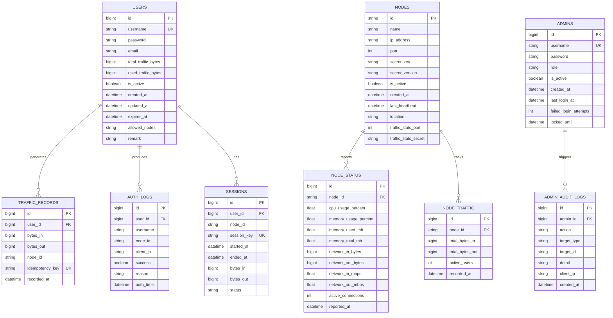

# 数据库设计

> **父文档**: [架构文档目录](README.md) | **关联**: [`traffic-statistics.md`](traffic-statistics.md) · [`api-design.md`](api-design.md)

## 1. ER 图

---

## 2. 表结构详细设计

### 2.1 用户表 (Users)

| 字段 | 类型 | 约束 | 说明 |
|------|------|------|------|
| Id | BIGINT | PK, AUTO_INCREMENT | 用户唯一标识 |
| Username | VARCHAR(64) | UNIQUE, NOT NULL | 登录用户名 |
| Password | VARCHAR(256) | NOT NULL | 密码（BCrypt 加密） |
| Email | VARCHAR(128) | NULL | 邮箱地址 |
| TotalTrafficBytes | BIGINT | NOT NULL, DEFAULT 0 | 总流量配额（字节） |
| UsedTrafficBytes | BIGINT | NOT NULL, DEFAULT 0 | 已使用流量（字节） |
| IsActive | BOOLEAN | NOT NULL, DEFAULT 1 | 是否激活 |
| CreatedAt | DATETIME | NOT NULL | 创建时间 |
| UpdatedAt | DATETIME | NOT NULL | 更新时间 |
| ExpiresAt | DATETIME | NULL | 过期时间（NULL=永不过期） |
| AllowedNodes | TEXT | NULL | 允许使用的节点ID列表（JSON数组，NULL=全部） |
| Remark | TEXT | NULL | 备注信息 |

### 2.2 流量记录表 (TrafficRecords)

| 字段 | 类型 | 约束 | 说明 |
|------|------|------|------|
| Id | BIGINT | PK, AUTO_INCREMENT | 记录ID |
| UserId | BIGINT | FK, NOT NULL | 用户ID |
| BytesIn | BIGINT | NOT NULL | 入站流量/用户上传（字节）。对应 Hysteria `rx`（服务端视角） |
| BytesOut | BIGINT | NOT NULL | 出站流量/用户下载（字节）。对应 Hysteria `tx`（服务端视角） |
| NodeId | VARCHAR(64) | NOT NULL | 节点ID |
| IdempotencyKey | VARCHAR(128) | UNIQUE, NOT NULL | 幂等键，格式 `{nodeId}_{userId}_{timestamp}`，防止重复计入 |
| RecordedAt | DATETIME | NOT NULL | 记录时间 |

> **注意流量方向映射**：Hysteria 的 `tx`/`rx` 是服务端视角。`tx` = 服务端发出 = 客户端收到 = **用户的下载流量**，在 `TrafficRecords` 中记入 `BytesOut`。`rx` = 服务端收到 = 客户端发出 = **用户的上传流量**，记入 `BytesIn`。详见 [`../hysteria/hysteria-traffic-stats-api.md`](../hysteria/hysteria-traffic-stats-api.md#get-traffic--查询用户流量)。

> **幂等保障**：`IdempotencyKey` 使用唯一约束，确保同一次上报的流量数据不会因重试而重复计入。详见 [`traffic-statistics.md`](traffic-statistics.md)。

### 2.3 认证日志表 (AuthLogs)

| 字段 | 类型 | 约束 | 说明 |
|------|------|------|------|
| Id | BIGINT | PK, AUTO_INCREMENT | 日志ID |
| UserId | BIGINT | FK, NULL | 用户ID（认证失败时为NULL） |
| Username | VARCHAR(64) | NOT NULL | 尝试认证的用户名 |
| NodeId | VARCHAR(64) | NOT NULL | 认证节点ID |
| ClientIp | VARCHAR(45) | NOT NULL | 客户端IP |
| Success | BOOLEAN | NOT NULL | 是否成功 |
| Reason | VARCHAR(256) | NULL | 失败原因 |
| AuthTime | DATETIME | NOT NULL | 认证时间 |

### 2.4 会话表 (Sessions)

| 字段 | 类型 | 约束 | 说明 |
|------|------|------|------|
| Id | BIGINT | PK, AUTO_INCREMENT | 会话ID |
| UserId | BIGINT | FK, NOT NULL | 用户ID |
| NodeId | VARCHAR(64) | NOT NULL | 节点ID |
| SessionKey | VARCHAR(128) | UNIQUE, NOT NULL | 会话密钥 |
| StartedAt | DATETIME | NOT NULL | 开始时间 |
| EndedAt | DATETIME | NULL | 结束时间 |
| BytesIn | BIGINT | NOT NULL, DEFAULT 0 | 入站流量 |
| BytesOut | BIGINT | NOT NULL, DEFAULT 0 | 出站流量 |
| Status | VARCHAR(16) | NOT NULL, DEFAULT 'active' | 会话状态：`active`、`idle`、`closed` |

### 2.5 节点表 (Nodes)

| 字段 | 类型 | 约束 | 说明 |
|------|------|------|------|
| Id | VARCHAR(64) | PK | 节点唯一标识（UUID） |
| Name | VARCHAR(128) | NOT NULL | 节点名称 |
| IpAddress | VARCHAR(45) | NOT NULL | 节点IP地址 |
| Port | INT | NOT NULL | Hysteria 服务端口 |
| SecretKey | VARCHAR(256) | NOT NULL | 节点密钥（用于节点间通信认证） |
| SecretVersion | INT | NOT NULL, DEFAULT 1 | 密钥版本号，用于密钥轮换 |
| IsActive | BOOLEAN | NOT NULL, DEFAULT 1 | 是否激活 |
| CreatedAt | DATETIME | NOT NULL | 创建时间 |
| LastHeartbeat | DATETIME | NULL | 最后心跳时间 |
| Location | VARCHAR(128) | NULL | 节点位置描述 |
| TrafficStatsPort | INT | NULL | Hysteria trafficStats API 端口（用于 Edge Agent 本地采集） |
| TrafficStatsSecret | VARCHAR(256) | NULL | trafficStats API 密钥 |
| ProvisionToken | VARCHAR(128) | UNIQUE, NULL | 预注册令牌（由管理员预注册时生成，边缘节点首次注册后清零） |
| ProvisionStatus | VARCHAR(16) | NOT NULL, DEFAULT 'pending' | 预注册状态：`pending`（等待注册）、`provisioned`（已注册）、`revoked`（已吊销） |

### 2.6 节点状态表 (NodeStatus)

| 字段 | 类型 | 约束 | 说明 |
|------|------|------|------|
| Id | BIGINT | PK, AUTO_INCREMENT | 状态记录ID |
| NodeId | VARCHAR(64) | FK, NOT NULL | 节点ID |
| CpuUsagePercent | FLOAT | NOT NULL | CPU 使用率（%） |
| MemoryUsagePercent | FLOAT | NOT NULL | 内存使用率（%） |
| MemoryUsedMb | FLOAT | NOT NULL | 已用内存（MB） |
| MemoryTotalMb | FLOAT | NOT NULL | 总内存（MB） |
| NetworkInBytes | BIGINT | NOT NULL | 累计网络流入（字节） |
| NetworkOutBytes | BIGINT | NOT NULL | 累计网络流出（字节） |
| NetworkInMbps | FLOAT | NOT NULL | 当前网络流入速率（Mbps） |
| NetworkOutMbps | FLOAT | NOT NULL | 当前网络流出速率（Mbps） |
| ActiveConnections | INT | NOT NULL | 当前活跃连接数 |
| ReportedAt | DATETIME | NOT NULL | 上报时间 |

### 2.7 节点流量统计表 (NodeTraffic)

| 字段 | 类型 | 约束 | 说明 |
|------|------|------|------|
| Id | BIGINT | PK, AUTO_INCREMENT | 统计ID |
| NodeId | VARCHAR(64) | FK, NOT NULL | 节点ID |
| TotalBytesIn | BIGINT | NOT NULL | 总入站流量 |
| TotalBytesOut | BIGINT | NOT NULL | 总出站流量 |
| ActiveUsers | INT | NOT NULL | 活跃用户数 |
| RecordedAt | DATETIME | NOT NULL | 统计时间 |

### 2.8 管理员表 (Admins)

| 字段 | 类型 | 约束 | 说明 |
|------|------|------|------|
| Id | BIGINT | PK, AUTO_INCREMENT | 管理员唯一标识 |
| Username | VARCHAR(64) | UNIQUE, NOT NULL | 管理员用户名 |
| Password | VARCHAR(256) | NOT NULL | 密码（BCrypt 加密） |
| Role | VARCHAR(32) | NOT NULL, DEFAULT 'admin' | 角色：`super_admin`、`admin`、`readonly` |
| IsActive | BOOLEAN | NOT NULL, DEFAULT 1 | 是否激活 |
| CreatedAt | DATETIME | NOT NULL | 创建时间 |
| LastLoginAt | DATETIME | NULL | 最后登录时间 |
| FailedLoginAttempts | INT | NOT NULL, DEFAULT 0 | 连续登录失败次数 |
| LockedUntil | DATETIME | NULL | 账号锁定到期时间（NULL=未锁定） |

> **角色说明**：
> - `super_admin`：完全权限，可管理其他管理员
> - `admin`：标准权限，可管理用户和节点
> - `readonly`：只读权限，仅可查看数据

### 2.9 管理员操作审计日志表 (AdminAuditLogs)

| 字段 | 类型 | 约束 | 说明 |
|------|------|------|------|
| Id | BIGINT | PK, AUTO_INCREMENT | 日志ID |
| AdminId | BIGINT | FK, NOT NULL | 操作管理员ID |
| Action | VARCHAR(64) | NOT NULL | 操作类型：`create`、`update`、`delete`、`login`、`logout`、`kick_user` 等 |
| TargetType | VARCHAR(32) | NOT NULL | 操作目标类型：`user`、`node`、`admin`、`system` |
| TargetId | VARCHAR(64) | NULL | 操作目标ID |
| Detail | TEXT | NULL | 操作详情（JSON格式，含变更前后对比） |
| ClientIp | VARCHAR(45) | NOT NULL | 操作来源IP |
| CreatedAt | DATETIME | NOT NULL | 操作时间 |
