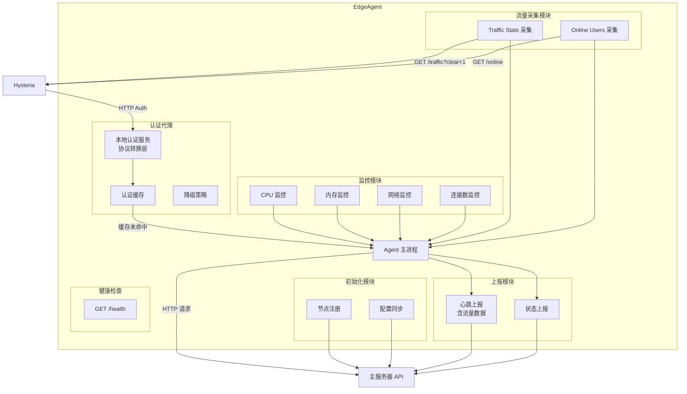
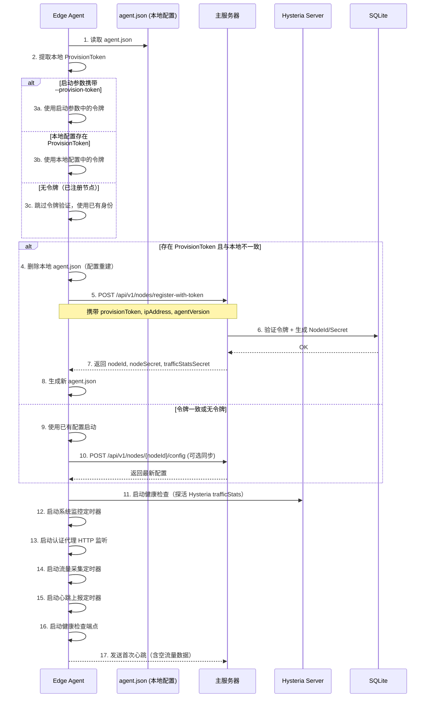
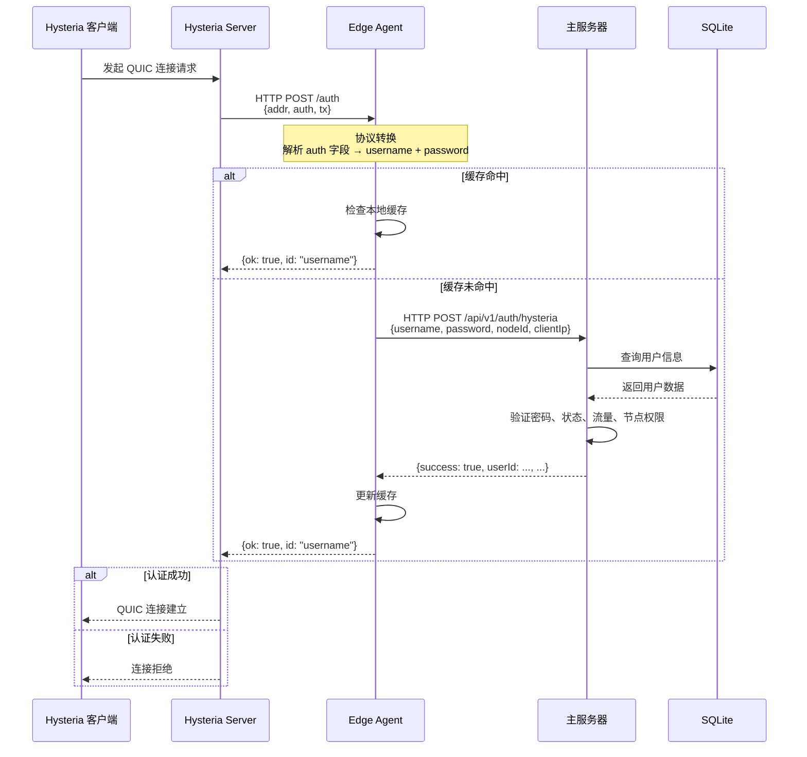

# 边缘节点与 Hysteria 集成

> **父文档**: [架构文档目录](README.md) | **关联**: [`system-architecture.md`](system-architecture.md) · [`api-design.md`](api-design.md) · [`traffic-statistics.md`](traffic-statistics.md) · [`../hysteria/hysteria-server-config.md`](../hysteria/hysteria-server-config.md) · [`../hysteria/hysteria-traffic-stats-api.md`](../hysteria/hysteria-traffic-stats-api.md)

---

## 1. Edge Agent 架构

边缘节点运行一个轻量级的 Edge Agent 进程，负责：

1. **预注册令牌验证**：启动时比对本地配置中的 `ProvisionToken` 与主服务器下发的令牌，决定是否重建配置
2. **启动注册**：使用预注册令牌或已有身份向主服务器注册并同步节点信息
3. **系统监控**：采集 CPU、内存、网络等指标
4. **认证代理**：接收本地 Hysteria 的认证请求，完成协议转换后转发到主服务器
5. **流量采集**：定时调用本地 Hysteria 的 [`trafficStats` API](../hysteria/hysteria-traffic-stats-api.md) 采集各用户流量和在线状态
6. **状态上报**：定时向主服务器发送心跳、系统状态和流量数据
7. **本地缓存**：缓存用户认证信息，减少网络请求
8. **健康探活**：暴露健康检查端点



---

## 2. Edge Agent 启动与初始化流程

### 2.1 启动流程概述

Edge Agent 启动时执行以下初始化序列，核心是 **预注册令牌比对 → 配置重建** 机制：



### 2.2 标识符比对逻辑

| 场景 | 本地 `ProvisionToken` | 启动参数 `--provision-token` | 行为 |
|------|----------------------|------------------------------|------|
| 全新部署 | 不存在 | 存在 | 使用启动参数令牌，向主服务器注册，生成新配置 |
| 令牌变更 | `token_A` | `token_B`（不同） | 删除本地配置，使用新令牌重新注册 |
| 令牌一致 | `token_A` | `token_A`（相同） | 使用已有配置正常启动 |
| 已注册节点 | 不存在（已清零） | 不存在 | 使用已有 `nodeId` + `nodeSecret` 正常启动 |
| 令牌过期 | 存在但已过期 | 存在但已过期 | 注册失败，记录错误日志，持续重试 |

### 2.3 配置重建流程

当检测到令牌不一致时，Edge Agent 执行以下操作：

1. **备份旧配置**：将 `agent.json` 重命名为 `agent.json.bak.{timestamp}`（保留审计追踪）
2. **删除旧配置**：移除 `agent.json`
3. **向主服务器注册**：调用 `POST /api/v1/nodes/register-with-token`
4. **生成新配置**：使用主服务器返回的 `nodeId`、`nodeSecret`、`trafficStatsSecret` 等生成新 `agent.json`
5. **启动所有模块**：系统监控、认证代理、流量采集、心跳上报

### 2.4 注册重试策略

| 参数 | 值 | 说明 |
|------|-----|------|
| 初始间隔 | 2s | 首次重试等待时间 |
| 最大间隔 | 60s | 指数退避上限 |
| 最大重试次数 | 5 | 超过后 Agent 退出 |
| 退出行为 | `exit(1)` | 由 systemd `Restart=always` 自动重启 |

---

## 3. 系统监控实现

### 3.1 CPU 使用率

```csharp
// 使用 /proc/stat 读取 CPU 信息
// 计算两次采样之间的差值
public double GetCpuUsage()
{
    var stat1 = ReadProcStat();
    Thread.Sleep(1000);
    var stat2 = ReadProcStat();
    
    var totalDiff = stat2.Total - stat1.Total;
    var idleDiff = stat2.Idle - stat1.Idle;
    
    return (1.0 - (double)idleDiff / totalDiff) * 100;
}
```

### 3.2 内存使用率

```csharp
// 读取 /proc/meminfo
public MemoryInfo GetMemoryInfo()
{
    var memInfo = ParseProcMeminfo();
    
    var used = memInfo.Total - memInfo.Available;
    var usagePercent = (double)used / memInfo.Total * 100;
    
    return new MemoryInfo
    {
        TotalMb = memInfo.Total / 1024 / 1024,
        UsedMb = used / 1024 / 1024,
        UsagePercent = usagePercent
    };
}
```

### 3.3 网络流量

```csharp
// 读取 /proc/net/dev
public NetworkInfo GetNetworkInfo()
{
    var interfaces = ParseProcNetDev();
    
    // 只统计非 lo 接口
    var totalIn = interfaces
        .Where(i => i.Name != "lo")
        .Sum(i => i.BytesReceived);
    
    var totalOut = interfaces
        .Where(i => i.Name != "lo")
        .Sum(i => i.BytesSent);
    
    return new NetworkInfo
    {
        TotalInBytes = totalIn,
        TotalOutBytes = totalOut
    };
}
```

---

## 4. 认证代理实现

Edge Agent 在本地启动一个 HTTP 服务，监听指定端口，接收 Hysteria 的认证请求。核心职责是完成 **Hysteria 原生协议 → 项目内部协议** 的转换。

### 4.1 协议转换逻辑

```csharp
// Edge Agent 认证代理核心逻辑
public async Task<HysteriaAuthResponse> HandleAuthAsync(HysteriaAuthRequest request)
{
    // 1. 解析 Hysteria 原生请求中的 auth 字段
    //    Hysteria 发送: { "addr": "1.2.3.4:5566", "auth": "base64_creds", "tx": 52428800 }
    var (username, password) = ParseAuthField(request.Auth);
    
    // 2. 检查本地缓存
    if (_cache.TryGet(username, out var cachedResult))
        return cachedResult;
    
    // 3. 构造内部 API 请求
    var internalRequest = new InternalAuthRequest
    {
        Username = username,
        Password = password,
        NodeId = _config.NodeId,
        ClientIp = ExtractIp(request.Addr)
    };
    
    // 4. 转发到主服务器
    var internalResponse = await _masterClient.PostAsync<InternalAuthResponse>(
        "/api/v1/auth/hysteria", internalRequest
    );
    
    // 5. 转换响应为 Hysteria 原生格式
    var hysteriaResponse = new HysteriaAuthResponse
    {
        Ok = internalResponse.Success,
        Id = internalResponse.Success ? username : ""
    };
    
    // 6. 更新缓存
    if (internalResponse.Success)
        _cache.Set(username, hysteriaResponse);
    
    return hysteriaResponse;
}
```

### 4.2 协议转换对照表

| 转换方向 | Hysteria 原生 | → | 项目内部 |
|-----------|--------------|---|----------|
| 请求 | `auth` (单一凭据字段) | → | `username` + `password`（分离） |
| 请求 | `addr` ("IP:Port") | → | `clientIp`（仅 IP） |
| 请求 | `tx`（速率） | → | 含在请求体中 |
| 请求 | 无节点标识 | → | `nodeId`（Agent 配置注入） |
| 响应 | `ok` + `id` | ← | `success` + `userId` |

> **协议详情**: Hysteria 原生 HTTP Auth 协议定义见 [`../hysteria/hysteria-server-config.md` §9.1](../hysteria/hysteria-server-config.md#91-http-验证本项目的核心集成方式)。

---

## 5. 流量采集实现（方案一）

> 这是流量统计的**核心实现**。方案选择背景和与其他方案的对比见 [`traffic-statistics.md`](traffic-statistics.md)。

Edge Agent 定时调用本地 Hysteria 的 [`trafficStats` API](../hysteria/hysteria-traffic-stats-api.md)，采集流量和在线用户数据，合并到心跳上报中。

```csharp
// Edge Agent 流量采集定时任务
public async Task CollectAndReportTrafficAsync()
{
    // 1. 调用本地 Hysteria trafficStats API — 获取流量并在返回后清零
    var traffic = await _httpClient.GetFromJsonAsync<Dictionary<string, TrafficInfo>>(
        "http://127.0.0.1:9999/traffic?clear=1",
        headers: new { Authorization = _config.TrafficStatsSecret }
    );
    
    // 2. 获取在线用户连接数
    var online = await _httpClient.GetFromJsonAsync<Dictionary<string, int>>(
        "http://127.0.0.1:9999/online",
        headers: new { Authorization = _config.TrafficStatsSecret }
    );
    
    // 3. 合并到心跳上报
    await _masterClient.PostAsync($"/api/v1/nodes/{_config.NodeId}/heartbeat", new
    {
        // ... 系统监控数据 ...
        UserTraffic = traffic,     // { "user1": { "tx": 1024, "rx": 512 }, ... }
        OnlineUsers = online,      // { "user1": 2, "user2": 1 }
        ReportedAt = DateTime.UtcNow
    });
}
```

### 5.1 数据流向

```
Hysteria Server                Edge Agent                  主服务器
     │                             │                           │
     │  (每 N 秒)                   │                           │
     │◄──── GET /traffic?clear=1 ──│                           │
     │───► {user: {tx, rx}}        │                           │
     │                             │                           │
     │◄──── GET /online ──────────│                           │
     │───► {user: connections}     │                           │
     │                             │──► POST /api/v1/nodes/   │
     │                             │    {nodeId}/heartbeat     │
     │                             │    (含 userTraffic +      │
     │                             │     onlineUsers)          │
     │                             │                           │
     │                             │◄─── 主服务器更新:         │
     │                             │     - Users.UsedTrafficBytes
     │                             │     - TrafficRecords 写入 │
     │                             │     - NodeTraffic 记录    │
```

### 5.2 流量方向映射

| Hysteria API 字段 | 视角 | 含义 | 主服务器数据库 |
|-------------------|------|------|---------------|
| `tx` | 服务端发出 | 用户下载 | `TrafficRecords.BytesOut` |
| `rx` | 服务端收到 | 用户上传 | `TrafficRecords.BytesIn` |
| 两者合计 | — | 用户总流量 | `Users.UsedTrafficBytes` |
| `online[user]` | — | 在线设备数 | 用于更新 `Sessions` 表 |

### 5.3 关键配置说明

Edge Agent 需要配置 `trafficStats` 相关信息以访问本地 Hysteria API：

```json
{
    "TrafficStats": {
        "ListenAddress": "127.0.0.1",
        "ListenPort": 9999,
        "Secret": "your_secret_here",
        "CollectIntervalSeconds": 30
    }
}
```

> **安全建议**: Hysteria 的 `trafficStats.listen` 应绑定到 `127.0.0.1`，仅允许本地 Edge Agent 访问。详见 [`../hysteria/hysteria-server-config.md` §14](../hysteria/hysteria-server-config.md#14-流量统计-api-trafficstats)。

---

## 6. Hysteria 服务端配置 (YAML)

边缘节点 Hysteria 服务端配置模板：

```yaml
# Hysteria 2 服务端配置 — 边缘节点模板
listen: :443

tls:
  cert: /etc/hysteria/server.crt
  key: /etc/hysteria/server.key

auth:
  type: http
  http:
    url: http://127.0.0.1:8080/auth    # Edge Agent 认证代理
    insecure: false

bandwidth:
  up: 100 mbps
  down: 100 mbps

ignoreClientBandwidth: false

sniff:
  enable: true

udpIdleTimeout: 60s

speedTest: false

# 流量统计 API — Edge Agent 通过此接口采集流量数据
trafficStats:
  listen: 127.0.0.1:9999               # 仅本地回环可访问
  secret: your_traffic_stats_secret     # 与 Edge Agent agent.json 中一致

# 伪装
masquerade:
  type: proxy
  proxy:
    url: https://www.bing.com
    rewriteHost: true
```

> **配置说明**:
> - `auth.http`: 指向 Edge Agent 的本地认证代理
> - `trafficStats`: 开启流量统计 API，供 Edge Agent 采集用户流量
> - 其他配置项详见 [`../hysteria/hysteria-server-config.md`](../hysteria/hysteria-server-config.md)

---

## 7. 认证流程


