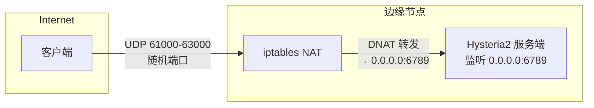
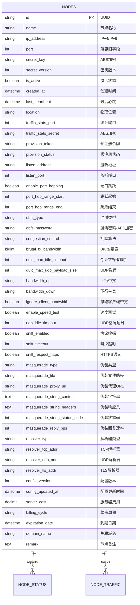

# 节点数据表重新设计 —— 支持完整 Hysteria 2 配置

> **父文档**: [架构文档目录](README.md) | **关联**: [`database-design.md`](database-design.md) · [`hysteria-server-config.md`](../hysteria/hysteria-server-config.md) · [`edge-node-design.md`](edge-node-design.md)
>
> **状态**: 📐 设计阶段 | **版本**: v2.0 | **日期**: 2026-05-24

---

## 1. 设计动机

当前 [`Node`](../../src/HysteriaAuth.Master/Models/Entities/Node.cs) 实体的 14 个字段仅覆盖节点基本身份和生命周期管理，缺少运行 Hysteria 2 服务端所需的完整配置字段。每当需要调整代理节点的网络参数（如混淆、拥塞控制、端口跳跃、UDP 超时、协议嗅探、伪装站点等），管理员必须 SSH 登录边缘节点手动修改 YAML 文件，无法通过控制面板统一管理。

本次重新设计的目标是：**让 Node 表成为 Hysteria 2 服务端配置的唯一权威来源**，由 Master 生成完整配置并通过 Edge Agent API 下发到边缘节点，实现从控制面板到边缘节点的全链路配置管理。

---

## 2. 设计原则

| 原则 | 说明 |
|------|------|
| **所有字段 NULLABLE / 含默认值** | 新增字段全部可为 NULL 或提供合理默认值，确保与已有数据完全向后兼容 |
| **配置语义化分组** | 字段名直接映射 Hysteria 2 YAML 配置项，降低认知成本 |
| **敏感字段 AES 加密** | `SecretKey`、`ObfsPassword` 等密钥类字段继续使用 [`AesEncryptionService`](../../src/HysteriaAuth.Master/Services/AesEncryptionService.cs) 加密存储 |
| **默认启用端口跳跃** | `EnablePortHopping = true`，Hysteria2 监听 `0.0.0.0:6789`，iptables 转发 UDP 61000–63000 → 6789 |
| **配置变更追踪** | 增加 `ConfigVersion` + `ConfigUpdatedAt` 字段，Edge Agent 可据此判断是否需要拉取新配置 |

---

## 3. 启用端口跳跃的默认架构



**iptables 规则示例：**

```bash
iptables -t nat -A PREROUTING -i eth0 -p udp --dport 61000:63000 -j DNAT --to-destination :6789
```

> 此规则由 Edge Agent 在节点注册完成后自动应用，无需人工干预。

---

## 4. 完整字段列表（共 ~42 个字段）

### 4.1 基础身份字段（原 14 个字段，保持不变）

| # | 字段名 | 类型 | 约束 | 默认值 | 说明 |
|---|--------|------|------|--------|------|
| 1 | `Id` | VARCHAR(64) | PK | `Guid.NewGuid()` | 节点唯一标识（UUID） |
| 2 | `Name` | VARCHAR(128) | NOT NULL | `""` | 节点名称 |
| 3 | `IpAddress` | VARCHAR(45) | NOT NULL | `""` | 节点 IPv4/IPv6 地址 |
| 4 | `Port` | INT | NOT NULL | — | Hysteria 服务端口（历史兼容字段，等同于 `ListenPort`） |
| 5 | `SecretKey` | VARCHAR(256) | NOT NULL, AES 加密 | `""` | 节点通信密钥（256-bit hex） |
| 6 | `SecretVersion` | INT | NOT NULL | `1` | 密钥版本号，用于密钥轮换 |
| 7 | `IsActive` | BOOLEAN | NOT NULL | `true` | 节点是否激活 |
| 8 | `CreatedAt` | DATETIME | NOT NULL | `UtcNow` | 创建时间 |
| 9 | `LastHeartbeat` | DATETIME | NULL | — | 最后心跳时间 |
| 10 | `Location` | VARCHAR(128) | NULL | — | 物理位置描述（如 `上海-阿里云`） |
| 11 | `TrafficStatsPort` | INT | NULL | — | trafficStats API 端口 |
| 12 | `TrafficStatsSecret` | VARCHAR(256) | NULL, AES 加密 | — | trafficStats API 密钥 |
| 13 | `ProvisionToken` | VARCHAR(128) | UNIQUE, NULL | — | 预注册令牌（注册后清空） |
| 14 | `ProvisionStatus` | VARCHAR(16) | NOT NULL | `"pending"` | 预注册状态 |

### 4.2 监听 & 端口跳跃配置（新字段，映射 `listen`）

| # | 字段名 | 类型 | 约束 | 默认值 | YAML 路径 | 说明 |
|---|--------|------|------|--------|-----------|------|
| 15 | `ListenAddress` | VARCHAR(45) | NULL | `"0.0.0.0"` | `listen` | Hysteria2 监听地址 |
| 16 | `ListenPort` | INT | NULL | `6789` | `listen` | Hysteria2 监听端口 |
| 17 | `EnablePortHopping` | BOOLEAN | NOT NULL | `true` | — | 是否启用端口跳跃 |
| 18 | `PortHopRangeStart` | INT | NULL | `61000` | `listen` | 端口跳跃范围起始 |
| 19 | `PortHopRangeEnd` | INT | NULL | `63000` | `listen` | 端口跳跃范围结束 |

> **listen YAML 生成逻辑**：
> ```yaml
> # 当 EnablePortHopping = true
> listen: 0.0.0.0:6789,0.0.0.0:61000-63000
> 
> # 当 EnablePortHopping = false
> listen: 0.0.0.0:6789
> ```

### 4.3 混淆配置（新字段，映射 `obfs`）

| # | 字段名 | 类型 | 约束 | 默认值 | YAML 路径 | 说明 |
|---|--------|------|------|--------|-----------|------|
| 20 | `ObfsType` | VARCHAR(32) | NULL | `"salamander"` | `obfs.type` | 混淆类型：`salamander` |
| 21 | `ObfsPassword` | VARCHAR(256) | NULL, AES 加密 | — | `obfs.salamander.password` | 混淆密码（与 SecretKey 同样强度） |

### 4.4 QUIC & 拥塞控制（新字段，映射 `quic` / `congestion`）

| # | 字段名 | 类型 | 约束 | 默认值 | YAML 路径 | 说明 |
|---|--------|------|------|--------|-----------|------|
| 22 | `CongestionControl` | VARCHAR(16) | NULL | `"bbr"` | `bandwidth.congestion.algorithm` | 拥塞控制算法：`bbr`、`cubic`、`brutal` |
| 23 | `BrutalTxBandwidth` | BIGINT | NULL | — | `bandwidth.congestion.brutal.txBandwidth` | Brutal 发件带宽（bps） |
| 24 | `QuicMaxIdleTimeout` | INT | NULL | `30` | `quic.maxIdleTimeout` | QUIC 最大空闲超时（秒） |
| 25 | `QuicMaxUdpPayloadSize` | INT | NULL | `1350` | `quic.maxUDPPayloadSize` | QUIC 最大 UDP 载荷（字节） |
| 26 | `QuicInitStreamReceiveWindow` | BIGINT | NULL | — | `quic.initStreamReceiveWindow` | 初始流接收窗口 |
| 27 | `QuicMaxStreamReceiveWindow` | BIGINT | NULL | — | `quic.maxStreamReceiveWindow` | 最大流接收窗口 |
| 28 | `QuicInitConnectionReceiveWindow` | BIGINT | NULL | — | `quic.initConnectionReceiveWindow` | 初始连接接收窗口 |
| 29 | `QuicMaxConnectionReceiveWindow` | BIGINT | NULL | — | `quic.maxConnectionReceiveWindow` | 最大连接接收窗口 |

### 4.5 带宽配置（新字段，映射 `bandwidth`）

| # | 字段名 | 类型 | 约束 | 默认值 | YAML 路径 | 说明 |
|---|--------|------|------|--------|-----------|------|
| 30 | `BandwidthUp` | VARCHAR(16) | NULL | — | `bandwidth.up` | 上行带宽（如 `100 mbps`） |
| 31 | `BandwidthDown` | VARCHAR(16) | NULL | — | `bandwidth.down` | 下行带宽（如 `200 mbps`） |
| 32 | `IgnoreClientBandwidth` | BOOLEAN | NULL | `false` | `bandwidth.ignoreClientBandwidth` | 忽略客户端带宽设置 |

### 4.6 速度测试配置（新字段，映射 `speedTest`）

| # | 字段名 | 类型 | 约束 | 默认值 | YAML 路径 | 说明 |
|---|--------|------|------|--------|-----------|------|
| 33 | `EnableSpeedTest` | BOOLEAN | NULL | `false` | `speedTest` | 是否启用速度测试（非 null 即表示启用） |
| 34 | `SpeedTestPingInterval` | INT | NULL | `60` | `speedTest.pingInterval` | Ping 间隔（秒） |
| 35 | `SpeedTestDownloadSize` | BIGINT | NULL | — | `speedTest.downloadSize` | 下载测试大小（字节） |
| 36 | `SpeedTestUploadSize` | BIGINT | NULL | — | `speedTest.uploadSize` | 上传测试大小（字节） |

### 4.7 UDP 配置（新字段，映射 `udpIdleTimeout`）

| # | 字段名 | 类型 | 约束 | 默认值 | YAML 路径 | 说明 |
|---|--------|------|------|--------|-----------|------|
| 37 | `UdpIdleTimeout` | INT | NULL | `60` | `udpIdleTimeout` | UDP 空闲超时（秒） |

### 4.8 协议嗅探配置（新字段，映射 `sniff`）

| # | 字段名 | 类型 | 约束 | 默认值 | YAML 路径 | 说明 |
|---|--------|------|------|--------|-----------|------|
| 38 | `SniffEnabled` | BOOLEAN | NULL | `false` | `sniff` | 是否启用协议嗅探 |
| 39 | `SniffTimeout` | INT | NULL | `5` | `sniff.timeout` | 嗅探超时（秒） |
| 40 | `SniffRespectHttps` | BOOLEAN | NULL | `false` | `sniff.respectHTTPS` | 是否遵从 HTTPS 语义 |

### 4.9 伪装配置（新字段，映射 `masquerade`）

| # | 字段名 | 类型 | 约束 | 默认值 | YAML 路径 | 说明 |
|---|--------|------|------|--------|-----------|------|
| 41 | `MasqueradeType` | VARCHAR(16) | NULL | — | `masquerade.type` | 伪装类型：`file`、`proxy`、`string`、`reply` |
| 42 | `MasqueradeFile` | VARCHAR(512) | NULL | — | `masquerade.file` | 伪装文件路径（type=file 时） |
| 43 | `MasqueradeProxyUrl` | VARCHAR(512) | NULL | — | `masquerade.proxy.url` | 伪装代理 URL（type=proxy 时） |
| 44 | `MasqueradeStringContent` | TEXT | NULL | — | `masquerade.string.content` | 伪装响应字符串（type=string 时） |
| 45 | `MasqueradeStringHeaders` | TEXT | NULL | — | `masquerade.string.headers` | 伪装响应头（JSON，type=string 时） |
| 46 | `MasqueradeStringStatusCode` | INT | NULL | `200` | `masquerade.string.statusCode` | 伪装响应状态码（type=string 时） |
| 47 | `MasqueradeReplyBps` | INT | NULL | — | `masquerade.reply.bps` | 伪装回复速率（bps，type=reply 时） |

### 4.10 DNS 解析器配置（新字段，映射 `resolver`）

| # | 字段名 | 类型 | 约束 | 默认值 | YAML 路径 | 说明 |
|---|--------|------|------|--------|-----------|------|
| 48 | `ResolverType` | VARCHAR(16) | NULL | `"system"` | `resolver.type` | 解析器类型：`system`、`udp`、`tcp`、`tls` |
| 49 | `ResolverTcpAddr` | VARCHAR(64) | NULL | — | `resolver.tcp.addr` | TCP 解析器地址（type=tcp 时） |
| 50 | `ResolverUdpAddr` | VARCHAR(64) | NULL | — | `resolver.udp.addr` | UDP 解析器地址（type=udp 时） |
| 51 | `ResolverTlsAddr` | VARCHAR(64) | NULL | — | `resolver.tls.addr` | TLS 解析器地址（type=tls 时） |
| 52 | `ResolverResolveInterval` | INT | NULL | — | `resolver.resolveInterval` | 解析间隔（秒） |
| 53 | `ResolverResolveConcurrency` | INT | NULL | — | `resolver.resolveConcurrency` | 解析并发数 |

### 4.11 配置版本追踪（新字段）

| # | 字段名 | 类型 | 约束 | 默认值 | 说明 |
|---|--------|------|------|--------|------|
| 54 | `ConfigVersion` | INT | NOT NULL | `1` | 配置版本号，每次配置变更后自增 |
| 55 | `ConfigUpdatedAt` | DATETIME | NULL | — | 配置最后更新时间 |

### 4.12 运营管理字段（新字段）

| # | 字段名 | 类型 | 约束 | 默认值 | 说明 |
|---|--------|------|------|--------|------|
| 56 | `ServerCost` | DECIMAL(10,2) | NULL | — | 服务器费用（月付金额） |
| 57 | `BillingCycle` | VARCHAR(16) | NULL | — | 续费周期：`monthly`、`quarterly`、`yearly` |
| 58 | `ExpirationDate` | DATETIME | NULL | — | 服务器到期日期 |
| 59 | `DomainName` | VARCHAR(256) | NULL | — | 节点关联域名 |
| 60 | `Remark` | TEXT | NULL | — | 节点备注信息 |

---

## 5. 更新后的 ER 图（NODES 部分）



---

## 6. 配置生成逻辑：Node Entity → Hysteria 2 YAML

新增 [`ConfigGeneratorService`](../../src/HysteriaAuth.Master/Services/) 负责将 Node 实体映射为 Hysteria 2 服务端 YAML 配置。

### 6.1 映射规则

```
Node.ListenAddress + ":" + Node.ListenPort  →  listen
  ├─ 若 EnablePortHopping = true
  │   └─ 追加 ",Node.ListenAddress:PortHopRangeStart-PortHopRangeEnd"

Node.ObfsType / Node.ObfsPassword          →  obfs
Node.BandwidthUp / Node.BandwidthDown       →  bandwidth.up / down
Node.CongestionControl                      →  bandwidth.congestion.algorithm
Node.BrutalTxBandwidth                      →  bandwidth.congestion.brutal.txBandwidth
Node.EnableSpeedTest (非 null 即启用)       →  speedTest
Node.UdpIdleTimeout                         →  udpIdleTimeout
Node.SniffEnabled                           →  sniff
Node.MasqueradeType + 相关字段              →  masquerade
Node.ResolverType + 相关字段                →  resolver
Node.TrafficStatsPort / TrafficStatsSecret  →  trafficStats.listen / secret
```

### 6.2 输出 YAML 模板示例

```yaml
# 自动生成于 2026-05-24T11:00:00Z | 配置版本: 3
listen: 0.0.0.0:6789,0.0.0.0:61000-63000

realm: hysteria.example.com

obfs:
  type: salamander
  salamander:
    password: "{obfsPassword_明文}"

quic:
  maxIdleTimeout: 30s
  maxUDPPayloadSize: 1350

bandwidth:
  up: 100 mbps
  down: 200 mbps
  congestion:
    algorithm: bbr

speedTest: {}

udpIdleTimeout: 60s

auth:
  type: http
  http:
    url: http://{master_host}:8080/api/v1/auth?nodeId={nodeId}
    secret: "{authProxySecret}"

resolver:
  type: system

sniff: {}

masquerade:
  type: file
  file:
    dir: /var/www/html

trafficStats:
  listen: 127.0.0.1:{trafficStatsPort}
  secret: "{trafficStatsSecret}"
```

---

## 7. 迁移注意事项

| 注意事项 | 说明 |
|----------|------|
| **向后兼容** | 所有新字段均 NULLABLE 或有默认值，现有数据无需任何修改即可正常工作 |
| **EF Core Migration** | 需要创建新的 Migration，由于只有 ADD COLUMN 操作，不会锁表或丢失数据 |
| **`Port` 字段保留** | 保留原有 `Port` 字段以兼容旧版 Edge Agent，`ConfigGeneratorService` 优先使用 `ListenPort`（非 NULL 时），回退到 `Port` |
| **AES 加密扩展** | `ObfsPassword` 需加入 [`AesEncryptionService`](../../src/HysteriaAuth.Master/Services/AesEncryptionService.cs) 的加密/解密范围 |
| **Edge Agent 适配** | 配置同步 API 响应需扩展为新结构，Edge Agent 需要支持解析新 YAML 格式并应用 iptables 规则 |
| **性能影响** | 字段从 14 增至 ~60，单行宽度显著增加但仍在 SQLite 限制内（单行最多 ~1KB，约 2000 列限制），无性能问题 |

---

## 8. C# Entity 代码（参考实现）

```csharp
// src/HysteriaAuth.Master/Models/Entities/Node.cs (redesigned)

using System.ComponentModel.DataAnnotations;
using System.ComponentModel.DataAnnotations.Schema;

namespace HysteriaAuth.Master.Models.Entities;

public class Node
{
    // ===== 基础身份（原有字段） =====
    [Key]
    [MaxLength(64)]
    public string Id { get; set; } = Guid.NewGuid().ToString();

    [Required, MaxLength(128)]
    public string Name { get; set; } = string.Empty;

    [Required, MaxLength(45)]
    public string IpAddress { get; set; } = string.Empty;

    public int Port { get; set; }

    [Required, MaxLength(256)]
    public string SecretKey { get; set; } = string.Empty;

    public int SecretVersion { get; set; } = 1;

    public bool IsActive { get; set; } = true;

    public DateTime CreatedAt { get; set; } = DateTime.UtcNow;

    public DateTime? LastHeartbeat { get; set; }

    [MaxLength(128)]
    public string? Location { get; set; }

    public int? TrafficStatsPort { get; set; }

    [MaxLength(256)]
    public string? TrafficStatsSecret { get; set; }

    [MaxLength(128)]
    public string? ProvisionToken { get; set; }

    [Required, MaxLength(16)]
    public string ProvisionStatus { get; set; } = "pending";

    // ===== 监听 & 端口跳跃（新字段） =====
    [MaxLength(45)]
    public string? ListenAddress { get; set; } = "0.0.0.0";

    public int? ListenPort { get; set; } = 6789;

    public bool EnablePortHopping { get; set; } = true;

    public int? PortHopRangeStart { get; set; } = 61000;

    public int? PortHopRangeEnd { get; set; } = 63000;

    // ===== 混淆（新字段） =====
    [MaxLength(32)]
    public string? ObfsType { get; set; } = "salamander";

    [MaxLength(256)]
    public string? ObfsPassword { get; set; }

    // ===== QUIC & 拥塞控制（新字段） =====
    [MaxLength(16)]
    public string? CongestionControl { get; set; } = "bbr";

    public long? BrutalTxBandwidth { get; set; }

    public int? QuicMaxIdleTimeout { get; set; } = 30;

    public int? QuicMaxUdpPayloadSize { get; set; } = 1350;

    public long? QuicInitStreamReceiveWindow { get; set; }

    public long? QuicMaxStreamReceiveWindow { get; set; }

    public long? QuicInitConnectionReceiveWindow { get; set; }

    public long? QuicMaxConnectionReceiveWindow { get; set; }

    // ===== 带宽（新字段） =====
    [MaxLength(16)]
    public string? BandwidthUp { get; set; }

    [MaxLength(16)]
    public string? BandwidthDown { get; set; }

    public bool? IgnoreClientBandwidth { get; set; } = false;

    // ===== 速度测试（新字段） =====
    public bool? EnableSpeedTest { get; set; } = false;

    public int? SpeedTestPingInterval { get; set; } = 60;

    public long? SpeedTestDownloadSize { get; set; }

    public long? SpeedTestUploadSize { get; set; }

    // ===== UDP（新字段） =====
    public int? UdpIdleTimeout { get; set; } = 60;

    // ===== 协议嗅探（新字段） =====
    public bool? SniffEnabled { get; set; } = false;

    public int? SniffTimeout { get; set; } = 5;

    public bool? SniffRespectHttps { get; set; } = false;

    // ===== 伪装（新字段） =====
    [MaxLength(16)]
    public string? MasqueradeType { get; set; }

    [MaxLength(512)]
    public string? MasqueradeFile { get; set; }

    [MaxLength(512)]
    public string? MasqueradeProxyUrl { get; set; }

    public string? MasqueradeStringContent { get; set; }

    public string? MasqueradeStringHeaders { get; set; }

    public int? MasqueradeStringStatusCode { get; set; } = 200;

    public int? MasqueradeReplyBps { get; set; }

    // ===== DNS 解析器（新字段） =====
    [MaxLength(16)]
    public string? ResolverType { get; set; } = "system";

    [MaxLength(64)]
    public string? ResolverTcpAddr { get; set; }

    [MaxLength(64)]
    public string? ResolverUdpAddr { get; set; }

    [MaxLength(64)]
    public string? ResolverTlsAddr { get; set; }

    public int? ResolverResolveInterval { get; set; }

    public int? ResolverResolveConcurrency { get; set; }

    // ===== 配置版本追踪（新字段） =====
    public int ConfigVersion { get; set; } = 1;

    public DateTime? ConfigUpdatedAt { get; set; }

    // ===== 运营管理（新字段） =====
    [Column(TypeName = "decimal(10,2)")]
    public decimal? ServerCost { get; set; }

    [MaxLength(16)]
    public string? BillingCycle { get; set; }

    public DateTime? ExpirationDate { get; set; }

    [MaxLength(256)]
    public string? DomainName { get; set; }

    public string? Remark { get; set; }
}
```

---

## 9. DTO 扩展要点

### 9.1 [`NodeDto.cs`](../../src/HysteriaAuth.Master/Models/DTOs/NodeDto.cs) 新增

| DTO | 扩展内容 |
|-----|---------|
| `NodeDto` | 追加所有配置字段（含运营字段），用于管理员面板展示 |
| `NodeConfigResponse` | 追加 `configYaml: string` 字段，返回完整生成的 YAML |
| `NodeDetailResponse` | 继承 `NodeDto`，自动包含全部字段 |
| `PreRegisterNodeRequest` | 增加可选的 `listenPort`、`domainName`、`location` 等字段 |
| `RegisterWithTokenResponse` | 增加 `configYaml` + `configVersion` 字段 |

### 9.2 新增 DTO

```csharp
// UpdateNodeConfigRequest — 管理员修改节点配置
public class UpdateNodeConfigRequest
{
    // 监听
    public string? ListenAddress { get; set; }
    public int? ListenPort { get; set; }
    public bool? EnablePortHopping { get; set; }
    public int? PortHopRangeStart { get; set; }
    public int? PortHopRangeEnd { get; set; }
    
    // 混淆
    public string? ObfsType { get; set; }
    public string? ObfsPassword { get; set; }
    
    // 拥塞控制
    public string? CongestionControl { get; set; }
    public long? BrutalTxBandwidth { get; set; }
    
    // 带宽
    public string? BandwidthUp { get; set; }
    public string? BandwidthDown { get; set; }
    public bool? IgnoreClientBandwidth { get; set; }
    
    // 速度测试
    public bool? EnableSpeedTest { get; set; }
    
    // UDP
    public int? UdpIdleTimeout { get; set; }
    
    // 协议嗅探
    public bool? SniffEnabled { get; set; }
    
    // 伪装
    public string? MasqueradeType { get; set; }
    public string? MasqueradeFile { get; set; }
    public string? MasqueradeProxyUrl { get; set; }
    public string? MasqueradeStringContent { get; set; }
    
    // DNS 解析器
    public string? ResolverType { get; set; }
    
    // 运营管理
    public decimal? ServerCost { get; set; }
    public string? BillingCycle { get; set; }
    public DateTime? ExpirationDate { get; set; }
    public string? DomainName { get; set; }
    public string? Remark { get; set; }
}
```

---

## 10. 关联文档

| 文档 | 路径 | 说明 |
|------|------|------|
| 数据库设计（原始） | [`database-design.md`](database-design.md) | 原始 14 字段 Node 表设计 |
| Hysteria 2 服务端配置参考 | [`../hysteria/hysteria-server-config.md`](../hysteria/hysteria-server-config.md) | 完整 YAML 配置项参考 |
| 边缘节点设计 | [`edge-node-design.md`](edge-node-design.md) | Edge Agent 架构与配置同步 |
| API 设计 | [`api-design.md`](api-design.md) | 节点管理 API 端点定义 |
| 开发阶段 Phase 7 | [`../developStage/08-phase7-node-table-expansion.md`](../developStage/08-phase7-node-table-expansion.md) | 本设计的实施计划 |
