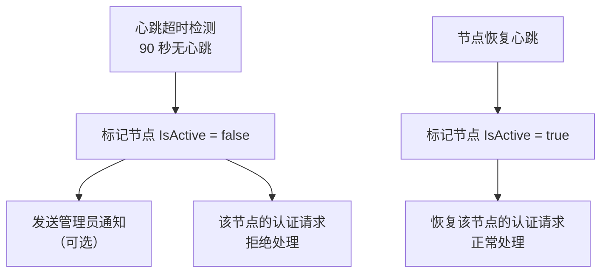

# 异常恢复、监控与测试

> **父文档**: [架构文档目录](README.md) | **关联**: [`edge-node-design.md`](edge-node-design.md) · [`traffic-statistics.md`](traffic-statistics.md) · [`security-design.md`](security-design.md)

---

## 1. 异常处理与降级

### 1.1 网络异常处理

| 场景 | 处理策略 |
|------|----------|
| 主服务器不可达 | Agent 使用本地缓存进行认证 |
| 缓存过期且主服务器不可达 | 拒绝新连接，允许已连接用户继续使用 |
| 数据库异常 | 返回 500 错误，记录日志 |
| 节点心跳超时 | 主服务器标记节点为离线状态（`IsActive = false`） |
| Hysteria trafficStats API 不可达 | Agent 跳过本次采集，记录警告日志，下次重试 |
| 流量数据上报失败 | 缓存到本地，下次上报时合并补报 |
| 节点密钥无效 | Agent 记录错误日志，持续重试注册，不清除已有密钥 |
| 数据库锁冲突 | 乐观并发重试（最多 3 次），超限后记录错误并返回 500 |

### 1.2 降级策略

```csharp
public async Task<AuthResult> AuthenticateAsync(AuthRequest request)
{
    try
    {
        // 尝试从主服务器认证
        return await _masterClient.AuthenticateAsync(request);
    }
    catch (Exception ex) when (_cache.IsEnabled)
    {
        _logger.LogWarning(ex, "主服务器不可达，使用缓存认证");
        
        // 降级：使用缓存认证
        return _cache.Authenticate(request.Username, request.Password);
    }
    catch (Exception ex)
    {
        _logger.LogError(ex, "认证失败");
        return AuthResult.Fail("internal_error");
    }
}
```

### 1.3 边缘节点离线处理



---

## 2. 监控与日志

### 2.1 日志级别

| 级别 | 说明 | 示例 |
|------|------|------|
| Trace | 详细调试信息 | 请求/响应详情、SQL 参数 |
| Debug | 调试信息 | 缓存命中/未命中、幂等检查结果 |
| Information | 一般信息 | 服务启动/停止、流量采集完成、节点注册成功 |
| Warning | 警告信息 | 主服务器响应慢、流量采集跳过、心跳超时 |
| Error | 错误信息 | 认证失败、数据库错误、API 不可达 |
| Critical | 严重错误 | 服务崩溃、数据库损坏 |

### 2.2 关键指标监控

| 指标 | 说明 | 数据来源 |
|------|------|----------|
| 认证成功率 | 认证成功次数 / 总认证次数 | `AuthLogs` 表 |
| 认证 P50/P99 延迟 | 认证请求处理时间分位数 | 内置 metrics |
| 活跃用户数 | 当前在线用户数 | Hysteria `/online` API |
| 用户流量使用量 | 每用户上传/下载字节数 | Hysteria `/traffic` API → `TrafficRecords` |
| 节点流量汇总 | 每节点总入站/出站流量 | `NodeTraffic` 表 |
| 流量采集间隔 | 两次流量采集的实际间隔 | Edge Agent 日志 |
| 节点健康状态 | 节点在线/离线状态 | 心跳超时检测 |
| TCP 流详情 | 活跃连接的目标地址和流量 | Hysteria `/dump/streams` API（按需调用） |
| 数据库大小 | SQLite 文件大小 | 文件系统 |
| API 请求速率 | 每分钟请求数（按端点分组） | 速率限制中间件 |

### 2.3 性能指标与 SLO

| 指标 | 目标 (SLO) | 测量方式 |
|------|-----------|----------|
| 认证请求 P50 延迟 | < 50ms | 主服务器内置 metrics |
| 认证请求 P99 延迟 | < 500ms | 主服务器内置 metrics |
| 心跳处理 P99 延迟 | < 100ms | 主服务器内置 metrics |
| 主服务器可用性 | ≥ 99.9% | 外部监控 + `/health` 端点 |
| Edge Agent 可用性 | ≥ 99.5% | 心跳上报连续性 |
| 流量数据上报延迟 | < 60s（2 个采集周期内） | 时间戳差值 |
| 数据库事务成功率 | ≥ 99.99% | 错误日志统计 |
| API 错误率（5xx） | < 0.1% | 中间件统计 |

> **SLO 告警**：当 P99 延迟连续 5 分钟超过目标值，或错误率连续 5 分钟超过阈值时，触发告警通知管理员。

---

## 3. 测试策略

### 3.1 测试分层

```
┌────────────────────────────────┐
│         E2E 测试                │  ← 完整认证流程 + 流量采集
│   (AuthFlowTests)              │
├────────────────────────────────┤
│       集成测试                  │  ← API 端点 + 数据库操作
│   (ApiTests + DatabaseTests)   │
├────────────────────────────────┤
│        单元测试                 │  ← 业务逻辑 + 服务层
│   (Services + Controllers)     │
└────────────────────────────────┘
```

### 3.2 测试框架与工具

| 层级 | 框架/工具 | 说明 |
|------|-----------|------|
| 单元测试 | xUnit + Moq + FluentAssertions | 业务逻辑单元测试 |
| 集成测试 | xUnit + Testcontainers + EF Core InMemory | API 端点和数据库集成 |
| E2E 测试 | xUnit + 本地 Hysteria 实例 | 完整认证流程验证 |

### 3.3 测试覆盖目标

| 模块 | 目标覆盖率 | 关键场景 |
|------|-----------|----------|
| `AuthService` | ≥ 90% | 认证成功、各种失败原因、流量检查、节点验证 |
| `UserService` | ≥ 85% | CRUD 操作、流量重置、批量操作 |
| `NodeService` | ≥ 85% | 注册、心跳处理、状态查询、密钥轮换 |
| `TrafficService` | ≥ 90% | 流量扣减、幂等检查、并发冲突重试、事务回滚 |
| `AdminService` | ≥ 85% | 登录、锁定、审计日志写入 |
| Edge Agent `AuthProxy` | ≥ 80% | 协议转换、缓存命中/未命中、降级 |
| Edge Agent `TrafficCollector` | ≥ 80% | 采集、合并、上报重试 |

### 3.4 关键测试用例

| 场景 | 层级 | 描述 |
|------|------|------|
| 认证成功 | 单元 | 正确用户名密码返回成功 |
| 密码错误 | 单元 | 错误密码返回 `invalid_credentials` |
| 流量耗尽 | 单元 | `UsedTrafficBytes >= TotalTrafficBytes` 返回 `traffic_exhausted` |
| 账号过期 | 单元 | `ExpiresAt < Now` 返回 `account_expired` |
| 节点白名单 | 单元 | 不在白名单返回 `node_not_allowed` |
| 协议转换 | 单元 | Hysteria 原生请求 → 内部 API 请求转换正确 |
| 并发扣减 | 集成 | 两个线程同时增量 `UsedTrafficBytes`，最终值正确 |
| 幂等检查 | 集成 | 重复上报相同数据，仅计入一次 |
| 心跳事务 | 集成 | 部分失败时整体回滚 |
| 节点注册 | 集成 | 首次注册 + 重复注册幂等 |
| 端到端认证 | E2E | Hysteria Client → 边缘节点 → 主服务器完整链路 |
