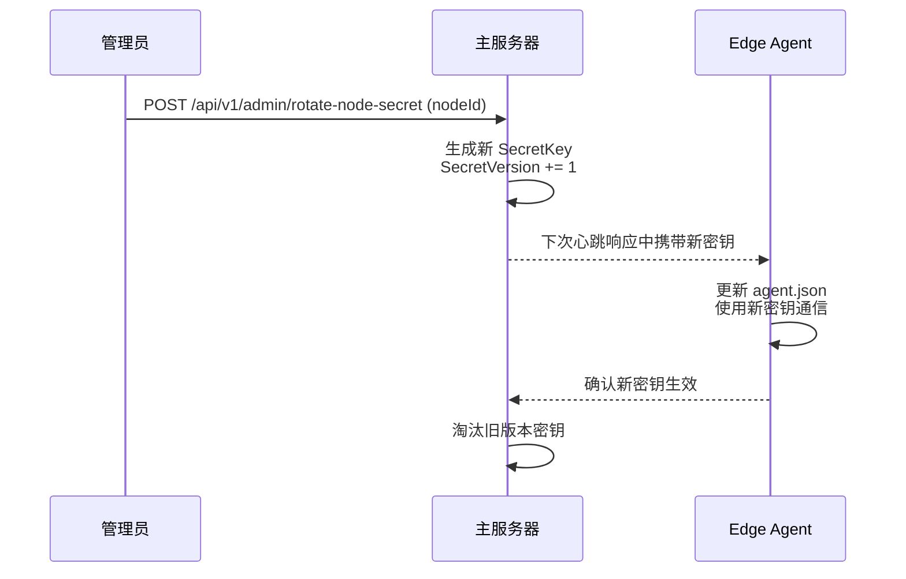

# 安全设计

> **父文档**: [架构文档目录](README.md) | **关联**: [`api-design.md`](api-design.md) · [`deployment.md`](deployment.md)

---

## 1. 认证安全

| 安全措施 | 说明 |
|----------|------|
| 密码加密 | 使用 BCrypt 算法存储用户密码和管理员密码（Work Factor = 12） |
| API 认证 | 管理员 API 使用 JWT Token（HMAC-SHA256），过期时间可配置 |
| 节点认证 | 节点间通信使用 Secret Key，通过 `X-Node-Secret` 请求头传递 |
| HTTPS | Master Server 启动时自动检测 `Https.CertDirectoryPath` 目录下的证书文件。存在则在 `Https.ListenPort` 上启用 HTTPS；缺失则在同端口回退 HTTP 并在日志和控制台输出醒目安全警告。监听地址/端口由 `appsettings.json` → `Https` 节统一管理。生产环境**强烈建议**部署有效证书。详见 `document/developStage/09-phase8-https-auto-detection.md` |
| 请求签名 | 关键操作添加请求签名防重放 |
| trafficStats 安全 | 绑定 `127.0.0.1` + 设置 secret，防止未授权访问 |
| 管理员登录保护 | 连续失败 5 次后锁定 15 分钟（可配置） |
| JWT Token 刷新 | Token 过期前 5 分钟可刷新，无需重新登录 |

---

## 2. 数据安全

| 安全措施 | 说明 |
|----------|------|
| SQL 注入防护 | 使用 EF Core 参数化查询 |
| XSS 防护 | 输入验证和输出编码 |
| 敏感数据加密 | 密钥等敏感数据使用 AES-256-GCM 加密存储 |
| 日志脱敏 | 日志中不记录密码等敏感信息，仅保留用户名和操作类型 |
| 审计追踪 | 所有管理员操作记录到 `AdminAuditLogs`，不可删除 |

---

## 3. 网络安全

| 安全措施 | 说明 |
|----------|------|
| CORS 配置 | 限制跨域访问，仅允许配置的管理端域名 |
| 速率限制 | API 请求速率限制（见 [§4](#4-速率限制配置)） |
| IP 白名单 | 管理 API 可配置 IP 白名单 |
| 节点密钥 | 节点注册和通信需要有效密钥 |
| 本地回环绑定 | Hysteria `trafficStats` 和 Edge Agent 认证代理均绑定 `127.0.0.1` |
| 请求体大小限制 | 限制请求体最大 1MB，防止大 payload 攻击 |

---

## 4. 速率限制配置

| 端点分组 | 限制规则 | 说明 |
|----------|----------|------|
| 认证 API (`/api/v1/auth/*`) | 100 次/分钟/IP | Edge Agent 汇聚了多用户请求，适度宽松 |
| 管理登录 (`/api/v1/admin/login`) | 10 次/分钟/IP | 防止暴力破解 |
| 管理 API 其他 | 60 次/分钟/Token | 管理员操作频率控制 |
| 节点心跳 (`/api/v1/nodes/*/heartbeat`) | 不限制 | 心跳需及时处理 |
| 健康检查 (`/health`) | 不限制 | 监控系统高频调用 |

> 速率限制中间件使用 ASP.NET Core 内置的 `RateLimiter` 中间件实现，基于固定窗口算法。

---

## 5. CORS 配置

```json
{
    "Cors": {
        "AllowedOrigins": ["https://admin.example.com"],
        "AllowedMethods": ["GET", "POST", "PUT", "DELETE"],
        "AllowedHeaders": ["Authorization", "Content-Type"],
        "ExposeHeaders": ["X-Request-Id"],
        "MaxAgeSeconds": 3600
    }
}
```

> 仅在管理 API 路由（`/api/v1/admin/*`、`/api/v1/users/*`）启用 CORS。节点通信 API（`/api/v1/auth/*`、`/api/v1/nodes/*`）不启用 CORS（无浏览器场景）。

---

## 6. 密钥管理策略

| 密钥类型 | 生成方式 | 长度 | 存储 | 轮换 |
|----------|----------|------|------|------|
| JWT Secret | 管理员配置 | ≥ 256-bit (32 字符) | `appsettings.json` 或环境变量 | 手动轮换 |
| 节点 SecretKey | Edge Agent 首次启动时随机生成 | 256-bit (64 hex) | `Nodes` 表（AES 加密） + `agent.json` | 通过 `SecretVersion` 支持多版本并存 |
| trafficStats Secret | 管理员配置 | ≥ 128-bit (16 字符) | `Nodes` 表（AES 加密） + `hysteria.yaml` | 手动轮换 |

### 节点密钥轮换流程



> **多版本密钥**：在轮换期间，主服务器同时接受旧版本和新版本的 `SecretKey`，确保零停机切换。
