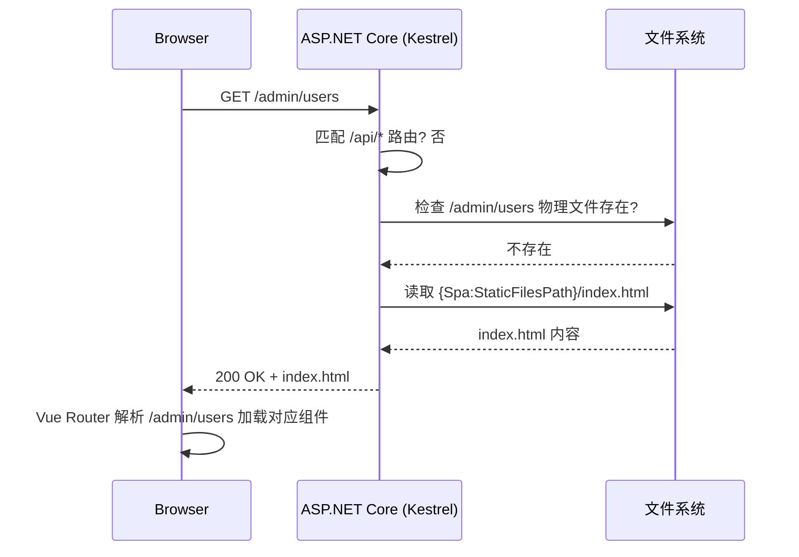

# SPA 前端集成设计

> **父文档**: [架构文档目录](architect/README.md) | **关联**: [`project-structure-configuration.md`](project-structure-configuration.md) · [`deployment.md`](deployment.md) · [`system-architecture.md`](system-architecture.md)

---

## 1. 概述

Master 节点将托管 Web 管理控制台前端 SPA（Vue3 + Vite7），通过 ASP.NET Core 内置的静态文件中间件 + 兜底路由实现。前端构建产物可以放在任意路径（相对或绝对），启动时自动解析为绝对路径并校验。

### 1.1 技术栈

| 层面 | 技术选型 |
|------|----------|
| 前端框架 | Vue 3 + Vite 7 |
| 路由模式 | Vue Router (history 模式) |
| 静态文件托管 | ASP.NET Core `UseStaticFiles` + `MapFallbackToFile` |
| 构建产物存放 | 可配置路径（相对/绝对），默认 `wwwroot/` |

### 1.2 SPA 路由兜底原理

Vue Router 在 history 模式下使用 HTML5 History API，URL 看起来像普通路径（如 `/admin/users`），但实际并不对应服务器上的物理文件。当用户刷新页面或直接访问深层路由时，服务器必须返回 `index.html`，由前端路由接管。



---

## 2. 配置设计

### 2.1 `appsettings.json` 新增 `Spa` 配置节

在 [`appsettings.json`](../src/HysteriaAuth.Master/appsettings.json) 中新增：

```json
{
    "Spa": {
        "Enabled": true,
        "StaticFilesPath": "wwwroot",
        "FallbackFile": "index.html",
        "CacheMaxAgeSeconds": 86400
    }
}
```

### 2.2 配置项说明

| 配置项 | 类型 | 默认值 | 说明 |
|--------|------|--------|------|
| `Enabled` | `bool` | `true` | 是否启用 SPA 静态文件托管和兜底路由。设为 `false` 时完全跳过静态文件中间件 |
| `StaticFilesPath` | `string` | `"wwwroot"` | 前端构建产物的目录路径。支持**相对路径**（相对于 `ContentRootPath`）和**绝对路径** |
| `FallbackFile` | `string` | `"index.html"` | SPA 兜底文件名，所有非 API 且非物理文件的请求都回退到此文件 |
| `CacheMaxAgeSeconds` | `int` | `86400` | 静态文件缓存最大时长（秒），默认 24 小时。仅对带 hash 的资源文件生效 |

### 2.3 路径解析规则

启动时按以下逻辑解析 `StaticFilesPath`：

```
输入：StaticFilesPath 配置值（string rawPath）
输出：string absolutePath

1. 如果 rawPath 是绝对路径（Windows: C:\... 或 Linux: /...）
   → absolutePath = rawPath
2. 如果 rawPath 是相对路径
   → absolutePath = Path.Combine(ContentRootPath, rawPath)
3. 调用 Path.GetFullPath(absolutePath) 标准化（消除 .. 和多余分隔符）
4. 检查 Directory.Exists(absolutePath)：
   - 存在 → 使用该路径，启动成功
   - 不存在 → 记录警告日志，跳过静态文件挂载（不阻止启动）
```

**示例**：

| 配置值 | ContentRootPath | 解析结果 |
|--------|----------------|----------|
| `"wwwroot"` | `/opt/hysteria-auth/master` | `/opt/hysteria-auth/master/wwwroot` |
| `"../frontend/dist"` | `/opt/hysteria-auth/master` | `/opt/hysteria-auth/frontend/dist` |
| `"/var/www/spa"` | 任意 | `/var/www/spa`（绝对路径直接使用） |
| `"D:\\WebUI\\dist"` | 任意 | `D:\WebUI\dist`（Windows 绝对路径） |

### 2.4 强类型配置类

新增 [`Config/SpaSettings.cs`](../src/HysteriaAuth.Master/Config/SpaSettings.cs)：

```csharp
namespace HysteriaAuth.Master.Config;

public class SpaSettings
{
    public const string SectionName = "Spa";

    public bool Enabled { get; set; } = true;
    public string StaticFilesPath { get; set; } = "wwwroot";
    public string FallbackFile { get; set; } = "index.html";
    public int CacheMaxAgeSeconds { get; set; } = 86400;
}
```

---

## 3. Middleware 管道变更

### 3.1 变更后的管道顺序

在 [`Program.cs`](../src/HysteriaAuth.Master/Program.cs) 中，静态文件中间件应在 **所有认证中间件之后、MapControllers 之前** 插入：

```
UseGlobalExceptionHandler → UseNodeAuth → UseJwtAuth → UseCors
                                                                    ← 原有管道
→ UseStaticFiles (新增) → MapControllers → MapFallbackToFile (新增)
  ↑ 仅当 Spa.Enabled = true 时挂载
```

### 3.2 关键代码

```csharp
// ============================
// SPA 静态文件托管（新增）
// ============================
var spaSettings = app.Services.GetRequiredService<
    Microsoft.Extensions.Options.IOptions<SpaSettings>>().Value;

if (spaSettings.Enabled)
{
    var contentRoot = app.Environment.ContentRootPath;
    var rawPath = spaSettings.StaticFilesPath;
    var absolutePath = Path.IsPathRooted(rawPath)
        ? rawPath
        : Path.GetFullPath(Path.Combine(contentRoot, rawPath));

    if (Directory.Exists(absolutePath))
    {
        app.UseStaticFiles(new StaticFileOptions
        {
            FileProvider = new PhysicalFileProvider(absolutePath),
            OnPrepareResponse = ctx =>
            {
                // 对带 hash 的静态资源设置长缓存
                if (ctx.File.Name.Contains(".", StringComparison.Ordinal))
                {
                    var ext = Path.GetExtension(ctx.File.Name);
                    if (ext is ".js" or ".css" or ".woff" or ".woff2" or ".ttf" or ".svg" or ".png" or ".ico")
                    {
                        ctx.Context.Response.Headers.CacheControl =
                            $"public, max-age={spaSettings.CacheMaxAgeSeconds}";
                    }
                }
            }
        });

        app.MapFallbackToFile(spaSettings.FallbackFile, new StaticFileOptions
        {
            FileProvider = new PhysicalFileProvider(absolutePath)
        });

        app.Logger.LogInformation(
            "SPA static files enabled: {Path} (resolved from '{RawPath}')",
            absolutePath, rawPath);
    }
    else
    {
        app.Logger.LogWarning(
            "SPA static files path not found: {Path} (resolved from '{RawPath}'). " +
            "Static file serving is disabled. Run 'npm run build' and place dist/* into this directory.",
            absolutePath, rawPath);
    }
}
```

### 3.3 路由优先级说明

ASP.NET Core 的路由匹配优先级：

| 优先级 | 路由类型 | 行为 |
|--------|----------|------|
| 1 (最高) | `MapControllers` — `/api/v1/*` | API 请求由 Controller 处理 |
| 2 | `UseStaticFiles` — 物理文件 | 如 `/assets/index-abc123.js` 存在则直接返回 |
| 3 (最低) | `MapFallbackToFile` — 兜底 | 其余所有请求返回 `index.html` |

> ⚠️ **重要**：`MapFallbackToFile` 必须放在 `MapControllers` 之后，否则会吞掉所有 API 请求。

---

## 4. 开发环境 Windows 构建脚本

### 4.1 新增脚本：`scripts/dev-build.ps1`

在 Windows 开发环境中一键构建后端 + 前端，输出到 `publish/local-dev/`，方便直接启动 exe 进行测试。

```powershell
# dev-build.ps1
# Windows 开发环境一键构建脚本
# 用途：编译后端 Release 版本 + 构建前端 SPA + 合并到统一输出目录

param(
    [string]$FrontendDistPath = "..\hysteria-auth-web\dist",
    [string]$OutputDir = "publish\local-dev",
    [string]$Configuration = "Release"
)

$ErrorActionPreference = "Stop"
$ScriptDir = Split-Path -Parent $MyInvocation.MyCommand.Path
$ProjectRoot = Resolve-Path "$ScriptDir\.."

Write-Host "========================================" -ForegroundColor Cyan
Write-Host " Hysteria Auth - Dev Build Script" -ForegroundColor Cyan
Write-Host "========================================" -ForegroundColor Cyan
Write-Host ""

# Step 1: Build .NET Backend (Master + Agent)
Write-Host "[1/4] Building .NET Backend..." -ForegroundColor Yellow
Push-Location $ProjectRoot

dotnet publish src/HysteriaAuth.Master -c $Configuration -r win-x64 --self-contained true -o "$OutputDir"
if ($LASTEXITCODE -ne 0) { throw "Master build failed" }

dotnet publish src/HysteriaAuth.Agent -c $Configuration -r win-x64 --self-contained true -o "$OutputDir\agent"
if ($LASTEXITCODE -ne 0) { throw "Agent build failed" }

Write-Host "  -> Backend build OK" -ForegroundColor Green

# Step 2: Copy Frontend Dist (if exists)
Write-Host "[2/4] Copying frontend SPA dist..." -ForegroundColor Yellow
$frontendAbs = Resolve-Path $FrontendDistPath -ErrorAction SilentlyContinue
if ($frontendAbs) {
    $spaTarget = "$OutputDir\wwwroot"
    if (Test-Path $spaTarget) { Remove-Item -Recurse -Force $spaTarget }
    Copy-Item -Recurse $frontendAbs $spaTarget
    Write-Host "  -> Frontend copied: $($frontendAbs) -> $spaTarget" -ForegroundColor Green
}
else {
    Write-Host "  -> Frontend dist not found at '$FrontendDistPath', skipping." -ForegroundColor Yellow
    Write-Host "     Run 'npm run build' in your Vue project first." -ForegroundColor Yellow
}

# Step 3: Ensure appsettings.json for local dev
Write-Host "[3/4] Checking appsettings.json..." -ForegroundColor Yellow
$appSettings = "$OutputDir\appsettings.json"
if (-not (Test-Path $appSettings)) {
    Copy-Item "$ProjectRoot\src\HysteriaAuth.Master\appsettings.json" $appSettings
    Write-Host "  -> Copied default appsettings.json" -ForegroundColor Green
}
else {
    Write-Host "  -> appsettings.json already exists, preserving." -ForegroundColor Green
}

# Step 4: Verify output
Write-Host "[4/4] Verifying output..." -ForegroundColor Yellow
$exe = "$OutputDir\HysteriaAuth.Master.exe"
if (Test-Path $exe) {
    Write-Host "  -> Master EXE: $exe" -ForegroundColor Green
    Write-Host "  -> Run: $exe" -ForegroundColor Green
}
else {
    throw "Master EXE not found at $exe"
}

Write-Host ""
Write-Host "========================================" -ForegroundColor Cyan
Write-Host " Build Complete!" -ForegroundColor Green
Write-Host " Output: $OutputDir" -ForegroundColor Green
Write-Host "========================================" -ForegroundColor Cyan
Write-Host ""
Write-Host "To start the master server:" -ForegroundColor White
Write-Host "  cd $OutputDir" -ForegroundColor White
Write-Host "  .\HysteriaAuth.Master.exe" -ForegroundColor White
Write-Host ""
Write-Host "Then open: http://localhost:5000  (SPA frontend)" -ForegroundColor White
Write-Host ""
```

### 4.2 使用方式

```powershell
# 在项目根目录执行
cd server-dev
.\scripts\dev-build.ps1

# 指定前端 dist 路径
.\scripts\dev-build.ps1 -FrontendDistPath "D:\projects\hysteria-auth-web\dist"

# 构建 Debug 版本
.\scripts\dev-build.ps1 -Configuration Debug

# 启动测试
cd publish\local-dev
.\HysteriaAuth.Master.exe
# 浏览器访问 http://localhost:5000
```

---

## 5. 跨平台交叉编译

### 5.1 Windows → Linux 发布

在 Windows 开发机上编译出 Linux-x64 可执行程序，然后部署到 Linux 服务器。

```powershell
# publish-linux.ps1
# Windows 开发环境 → Linux-x64 交叉编译脚本

param(
    [string]$FrontendDistPath = "..\hysteria-auth-web\dist",
    [string]$OutputDir = "publish\linux-x64",
    [string]$Configuration = "Release"
)

$ErrorActionPreference = "Stop"
$ScriptDir = Split-Path -Parent $MyInvocation.MyCommand.Path
$ProjectRoot = Resolve-Path "$ScriptDir\.."

Write-Host "========================================" -ForegroundColor Cyan
Write-Host " Hysteria Auth - Linux Cross-Compile" -ForegroundColor Cyan
Write-Host "========================================" -ForegroundColor Cyan
Write-Host ""

# Step 1: Publish for linux-x64
Write-Host "[1/3] Publishing for linux-x64..." -ForegroundColor Yellow
Push-Location $ProjectRoot

dotnet publish src/HysteriaAuth.Master -c $Configuration -r linux-x64 --self-contained true -o "$OutputDir"
if ($LASTEXITCODE -ne 0) { throw "Master publish failed" }

dotnet publish src/HysteriaAuth.Agent -c $Configuration -r linux-x64 --self-contained true -o "$OutputDir\agent"
if ($LASTEXITCODE -ne 0) { throw "Agent publish failed" }

Write-Host "  -> Linux-x64 publish OK" -ForegroundColor Green

# Step 2: Copy frontend dist
Write-Host "[2/3] Copying frontend SPA dist..." -ForegroundColor Yellow
$frontendAbs = Resolve-Path $FrontendDistPath -ErrorAction SilentlyContinue
if ($frontendAbs) {
    $spaTarget = "$OutputDir\wwwroot"
    if (Test-Path $spaTarget) { Remove-Item -Recurse -Force $spaTarget }
    Copy-Item -Recurse $frontendAbs $spaTarget
    Write-Host "  -> Frontend copied to wwwroot/" -ForegroundColor Green
}
else {
    Write-Host "  -> Frontend dist not found, skipping. SPA will be disabled." -ForegroundColor Yellow
}

# Step 3: Package for deployment
Write-Host "[3/3] Creating deployment package..." -ForegroundColor Yellow
$packageName = "hysteria-auth-linux-x64-$(Get-Date -Format 'yyyyMMdd-HHmmss').tar.gz"
Push-Location "$ProjectRoot\publish"
tar -czf $packageName "linux-x64"
Pop-Location
Write-Host "  -> Package: publish/$packageName" -ForegroundColor Green

Write-Host ""
Write-Host "========================================" -ForegroundColor Cyan
Write-Host " Cross-Compile Complete!" -ForegroundColor Green
Write-Host " Package: publish/$packageName" -ForegroundColor Green
Write-Host "========================================" -ForegroundColor Cyan
Write-Host ""
Write-Host "Deploy to Linux:" -ForegroundColor White
Write-Host "  scp publish/$packageName user@server:/tmp/" -ForegroundColor White
Write-Host "  ssh user@server" -ForegroundColor White
Write-Host "  cd /opt/hysteria-auth && tar -xzf /tmp/$packageName" -ForegroundColor White
Write-Host "  sudo systemctl restart hysteria-auth-master" -ForegroundColor White
```

### 5.2 支持的 RID (Runtime Identifier)

| 目标平台 | RID | 说明 |
|----------|-----|------|
| Windows x64 | `win-x64` | Windows 10+ / Windows Server 2016+ |
| Linux x64 | `linux-x64` | Ubuntu 20.04+ / Debian 11+ / CentOS 8+ |
| Linux ARM64 | `linux-arm64` | 树莓派 4+ / ARM 云服务器 |

### 5.3 手动交叉编译命令

```bash
# Windows 上编译 Linux 版本
dotnet publish src/HysteriaAuth.Master -c Release -r linux-x64 --self-contained true -o publish/linux-x64
dotnet publish src/HysteriaAuth.Agent -c Release -r linux-x64 --self-contained true -o publish/linux-x64/agent

# Linux 上编译 Windows 版本（通常不需要）
dotnet publish src/HysteriaAuth.Master -c Release -r win-x64 --self-contained true -o publish/win-x64
```

---

## 6. Nginx 配置变更（可选）

当使用 Nginx 作为反向代理时，SPA 静态文件可以由 Nginx 直接托管（替代 ASP.NET Core 托管），两种方案任选其一：

### 6.1 方案 A：ASP.NET Core 托管（推荐，无需修改 Nginx）

保持现有 Nginx 配置不变，所有请求透传到 Kestrel，由 ASP.NET Core 的 `UseStaticFiles` + `MapFallbackToFile` 处理。

### 6.2 方案 B：Nginx 直接托管静态文件

在 [`nginx-master.conf`](../scripts/nginx-master.conf) 中新增 `location /` 块：

```nginx
server {
    listen 443 ssl http2;
    server_name master.example.com;

    # ... SSL 配置 ...

    # SPA 静态资源（Nginx 直接托管，性能更优）
    location / {
        root /opt/hysteria-auth/master/wwwroot;
        try_files $uri $uri/ /index.html;
        
        # 静态资源缓存
        location ~* \.(js|css|png|jpg|jpeg|gif|ico|svg|woff|woff2|ttf)$ {
            expires 1d;
            add_header Cache-Control "public, immutable";
        }
    }

    # 健康检查
    location /health {
        proxy_pass http://127.0.0.1:5000;
        # ...
    }

    # API 路由（保持原有配置）
    location /api/v1/auth/   { proxy_pass http://127.0.0.1:5000; }
    location /api/v1/admin/  { proxy_pass http://127.0.0.1:5000; }
    location /api/v1/users/  { proxy_pass http://127.0.0.1:5000; }
    location /api/v1/nodes/  { proxy_pass http://127.0.0.1:5000; }
}
```

> ⚠️ 若使用方案 B，需将 `Spa.Enabled` 设为 `false`，避免两处同时处理静态文件。

---

## 7. Docker 构建变更

在 [`Dockerfile.master`](../docker/Dockerfile.master) 中添加前端构建阶段：

```dockerfile
# ============================
# Stage 1: 构建前端 SPA
# ============================
FROM node:22-alpine AS spa-build
WORKDIR /spa
COPY hysteria-auth-web/package*.json ./
RUN npm ci
COPY hysteria-auth-web/ ./
RUN npm run build

# ============================
# Stage 2: 构建后端
# ============================
FROM mcr.microsoft.com/dotnet/sdk:10.0 AS build
WORKDIR /src
COPY ["src/HysteriaAuth.Master/HysteriaAuth.Master.csproj", "src/HysteriaAuth.Master/"]
RUN dotnet restore "src/HysteriaAuth.Master/HysteriaAuth.Master.csproj"
COPY . .
WORKDIR "/src/src/HysteriaAuth.Master"
RUN dotnet build "HysteriaAuth.Master.csproj" -c Release -o /app/build

FROM build AS publish
RUN dotnet publish "HysteriaAuth.Master.csproj" -c Release -o /app/publish

# ============================
# Stage 3: 最终镜像
# ============================
FROM mcr.microsoft.com/dotnet/aspnet:10.0 AS final
WORKDIR /app
COPY --from=publish /app/publish .
COPY --from=spa-build /spa/dist ./wwwroot
RUN mkdir -p /var/lib/hysteria-auth /var/log/hysteria-auth /var/backups/hysteria-auth
ENV ASPNETCORE_URLS=http://+:5000
ENV ASPNETCORE_ENVIRONMENT=Production
EXPOSE 5000
ENTRYPOINT ["dotnet", "HysteriaAuth.Master.dll"]
```

---

## 8. 前端开发注意事项

### 8.1 Vite 配置

前端 Vite 项目需要配置 `base` 路径和代理：

```typescript
// vite.config.ts
import { defineConfig } from 'vite'
import vue from '@vitejs/plugin-vue'

export default defineConfig({
  plugins: [vue()],
  base: '/', // 根路径部署
  server: {
    port: 5173,
    proxy: {
      // 开发时 API 代理到后端
      '/api': {
        target: 'http://localhost:5000',
        changeOrigin: true,
      },
    },
  },
  build: {
    outDir: 'dist',
    assetsDir: 'assets',
  },
})
```

### 8.2 Vue Router 配置

```typescript
// router/index.ts
import { createRouter, createWebHistory } from 'vue-router'

const router = createRouter({
  history: createWebHistory(), // 必须使用 history 模式（非 hash）
  routes: [
    // ... 路由定义
  ],
})
```

### 8.3 API 请求 Base URL

前端通过 Vite 环境变量配置 API 地址，生产环境同域部署无需额外配置：

```typescript
// 生产环境同域，直接使用相对路径
const apiClient = axios.create({
  baseURL: '/api/v1',
})
```

---

## 9. 文件变更清单

| 文件 | 操作 | 说明 |
|------|------|------|
| `src/HysteriaAuth.Master/appsettings.json` | 修改 | 新增 `Spa` 配置节 |
| `src/HysteriaAuth.Master/Config/SpaSettings.cs` | 新增 | 强类型配置类 |
| `src/HysteriaAuth.Master/Program.cs` | 修改 | 添加 `UseStaticFiles` + `MapFallbackToFile` |
| `scripts/dev-build.ps1` | 新增 | Windows 开发环境一键构建脚本 |
| `scripts/publish-linux.ps1` | 新增 | Windows→Linux 交叉编译打包脚本 |
| `scripts/nginx-master.conf` | 可选修改 | 若选择 Nginx 托管方案需更新 |
| `docker/Dockerfile.master` | 可选修改 | 若使用 Docker 需添加前端构建阶段 |
