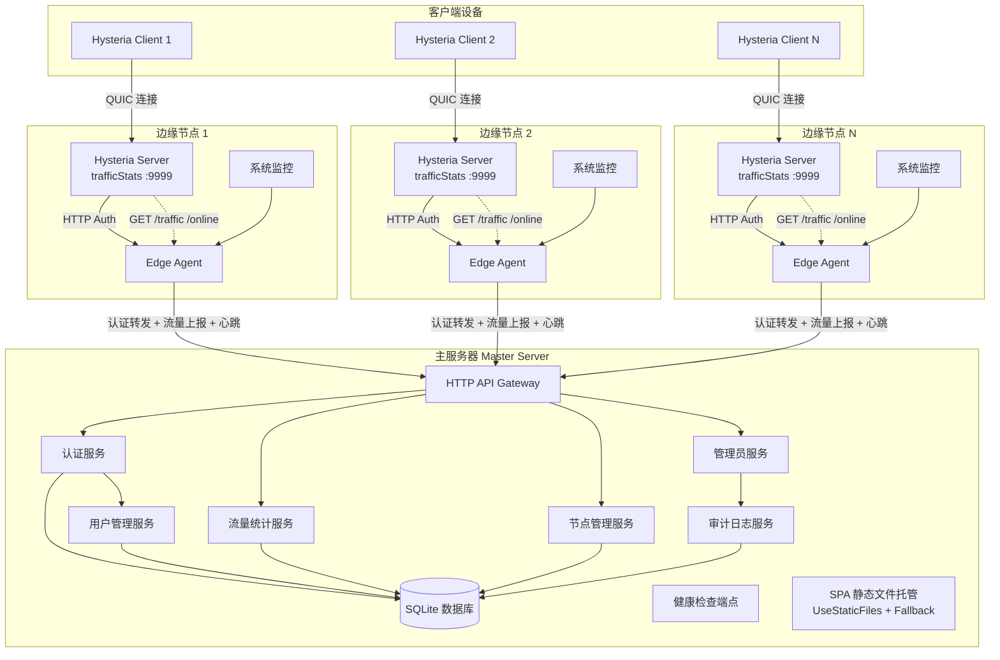
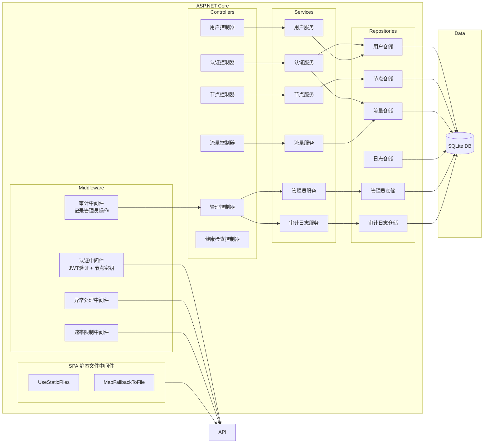
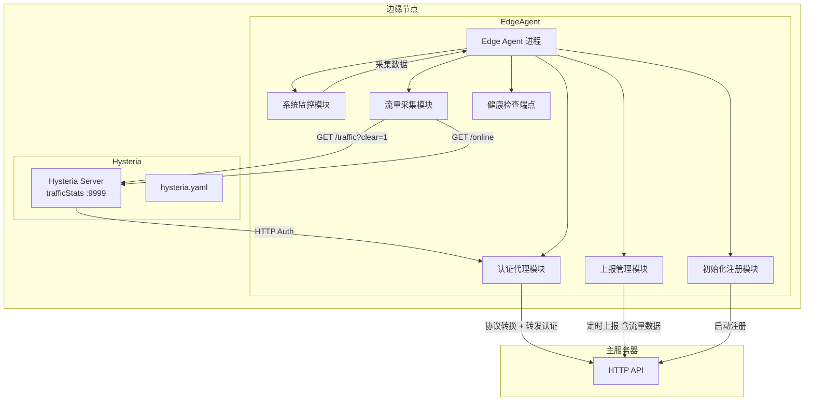

# 系统架构设计

> **父文档**: [架构文档目录](README.md) | **关联**: [`overview.md`](overview.md) · [`edge-node-design.md`](edge-node-design.md) · [`spa-integration.md`](spa-integration.md)

## 1. 整体架构图



### 架构要点

- **主服务器** 是中心化控制面，承载所有业务逻辑和数据存储
- **边缘节点** 是无状态的转发与采集层，每个节点独立运行 Hysteria Server + Edge Agent
- 客户端通过 **QUIC** 直连边缘节点的 Hysteria Server，不经过主服务器
- 认证请求由 Hysteria Server 通过 **本地回环 HTTP** 交给 Edge Agent，Agent 完成协议转换后转发到主服务器
- 流量数据通过 **定时采集 → 合并心跳上报** 的异步通道汇总到主服务器
- **SPA 静态文件托管**：Master 服务器通过 ASP.NET Core 中间件托管 Vue3+Vite7 管理控制台前端

---

## 2. 主服务器架构



### 分层职责

| 层 | 职责 |
|----|------|
| **Controllers** | HTTP 请求路由、参数校验、响应格式化 |
| **Services** | 业务逻辑编排、事务管理 |
| **Repositories** | 数据访问抽象，封装 EF Core 操作 |
| **Middleware** | 横切关注点：认证、异常、限流、审计、SPA 静态文件托管 |
| **Data** | SQLite 数据库文件和 EF Core 上下文 |

---

## 3. 边缘节点架构



### Edge Agent 模块职责

| 模块 | 职责 |
|------|------|
| **系统监控 (SysMon)** | 采集 CPU、内存、网络等系统指标 |
| **认证代理 (AuthProxy)** | 接收本地 Hysteria 认证请求，完成 Hysteria 原生协议 → 内部协议的转换 |
| **流量采集 (TrafficCollector)** | 定时调用 Hysteria `trafficStats` API 获取各用户流量和在线数 |
| **上报管理 (ReportMgr)** | 合并系统指标和流量数据，定时发送心跳到主服务器 |
| **初始化注册 (InitMgr)** | 首次启动时向主服务器注册节点信息 |
| **健康检查 (HealthEP)** | 暴露 `/health` 端点供外部监控探活 |

> 分布式节点通信设计详情见 [`edge-node-design.md`](edge-node-design.md)。

---

## 4. SPA 静态文件托管

> 详细设计见 [`spa-integration.md`](spa-integration.md)

Master 服务器通过 ASP.NET Core 内置的 `UseStaticFiles` + `MapFallbackToFile` 中间件托管 Vue3+Vite7 前端 SPA 的构建产物。中间件管道在 `MapControllers` 之后插入兜底路由，确保 API 请求优先匹配，非 API 请求回退到 `index.html`（支持 Vue Router history 模式）。

### 4.1 核心组件

| 组件 | 说明 |
|------|------|
| `SpaSettings` 配置类 | 强类型绑定 `appsettings.json` 中 `Spa` 节，含 `Enabled`、`StaticFilesPath`、`FallbackFile`、`CacheMaxAgeSeconds` |
| 路径解析器 | 启动时将 `StaticFilesPath`（相对或绝对路径）解析为绝对路径，并校验目录存在性 |
| `UseStaticFiles` | 提供 `wwwroot/`（或自定义路径）下的 JS/CSS/资源文件 |
| `MapFallbackToFile` | 将非 API、非物理文件的请求回退到 `index.html` |

### 4.2 中间件管道路由优先级

```
1. MapControllers    → /api/v1/*        (API 控制器)
2. UseStaticFiles    → /assets/*        (物理静态文件)
3. MapFallbackToFile → /admin/users     (SPA 兜底 → index.html)
```

### 4.3 路径配置示例

| 配置值 | 说明 |
|--------|------|
| `"wwwroot"` | 默认，相对于 ContentRootPath |
| `"/var/www/spa"` | Linux 绝对路径 |
| `"D:\\WebUI\\dist"` | Windows 绝对路径 |
| `"../frontend/dist"` | 相对路径，指向上级目录 |
