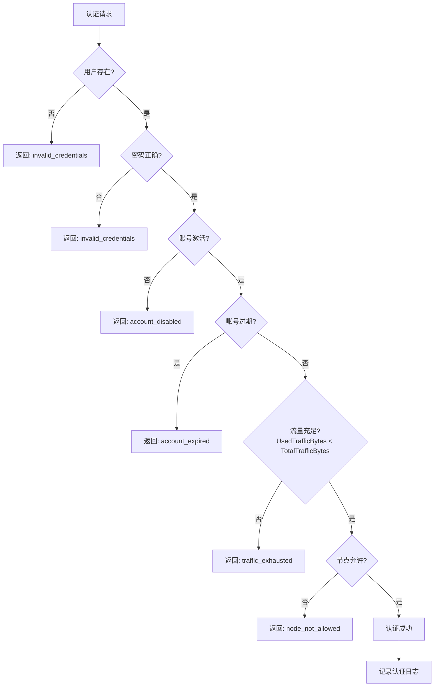
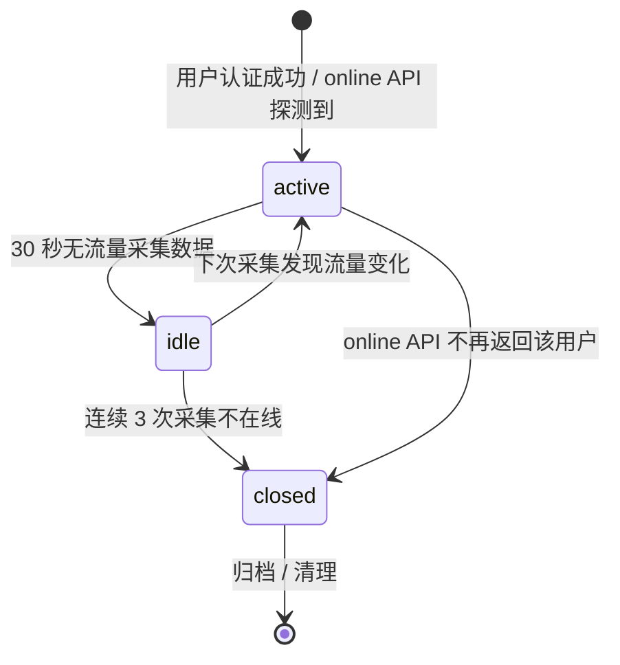
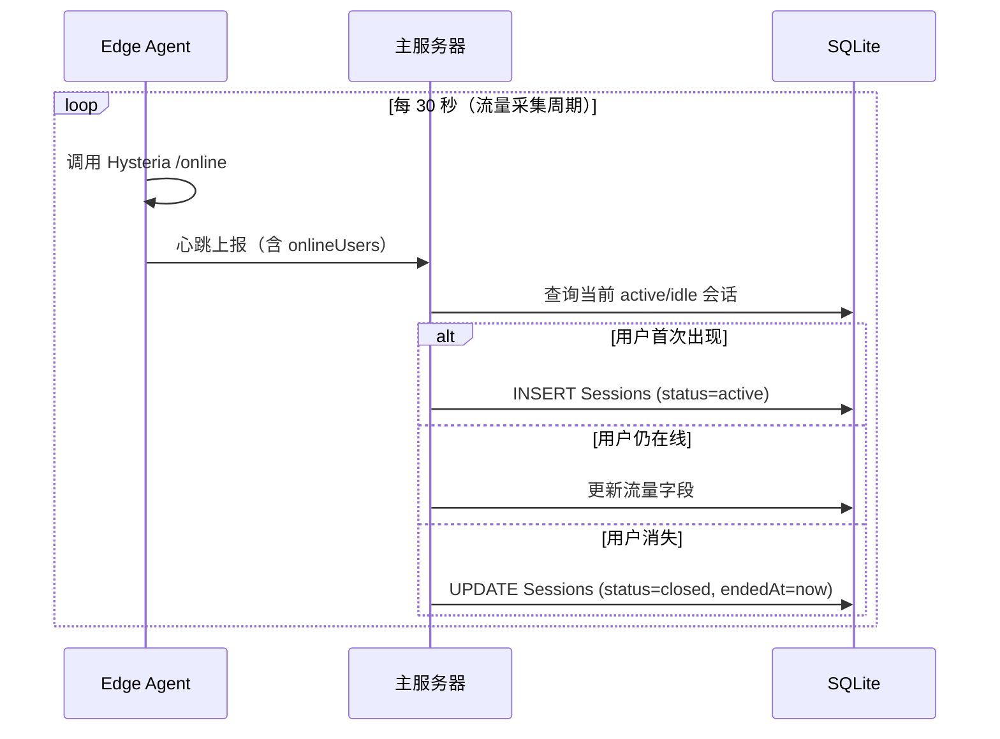

# 流量统计、会话管理与并发控制

> **父文档**: [架构文档目录](README.md) | **关联**: [`../hysteria/hysteria-traffic-stats-api.md`](../hysteria/hysteria-traffic-stats-api.md) · [`edge-node-design.md`](edge-node-design.md) · [`api-design.md`](api-design.md) · [`database-design.md`](database-design.md)

---

## 1. 流量统计方案选型

针对流量统计，评估了以下两种方案：

| 方案 | 描述 | 优点 | 缺点 |
|------|------|------|------|
| | **方案一（采用）** | Edge Agent 内部采集，定时调用本地 Hysteria `trafficStats` API，汇总后上报主服务器 | 延迟低（本地回环）、无需暴露端口、安全性好 | 依赖 Edge Agent 稳定运行 |
| | 方案二 | 主服务器直接调用各边缘节点的 `trafficStats` API | 无需 Edge Agent 参与 | 需要边缘节点开放端口或 VPN 组网、网络延迟高、安全风险大 |

**选择方案一的核心理由**：

1. **安全性**：`trafficStats.listen` 绑定 `127.0.0.1`，仅本地进程可访问，无需暴露到公网
2. **可靠性**：本地回环调用不受网络波动影响
3. **数据一致性**：使用 `?clear=1` 参数在读取后清零，确保每次采集的是增量数据，不会重复计数
4. **架构简洁**：Edge Agent 本身就是数据汇总点，流量数据和系统监控数据合并上报，减少主服务器的连接数

---

## 2. 流量采集流程

```mermaid
flowchart TD
    Start[Edge Agent 定时器触发] --> CallTraffic[GET /traffic?clear=1]
    CallTraffic --> CallOnline[GET /online]
    CallOnline --> Merge[合并系统监控数据]
    Merge --> Report[POST /api/v1/nodes/{nodeId}/heartbeat]
    
    Report --> MasterProcess[主服务器处理]
    
    subgraph MasterProcess[主服务器处理流程]
        direction TB
        CheckIdempotency{幂等键检查}
        CheckIdempotency -->|新数据| BeginTx[开启数据库事务]
        CheckIdempotency -->|重复数据| Skip[跳过（重复上报）]
        BeginTx --> UpdateUsers[遍历 userTraffic<br/>更新 Users.UsedTrafficBytes]
        UpdateUsers --> InsertRecords[写入 TrafficRecords<br/>含 IdempotencyKey<br/>tx → BytesOut, rx → BytesIn]
        InsertRecords --> UpdateSessions[更新 Sessions 表<br/>在线状态]
        UpdateSessions --> UpdateNodeTraffic[写入 NodeTraffic<br/>节点汇总]
        UpdateNodeTraffic --> CommitTx[提交事务]
        CheckQuota{检查流量配额}
        CommitTx --> CheckQuota
    end
    
    Skip --> CheckQuota
    
    CheckQuota -->|超额| KickUser[调用 Edge Agent<br/>踢用户下线]
    CheckQuota -->|正常| Done[完成]
    
    KickUser --> Done
```

---

## 3. 流量检查流程（认证时）



> **流量检查策略**: 认证时仅校验 `Users.UsedTrafficBytes < Users.TotalTrafficBytes`，不进行预扣减。实际流量扣减通过定时采集上报机制异步完成（§2）。当流量超额时，主服务器可主动通过 Edge Agent 调用 [`POST /kick`](../hysteria/hysteria-traffic-stats-api.md#post-kick--踢用户下线) 断开用户连接。

---

## 4. 数据可靠性保障

| 保障措施 | 说明 |
|----------|------|
| `?clear=1` 原子操作 | 读取后立即清零，防止重复计数 |
| 增量上报 | 每次上报的是自上次采集以来的增量，而非累计值 |
| 幂等键保护 | 使用 `{nodeId}_{userId}_{timestamp}` 幂等键防止上报重试导致重复计入（详见 [§7.2](#72-流量数据幂等性)） |
| 上报重试 | Edge Agent 上报失败时重试 3 次（可配置），防止数据丢失 |
| 本地缓存兜底 | 如果主服务器不可达，Edge Agent 缓存流量数据，待恢复后补报 |
| 数据库事务 | 主服务器在单个事务中更新 `UsedTrafficBytes` 和写入 `TrafficRecords` |
| 并发扣减保护 | 使用乐观并发控制（行版本），确保 `UsedTrafficBytes` 并发更新安全（详见 [§7.1](#71-usersusedtrafficbytes-并发扣减)） |

---

## 5. 会话生命周期管理

### 5.1 会话状态机



### 5.2 会话管理流程



### 5.3 会话清理策略

| 操作 | 策略 |
|------|------|
| `closed` 会话 | 保留 7 天后自动清理（后台定时任务） |
| `idle` → `active` | 自动恢复，不创建新会话 |
| `idle` → `closed` | 连续 3 次采集（90 秒）不在线则关闭 |
| 流量数据 | `Sessions.BytesIn/BytesOut` 在每次心跳时更新，与 `TrafficRecords` 保持同步 |

---

## 6. 并发控制与数据一致性

### 6.1 `Users.UsedTrafficBytes` 并发扣减

由于多个 Edge Agent 可能同时上报同一个用户的流量数据（同一用户连接不同节点），对 `UsedTrafficBytes` 的更新存在并发竞争。

**策略**：使用 EF Core 乐观并发控制（Optimistic Concurrency）。

```csharp
// User 实体配置
public class User
{
    // ... 其他字段 ...
    
    [Timestamp]
    public byte[] RowVersion { get; set; }  // 行版本号，由数据库自动管理
}

// 流量扣减服务
public async Task UpdateUsedTrafficAsync(long userId, long bytesToAdd, int retryCount = 3)
{
    for (int i = 0; i < retryCount; i++)
    {
        try
        {
            var user = await _context.Users.FindAsync(userId);
            user.UsedTrafficBytes += bytesToAdd;
            await _context.SaveChangesAsync();
            return; // 成功
        }
        catch (DbUpdateConcurrencyException)
        {
            if (i == retryCount - 1) throw; // 最后一次仍失败则抛出
            // 重新加载实体并重试
            await Task.Delay(Random.Shared.Next(10, 50));
            _context.ChangeTracker.Clear();
        }
    }
}
```

### 6.2 流量数据幂等性

Edge Agent 上报失败后会重试，也可能因网络问题导致同一批数据被多次发送。使用幂等键机制防止重复计入。

**幂等键生成规则**：`{nodeId}_{timestamp_rounded_to_interval}`

示例：`edge-node-01_2025-01-01T12:00:00Z`

```csharp
// 主服务器心跳处理中的幂等检查
public async Task ProcessHeartbeatAsync(HeartbeatRequest request)
{
    // 生成幂等键
    var idempotencyKey = $"{request.NodeId}_{request.ReportedAt:yyyy-MM-ddTHH:mm:00Z}";
    
    // 开始事务
    using var transaction = await _context.Database.BeginTransactionAsync();
    
    foreach (var (username, traffic) in request.UserTraffic)
    {
        var userId = await GetUserIdAsync(username);
        
        // 检查幂等键是否已存在
        var exists = await _context.TrafficRecords
            .AnyAsync(r => r.IdempotencyKey == idempotencyKey && r.UserId == userId);
        
        if (exists)
        {
            _logger.LogDebug("跳过重复流量数据: {Key}", idempotencyKey);
            continue;
        }
        
        // 写入流量记录（含幂等键）
        _context.TrafficRecords.Add(new TrafficRecord
        {
            UserId = userId,
            BytesIn = traffic.Rx,
            BytesOut = traffic.Tx,
            NodeId = request.NodeId,
            IdempotencyKey = $"{idempotencyKey}_{username}",
            RecordedAt = request.ReportedAt
        });
        
        // 更新用户已用流量（带乐观并发重试）
        await UpdateUsedTrafficAsync(userId, traffic.Rx + traffic.Tx);
    }
    
    await transaction.CommitAsync();
}
```

> **唯一约束**：`TrafficRecords.IdempotencyKey` 设置数据库 UNIQUE 约束，即使应用层检查遗漏，数据库层面也能保证幂等性。

### 6.3 心跳数据原子性

心跳请求同时承载系统状态、用户流量、在线用户三类数据。处理过程中若部分成功会导致数据不一致。

**策略**：整个心跳处理包裹在一个数据库事务中，任一子操作失败则整体回滚。

```
BEGIN TRANSACTION
    INSERT NodeStatus (系统状态)
    FOR EACH user IN userTraffic:
        IF NOT idempotency_duplicate:
            INSERT TrafficRecords
            UPDATE Users.UsedTrafficBytes
    INSERT NodeTraffic (节点流量汇总)
    UPDATE Nodes.LastHeartbeat
    UPDATE Sessions (在线状态)
COMMIT
```
